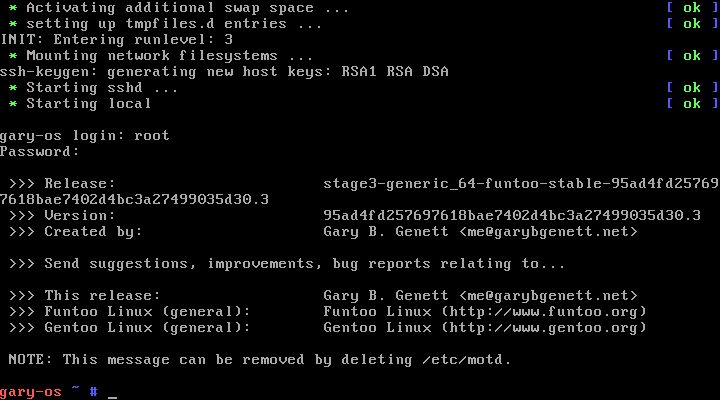
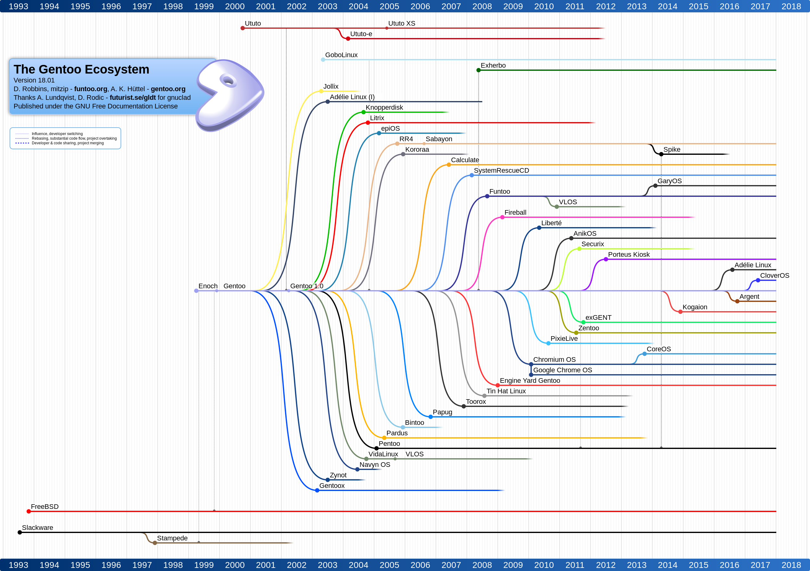

# Welcome to GaryOS (gary-os)

********************************************************************************


"The one file that does it all."

  * Latest: GaryOS v3.0 ([64-bit]) ([32-bit]) ([Packages]) ([Notes]) ([License])
  * Homepage: [https://github.com/garybgenett/gary-os](https://github.com/garybgenett/gary-os)
  * Download: [https://sourceforge.net/projects/gary-os](https://sourceforge.net/projects/gary-os)

[License]: https://github.com/garybgenett/gary-os/blob/master/LICENSE.md
[Readme]: https://github.com/garybgenett/gary-os/blob/master/README.md

[Gary B. Genett]: http://www.garybgenett.net/resume.html
[gary-os@garybgenett.net]: mailto:gary-os@garybgenett.net?subject=GaryOS%20Submission&body=Why%20I%20love%20GaryOS%20so%20much...

********************************************************************************

  * [Overview]
    * [Quick Start]
    * [Requirements]
    * [Contact & Support]
    * [Acknowledgements & Reviews]
  * [Information]
    * [Design]
        * [Goals]
        * [Rationale]
        * [Caveats]
        * [History]
    * [Details]
        * [Customizing]
        * [Structure]
        * [Tools]
        * [Similar Projects]
  * [Instructions]
    * [Booting]
        * [USB Drive & Grub Rescue]
        * [Windows Dual-Boot]
        * [PXE Boot]
    * [Running]
        * [Forensics & Recovery]
        * [Networking Configuration]
        * [Graphical Interface]
    * [Building]
        * [Live Update]
        * [Hard Drive Install]
  * [Version History]
    * [2015-03-16 v3.0 21811b59a8484b2a6b73e0c5277f23c50a0141dc.0]
    * [2014-06-19 v2.0 873ca4a3a4e6ff41e510dbcf2e0fe549fb23474d.0]
    * [2014-03-13 v1.1 95ad4fd257697618bae7402d4bc3a27499035d30.4]
    * [2014-02-28 v1.0 95ad4fd257697618bae7402d4bc3a27499035d30.3]
    * [2014-02-24 v0.3 95ad4fd257697618bae7402d4bc3a27499035d30.2]
    * [2014-02-13 v0.2 95ad4fd257697618bae7402d4bc3a27499035d30.1]
    * [2014-02-09 v0.1 95ad4fd257697618bae7402d4bc3a27499035d30.0]

********************************************************************************

# Overview #####################################################################
[Overview]: #overview

GaryOS is an entire GNU/Linux system in a single bootable file.  It is also
a build system to produce both the bootable file and entire installations.

The booted system consists of a Linux kernel and a Funtoo (based on Gentoo)
initramfs.  It is generated using a customized Funtoo configuration with
a modified Linux kernel configuration (based on the latest Grml default).  The
included build system is entirely specialized for the task.  GaryOS can build
itself from within itself.

There are no major projects which take this same approach on this scale.  The
result is a self-contained file that is more flexible and capable than other
live systems.

Primary features:

  * Comprehensive: complete and optimized Funtoo system with compile toolchain
  * Invisible: resides completely in memory and does not need media after boot
  * Safe: no hard drives are mounted and swap is disabled
  * Flexible: can be used anywhere a Linux kernel can (USB, PXE, etc.)
  * Portable: small footprint can easily fit on any partition
  * Usable: upgrades are as simple as replacing the file
  * Adaptable: supports source-based package options and custom builds
  * Complete: bootloader and direct-to-disk install of a ready-to-use system
  * Fast: everything lives in memory, so all operations happen very rapidly

The goal of GaryOS is to provide a single, simple file which can be
conveniently used for system rescue or installation, or as a temporary
workstation for productivity or learning.  In parallel with this is the
objective of maintaining a usable build system to create GaryOS or other custom
systems.




## Quick Start #################################################################
[Quick Start]: #quick-start

GaryOS releases are not stored in the Git repository, due to size.  The first
step is to download the latest [Kernel].

The simplest way to try GaryOS is using the [Qemu] virtual machine emulator,
which runs on all major platforms.  Once installed, you can boot GaryOS
directly using something like:

  * `qemu-system-x86_64 -m 4096 -kernel [...]/gary-os-[...].kernel`

To use it "for real", follow the brief instructions in the [USB Drive & Grub
Rescue] or [Windows Dual-Boot] sections, depending on whether your current
platform is Linux or Windows.  Apple platforms are not supported.

For advanced users with an existing bootloader (such as Grub), you can add an
entry pointing to the file on disk.  In Grub, this looks something like:

  * `linux (hd0,1)/boot/gary-os-[...].kernel`

All the standard Linux kernel options/parameters are valid.  For example, the
amount of memory Linux allocates to itself can be specified as usual:

  * `linux (hd0,1)/boot/gary-os-[...].kernel mem=8192m`

Once booted, the entire system resides in memory, and any media used to boot it
is no longer necessary.

  * Log in as `root` with password `gary-os`.

After use, the system may simply be powered off.  There is no need to shutdown
GaryOS, since it will boot completely fresh from the file each time.

## Requirements ################################################################
[Requirements]: #requirements

A 64-bit x86 CPU is required.  GaryOS is not built for any other platforms.
Intel and AMD x86 processors are by far the most common for desktop and laptop
computers, which is what GaryOS was designed for.  Due to fundamental internal
hardware differences, and the lack of an available development system, Apple
platforms are not supported.

The booted system requires at least 4GB of RAM.  Some of the advanced features
and uses require additional memory, and 8GB is recommended.

The GaryOS kernel is roughly ~700-800MB in size, and at least 1GB of storage is
recommended.  All efforts have been made to make GaryOS as compact as possible.
However, Linux packages continue to grow in size, such as these required
packages:

  * GCC
  * Linux firmware
  * Grub
  * Python (still needs both v2.x and v3.x for a complete system)
  * Glibc

This list is not meant to be critical, and is only provided for transparency.
The work necessary to keep the distribution compact is ongoing.

Twice during boot, at initial kernel load and initramfs decompression, GaryOS
can appear to hang as the kernel and initramfs are loaded into memory.  This is
normal, and only takes a few moments each.  It uses the standard Linux
infrastructure which does not display any progress.  The actual boot time is
just as fast as other live systems, but the lack of output can be unnerving.
Thus, the final requirement is a tad bit of patience.

## Contact & Support ###########################################################
[Contact & Support]: #contact--support

[Gary B. Genett] is the sole developer and maintainer of GaryOS.  It is
a personal project with aspirations of recognition as an actual distribution,
however misguided.

There is no documentation other than this file and the usage output of the
build scripts.  The uses outlined in the [Instructions] section are the
official "happy paths", and are tested and supported.

Typing `make` or `make usage` will display the supported uses of the build
system.  Advanced uses are documented with `make help`, and are also supported
(but should only be used by those who know what they are doing).  When
reporting issues with the build system, please include the `_gentoo.log` file
from the `build` directory.

While there appears to be some adoption of GaryOS, it is not yet enough to
warrant a formal issue tracker.  For any issues, please contact the author
directly at: [gary-os@garybgenett.net]

GaryOS is very flexible, and both the kernel and build system can be used for
a wide range of applications.  Other uses of all the GaryOS tooling are
encouraged, and the author would be glad to hear about any unique or creative
ways they are employed.  For some ideas, check out the "[\_gary-os]" set file,
which outlines some of the author's personal uses along with the steps used to
test and validate GaryOS each release.

The author will also take you out on the town if you schedule time to geek out
with him in the Seattle area.

[\_gary-os]: https://github.com/garybgenett/gary-os/blob/master/gentoo/sets/_gary-os

## Acknowledgements & Reviews ##################################################
[Acknowledgements & Reviews]: #acknowledgements--reviews

GaryOS has maintained a steady stream of downloads since its inception in 2014.
As of September 2019, it has maintained an average of ~90 downloads a month
over its lifetime, with notable spikes of ~2K, ~0.6K and ~1.5K in March 2018,
January 2019 and September 2019, respectively.  Activity is concentrated in the
U.S. and Europe, but there is clearly a worldwide audience.

  * [https://sourceforge.net/projects/gary-os/files/stats/timeline?dates=2014-02-28+to+2038-01-19](https://sourceforge.net/projects/gary-os/files/stats/timeline?dates=2014-02-28+to+2038-01-19)
  * [https://sourceforge.net/projects/gary-os/files/stats/map?dates=2014-02-28+to+2038-01-19](https://sourceforge.net/projects/gary-os/files/stats/map?dates=2014-02-28+to+2038-01-19)

Despite the relatively small user base, modest infrastructure, and infrequent
release schedule, GaryOS has managed to receive some official acknowledgment.

Most notably, it has been included in the official Gentoo family tree:



*Source: [https://github.com/gentoo/gentoo-ecosystem/blob/master/gentoo-18.01.svg](https://github.com/gentoo/gentoo-ecosystem/blob/master/gentoo-18.01.svg)*

It is also listed on the official Funtoo ecosystem page:

[https://funtoo.org/Gentoo_Ecosystem](https://funtoo.org/Gentoo_Ecosystem)

There is a Softpedia review of v2.0 from a few years ago, which is interesting
because it means somebody took the time to boot it up and play with it:

[https://linux.softpedia.com/get/Linux-Distributions/GaryOS-103629.shtml](https://linux.softpedia.com/get/Linux-Distributions/GaryOS-103629.shtml)

Snapshots of all discovered references to GaryOS are kept in the "[archive]"
directory.  Please use [Contact & Support] to message the author of any other
acknowledgements you may find, including you having read this far.

[archive]: https://github.com/garybgenett/gary-os/blob/master/artifacts/archive

********************************************************************************

# Information ##################################################################
[Information]: #information

This collections of sections covers GaryOS and the repository in greater depth,
and is not for the faint of heart.

It is mainly here for completeness.  The most useful information is in the
[Overview] and [Instructions] sections.

## Design ######################################################################
[Design]: #design

GaryOS was not really "designed", per se.  It very much happened organically.
Any lack of production value to the code is a result of that.

Despite not having been designed in the traditional sense, GaryOS does have
clear structure and requirements.

### Goals ######################################################################
[Goals]: #goals

Top requirements:

  * Bootable from a single kernel file, using initramfs
  * Based on Funtoo using "stage3" build automation
  * Generic kernel/build configuration; should run on most modern x86
    platforms (both 64-bit and 32-bit)
  * Minimal customization of default installation, outside of package
    build tuning (i.e. "portage" configuration)
  * Make Funtoo installation trivial as a "live" media
  * All-purpose, multi-OS rescue environment

Other objectives:

  * Widely deployable; support PXE and native dual-booting with other
    popular OSes, such as Windows and Mac OS X
  * Learning environment for those new to GNU/Linux or Funtoo
  * Example configuration and scripts for tuning and maintaining
    a Funtoo system
  * Maintain DIY (Do It Yourself) approach; favor documentation and
    instructions over helper scripts
  * Provide upstream enhancements to "stage3" automation

Explicit non-goals:

  * Growing bigger than a single kernel file
  * Customization or deep branding of overall system
  * Development of helper scripts/commands library, or customization of
    boot and "init" infrastructure
  * Becoming a complete desktop environment (minimal X.Org GUI only)

### Rationale ##################################################################
[Rationale]: #rationale

I thought it important to document my thoughts regarding the good deal
of focus on the "single bootable file" aspect of GaryOS as its primary
differentiator from other "live" systems.

The number of "live" systems, for everything from basic rescue to a full
workstation, is quite staggering.  Not all that long ago, building a new
"live" system required quite a bit of creativity and expertise.
Projects like KNOPPIX had provided a methodology, but the implementation
was very specific to the project.  It wasn't until Debian created their
Debian Live project, to automate creation of their installation media,
that "live" technology really blossomed.  Subsequently, a number of
projects using forks of this system emerged, including the perennially
useful Grml.  It is much easier to create a new or forked "live" system
today than it was a couple years ago.

Personally, I think the real value of GaryOS is as a bootstrap media for
installing Funtoo which was really my original focus when exploring Metro.
Funtoo can be installed pretty much from any system, using a "stage3" and
"chroot".  Getting from there to a basic system ready to be booted can take
a bit of time and effort, though, and GaryOS can be a very useful tool for
getting to a "half-way mark" of sorts.  A functioning bootloader and kernel,
along with a good many tools already installed, can make getting over the
installation hump a bit easier.  I've often wondered if the lack of
a "ready-to-go" Funtoo system has hampered growth of the user-base, as
inexperienced users gravitate towards more ready-made and marketing-savvy
distributions like Ubuntu.

Getting back to a "single bootable file" in comparison to traditional
ISO-based "live" systems, ISO files have a couple options for use:

  1. Write to CD/DVD media, and boot from there
  2. Write directly to USB media, and boot from there
  3. Extract to USB media, and install/configure bootloader manually
  4. Manually extract kernel, initrd and SquashFS to media, and
     configure bootloader similarly to ISO bootloader (usually ISOLINUX)
  5. Boot ISO file directly, using "loop" functionality of bootloader

The challenges and issues with each approach:

  1. USB drives are a much more convenient and usable boot media than
     CDs/DVDs these days.  They are easier to carry, harder to damage
     and more ubiquitous (modern servers and laptops often don't have
     CD/DVD drives, but they all have USB).  CDs/DVDs are also not as
     re-usable as USB drives.
  2. Both the options for transferring ISO media to USB are less than
     ideal.  This is the more convenient case, but requires you to erase
     the rest of the contents of the drive.
  3. This case preserves other data on the drive at the expense of
     complexity.  In both ISO media to USB cases, upgrading the ISO to
     a new version is not as trivial as it should be.
  4. I personally use this method, and it works relatively well.
     However, it took a bit of time and patience to figure out how to
     make it work, and upgrades still take a bit of diligence each time;
     file names and locations often change, as do boot options and other
     key values.
  5. Grub provides the necessary "loop" functionality, but this works by
     creating a "fake" CD/DVD-ROM drive that the booting OS can use,
     essentially requiring a small Grub footprint to stay in memory and
     for the boot media to stay connected through the entirety of the
     session.  It also requires the "live" system to support booting in
     this manner.

The reason ISO files continue to be the standard package for "live"
systems is capacity and convenience.  Outside of the Linux initramfs
method employed by GaryOS, there is no better way to package an entire
system into a single file that is ready to be booted in any number of
ways.  As covered earlier, using a Linux initramfs limits the size of
the system that can be packaged.  Thanks to modern compression
algorithms, GaryOS is able to get a roughly 2GB root filesystem
delivered.  Most of the ISO systems deliver root filesystems much larger
than this.

I personally continue to employ #4 above to keep a selection of "live"
systems available on the boot media I carry with me everywhere.  Systems
like Grml are still what I use when I need an immediate desktop or to
demonstrate the power and flexibility of GNU/Linux systems.  However,
for rescue, recovery and installation, GaryOS has become my first pick
since it has all the tools I need configured the way I want them.  If
I could only have one file available, it would be GaryOS, which is why
this project exists.

The reader, of course, must make up their own mind about what is best
for them.

### Caveats ####################################################################
[Caveats]: #caveats

Humans are not perfect, and rarely is anything we create.  I'm proud of
this project, but also want to be clear about its shortcomings.

Most notable is the code I've written to produce this.  The coding style
I use was grown organically, and is not based on any of the well-known
syntax and style guides used by other projects.  While consistent and
generally readable, there are a couple specific areas I'd like to
comment on, in order to avoid the appearance of ignorance, negligence or
just plain bad habits:

  * Comments
    * There are few, if any, of them.  Most of the code is pretty
      self-explanatory, at least to me, but may not be readily
      digestible by others without documentation of the thought-process.
  * Columns
    * I don't try to be POSIX or any other type of compliance when
      scripting for fun.  Since I work on big monitors, I tend to make
      my coding/writing terminals **HUGE**.  Reading or modifying on an
      80x25 terminal will frustrate you as much as it does me.
  * Tabs
    * I use them everywhere.  This is not an issue really, except that
      I've broken two of the ancient spacing rules:
        1. In some places, I mix spaces and tabs intentionally
        2. I regularly use tabs for non-leading space
    * Changing the "tab stop" to anything other than "8" will make the
      formatting look even more ugly than it already is.
  * Syntax
    * I use explicit syntax everywhere, all the time.  This keeps the
      code consistent and therefore readable, in my humble opinion, but
      it also adds a lot more characters.  Some say they hate it and
      that it makes their eyes bleed.
  * Options
    * There really aren't any.  Most of the configurability is
      implemented in the form of variables at the top of each script.
      Where there are command-line options, they are rudimentary and
      undocumented.  Someday I should add real argument processing and
      the helpful "usage" output any reasonable user would expect.
  * Cleverness
    * I could use more of it.  In a couple places, I could use a lot
      less.  I'm positive that I've taken the long route in a number of
      cases.  There's a ton of "sed" and "piping" everywhere.  Error
      handling is best-effort.  I probably should have done this all in
      something more powerful, like Perl.
  * Salesmanship
    * I've written much prettier code that I can't or won't share, so
      this is one of the few public examples of my work at the current
      time.  Hopefully it doesn't turn away any potential employers.

Another area of mention is the source code and repository management.
The configuration and coding history for this project resides in several
different personal repositories.  The process used to pull the
individual commits out of each repository and consolidate them together
into the unified one that's been made public is all documented in the
"metro.sh" script.  As a matter of fact, the vast majority of that
script, which began life as a simple wrapper to Metro, is now the code
used to package and release GaryOS.  The long and short of it is that
even minor disruptions to my personal repositories (such as a "rebase"),
or inclusion of other components/scripts into the GaryOS repository,
will result in a public repository that can not use the "fast-forward"
feature of Git and requires re-cloning.  I will endeavor to avoid this,
but the risk does exist.

The final concern would be supportability.  This is a mostly personal
project that I plan to update at least twice a year, but I don't have
a copious amount of free time with which to support and enhance this
project.

Buyer beware.  You own all the pieces.

Other than that, GaryOS should be rock-solid.  ;^)

### History ####################################################################
[History]: #history

Initially, the goal was just to learn the Metro system so I could roll
my own "stage3" files.  As I continued to merge in my configuration
customizations, the difference between a "stage3" and a system that
could be run "live" began to disappear.

In parallel, explorations of Buildroot/Busybox introduced me to the
embedded initramfs concept, and gave me the idea to package the guts of
the "stage3" files from Metro into a Linux kernel for a relatively novel
"live" OS.

If not for my life partner, Rachel, it all would have stopped there.
Her prodding to "go for it" pushed me from just thinking about
publishing this as an opensource project into actually doing it.

I did not name the project GaryOS out of any delusions of grandeur or
egomania.  Indeed, the name was coined not by me but two very good
friends of mine, Steve and Colin, who used to (and still do) poke fun at
the amount of time and effort I spent/spend tuning and customizing my
computing environment.  They jokingly called my workstation "GaryOS",
when it was really nothing more than a heavily personalized and
automated system using the tools and configuration options made
available by all the projects whose software I use.  Since GaryOS really
is nothing more than my own "wrapping" on the more mature work of
others, it seemed fitting to name the project as such in
a tongue-in-cheek and somewhat self-deprecating manner.

That final point is worth re-iterating: GaryOS is 95%+ the work of other
projects.  All I've done is tie things together in a way I find novel,
appealing and useful.

## Details #####################################################################
[Details]: #details

In this section, I will try to outline the key pieces which make GaryOS
tick.  The work will still pretty much speak for itself, but some
explanation of what all the stuff in this repository is will likely be
beneficial to anyone curious enough to have read this far.

Most of what is needed to use the contents of this repository is
contained in the [Customizing] and [Structure] sections below.

### Customizing ################################################################
[Customizing]: #customizing

Since these scripts and configurations were originally intended for
strictly personal use, they have a strong bias towards my directory
structure and processes.  They are admittedly ill-suited to ready use
under other circumstances.  Releasing the source of GaryOS is tantamount
to simply showing my work.

That said, I am a bit of a perfectionist and want all my code to be easy
to re-purpose, re-configure and generally support.  All of the scripts
have been written with variables for all files/directories involved, and
these variables are placed at the top of each script.  Pretty much
everything that would be configurable via a command-line option is
exposed as a variable.

Here are the primary directories and what I use them for:

  * `$HOME/setup/gentoo`
    * Funtoo configuration directory.  Full contents are in the "gentoo"
      directory in this repository.
    * Replicated to "/etc/portage" regularly.
  * `/.g/_data/_build`
    * Directory for source repositories and temporary builds.  This is
      ultimately a disposable working directory.
  * `/.g/_data/_builds`
    * Output of builds which I intend to keep/track.
  * `/.g/_data/_target/iso`
    * Where I keep all downloaded binary files.  Typically ISOs, there
      are also miscellaneous files, like "stage3/portage" archives, and
      documentation.
  * `/.g/_data/zactive`
    * My main data directory.  Most everything I create lives here.
  * `/.g/_toor`
    * Free partition, used for "chroot" builds and testing.

This is far from comprehensive, but should help map things out for
anyone with enough free time and curiosity.

In a perfect world, this section could be removed after the scripts were
cleaned up and documented properly.

### Structure ##################################################################
[Structure]: #structure

Here is documented the overall structure of the repository, along with
details for the individual components.

Top level directory:

  * Distribution:
    * [README.md](https://github.com/garybgenett/gary-os/blob/master/README.md)
        * This file.  All the documentation for GaryOS.
    * [LICENSE.md](https://github.com/garybgenett/gary-os/blob/master/LICENSE.md)
        * The license GaryOS is distributed under.
    * [images/icon.png](https://github.com/garybgenett/gary-os/blob/master/artifacts/images/icon.png)
        * Creative "hack" to have an icon for the project.  Icons make
          it seem like you are "for real", so I had to have one.
    * [images/screenshot_cli.png](https://github.com/garybgenett/gary-os/blob/master/artifacts/images/screenshot_cli.png)
        * Pretty self-explanatory.  Snapshot of what booting v1.0 looked
          like, for promotion, reference and posterity.
    * [images/screenshot_gui.png](https://github.com/garybgenett/gary-os/blob/master/artifacts/images/screenshot_gui.png)
        * Also self-explanatory.  Snapshot of the what the initial X.Org
          GUI in v2.0 looked like.
  * Release:
    * [_commit](https://github.com/garybgenett/gary-os/blob/master/_commit)
        * Primarily for my tracking, records commit IDs for each of the
          public and private repositories relevant to the building of
          GaryOS.  Updated each release.
    * [_config.64](https://github.com/garybgenett/gary-os/blob/master/_config.64),
      [_config.32](https://github.com/garybgenett/gary-os/blob/master/_config.32)
        * Linux kernel configurations used for the 64-bit and 32-bit
          builds, respectively.  These are extracted from Grml ISOs
          using "extract-ikconfig" in the "metro.sh" script.  Updated
          each release.
    * [_packages.64](https://github.com/garybgenett/gary-os/blob/master/_packages.64),
      [_packages.32](https://github.com/garybgenett/gary-os/blob/master/_packages.32)
        * Final package lists for the 64-bit and 32-bit builds,
          respectively.  These are generated from the "initrd" files in
          the "metro.sh" script.  Updated each release.
  * Production:
    * [.bashrc](https://github.com/garybgenett/gary-os/blob/master/.bashrc)
        * My personal Bash configuration file, and also the scripting
          library I use for almost all of my personal scripts.  Several
          variables and functions are sourced from this file, and it was
          easier to just include it into this project than to replicate
          all of the referenced pieces.
    * [gentoo](https://github.com/garybgenett/gary-os/blob/master/gentoo)
        * Contains the entirety of my personal Funtoo configuration, including
          the scripts and files I use to manage my Funtoo installations.
    * [scripts](https://github.com/garybgenett/gary-os/blob/master/scripts)
        * All the code used to create GaryOS lives in here.  Exported
          from my personal scripts directory.

Scripts directory:

  * As you would expect, there are scripts in this directory:
    * [grub.sh](https://github.com/garybgenett/gary-os/blob/master/scripts/grub.sh)
        * Used to produce two different types of Grub images.  One is
          for dual-booting purposes with other OSes, such as Windows,
          and the other is to have a Grub "rescue" installation which
          does not require access to any hard drive partitions for its
          modules or configuration.
        * Documented in more detail in the [Windows Dual-Boot] and [Grub
          Rescue] sections under [Use Cases].
        * Not critical to GaryOS as a whole.  Mainly to simplify and
          automate the use cases mentioned.
    * [metro.sh](https://github.com/garybgenett/gary-os/blob/master/scripts/metro.sh)
        * In essence, this script **IS** GaryOS.
        * Contains all of the wrapping of Metro used to create "stage3"
          files using the Funtoo customizations below.
        * Does the work of extracting "stage3" files and selectively
          archiving them into "initrd" files.  The "initrd" files are
          then compiled into the Linux kernel built inside the relevant
          "stage3".
        * Also houses the release process for GaryOS, which consists of
          exporting patches from my personal repositories and
          consolidating them into the final GaryOS repository.  It also
          adds release "tags" and publishes GaryOS to GitHub and
          SourceForge.

Gentoo directory and configuration:

  * Scripts:
    * [.colorize](https://github.com/garybgenett/gary-os/blob/master/gentoo/.colorize)
        * Hackish attempt to add colorization to compile output.  It
          works, but disrupts the sandbox environment and has caused
          builds to break.  Not used anymore, but kept for posterity.
    * [.emergent](https://github.com/garybgenett/gary-os/blob/master/gentoo/.emergent)
        * Audit script which validates current Funtoo configuration against
          Portage tools/output.  Reports back all kinds of useful information,
          the most useful of which is a list of USE flags and variables which
          have been added or removed upstream.
        * Generally speaking, it is the first line of defense against
          stale configuration options, unused/unconfigured new options
          and configuration "snow" as a whole.
    * [.hacks](https://github.com/garybgenett/gary-os/blob/master/gentoo/.hacks)
        * An aptly-named script, it performs all kinds of miscellaneous
          corrections, fixes and customizations which generally keep me
          happy.
  * Management:
    * [_gentoo](https://github.com/garybgenett/gary-os/blob/master/gentoo/_gentoo)
        * Directory of "okay" files used by ".emergent" script above.
    * [_overlay](https://github.com/garybgenett/gary-os/blob/master/gentoo/_overlay)
        * Funtoo "overlay" directory.  Used very sparingly, and mostly for
          fixing broken packages.
        * Fun side note: I wanted the "gkrellaclock" to look more like
          a genuine "xclock", so I hacked it into one.  This was my
          first real experience coding in C.
  * Automation:
    * [_system](https://github.com/garybgenett/gary-os/blob/master/gentoo/_system)
        * This script is the workhorse of my Funtoo system, just as "metro.sh"
          is the core driver of GaryOS.
        * Most commonly, run without any arguments to update Portage
          tree and pre-fetch source files.
        * Often run with `-u` to completely update the installation,
          based on recommendations from Funtoo documentation.
        * Used with `-[0/12]` options for completely automated "chroot"
          installation.
  * Configuration:
    * [funtoo](https://github.com/garybgenett/gary-os/blob/master/gentoo/funtoo)
        * Contains the commit ID that the Funtoo Portage repository
          should be "pinned" to.
        * Ties Funtoo configuration to a particular version of the Portage
          tree, which ensures repeatability and stability.
    * [make.conf](https://github.com/garybgenett/gary-os/blob/master/gentoo/make.conf),
      [package.keywords](https://github.com/garybgenett/gary-os/blob/master/gentoo/package.keywords),
      [package.license](https://github.com/garybgenett/gary-os/blob/master/gentoo/package.license),
      [package.mask](https://github.com/garybgenett/gary-os/blob/master/gentoo/package.mask),
      [package.unmask](https://github.com/garybgenett/gary-os/blob/master/gentoo/package.unmask),
      [package.use](https://github.com/garybgenett/gary-os/blob/master/gentoo/package.use)
        * Standard Funtoo Portage configuration files, documented in `man
          portage`.
        * My personal configuration, most of which is carried over to
          GaryOS.
    * [savedconfig](https://github.com/garybgenett/gary-os/blob/master/gentoo/savedconfig)
        * Seemingly undocumented storage area for compile-time
          configuration files.
        * [dwm](https://github.com/garybgenett/gary-os/blob/master/gentoo/savedconfig/x11-wm/dwm):
          configuration for "dwm" window manager
    * [sets](https://github.com/garybgenett/gary-os/blob/master/gentoo/sets)
        * User-defined package "sets", also documented in `man portage`.
        * [metro](https://github.com/garybgenett/gary-os/blob/master/gentoo/sets/metro):
          used to create GaryOS.
        * [packages](https://github.com/garybgenett/gary-os/blob/master/gentoo/sets/packages):
          my personal list for a complete workstation installation.

### Tools ######################################################################
[Tools]: #tools

All the real heavy-lifting is accomplished using these tools/projects:

  * Metro: [http://funtoo.org/Metro_Quick_Start_Tutorial](http://funtoo.org/Metro_Quick_Start_Tutorial)
  * Funtoo: [http://funtoo.org](http://funtoo.org)
  * Gentoo: [http://gentoo.org](http://gentoo.org)
  * Linux Initramfs: [http://kernel.org/doc/Documentation/filesystems/ramfs-rootfs-initramfs.txt](http://kernel.org/doc/Documentation/filesystems/ramfs-rootfs-initramfs.txt)

Inspiration was provided by:

  * Buildroot: [http://buildroot.uclibc.org](http://buildroot.uclibc.org)
  * BusyBox: [http://busybox.net](http://busybox.net)
  * StaticPerl: [http://software.schmorp.de/pkg/App-Staticperl.html](http://software.schmorp.de/pkg/App-Staticperl.html)

Kernel configuration, package lists and acknowledgments to:

  * Grml: [http://grml.org](http://grml.org)
  * SystemRescueCd: [http://sysresccd.org/SystemRescueCd_Homepage](http://sysresccd.org/SystemRescueCd_Homepage)

Homage to those who started it all:

  * tomsrtbt: [http://www.toms.net/rb](http://www.toms.net/rb)
  * KNOPPIX: [http://knopper.net/knoppix/index-en.html](http://knopper.net/knoppix/index-en.html)
  * Debian Live: [http://live.debian.net](http://live.debian.net)

Special thanks to the sites which made worldwide distribution possible:

  * SourceForge: [https://sourceforge.net](https://sourceforge.net)
  * GitHub: [https://github.com](https://github.com)

GitHub was instrumental in inspiring me to publish this project, but
SourceForge provided the distribution platform which made it possible to
reach an international audience overnight.

### Similar Projects ###########################################################
[Similar Projects]: #similar-projects

Since the creation of GaryOS, I've discovered the following projects
during ongoing research:

  * Better-Initramfs: [https://github.com/slashbeast/better-initramfs](https://github.com/slashbeast/better-initramfs)
  * Aboriginal Linux: [http://landley.net/aboriginal/about.html](http://landley.net/aboriginal/about.html)

GaryOS shares many of the same goals and attributes/features as these
projects.  The primary difference being that both these projects strive
to be minimalist and/or otherwise purely rescue/development focused.
GaryOS instead tries to be as complete an environment as possible while
still fitting in an initramfs.

Both projects are pretty damn awesome.

********************************************************************************

# Instructions #################################################################
[Instructions]: #instructions

Below are the primary use cases considered for GaryOS.  Each is tested
every release, and contains validation information.

These are also considered the "howto" instructions for each case.

## Booting #####################################################################
[Booting]: #booting

### USB Drive & Grub Rescue ####################################################
[USB Drive & Grub Rescue]: #usb-drive--grub-rescue

  * Definition:
    * Boot into a mostly complete Grub environment directly from the
      boot record without requiring any additional files from disk.
    * Create a Grub "core.img" which can be booted using identical
      methods and options as GaryOS, such as PXE, Qemu, etc.
  * Last tested with:
    * Tested in place of GaryOS with both Qemu and PXE.
        * For details on PXE, see the [PXE Boot] section below.
    * Grub: sys-boot/grub-2.02_beta2-r3
  * Research and development:
    * [https://gnu.org/software/grub/manual/grub.html#BIOS-installation](https://gnu.org/software/grub/manual/grub.html#BIOS-installation)
        * [https://gnu.org/software/grub/manual/grub.html#Images](https://gnu.org/software/grub/manual/grub.html#Images)
    * [http://lukeluo.blogspot.com/2013/06/grub-how-to-4-memdisk-and-loopback.html](http://lukeluo.blogspot.com/2013/06/grub-how-to-4-memdisk-and-loopback.html)
    * [http://wiki.osdev.org/GRUB_2#Disk_image_instructions](http://wiki.osdev.org/GRUB_2#Disk_image_instructions)

For convenience and supportability, this case has also been automated in
the `grub.sh` script.  The `gary-os.grub.*` file in the root download
directory contains an archive of the output of this script.  However,
for this case the script will need to be run locally.  The [Windows
Dual-Boot] section above has more details on the `grub.sh` script and
its usage and output.

Instructions for Grub "rescue" image installation to hard disk:

  1. Create an empty working directory:
     * e.g. `mkdir /tmp/grub`
  2. Change into the working directory:
     * e.g. `cd /tmp/grub`
  3. Run the `grub.sh` script with a block device argument:
     * e.g. `grub.sh /dev/sda`
  4. The script will create necessary files in the working directory,
     and then uses `grub-bios-setup` to install the custom-built
     "core.img" into the boot record.
  5. The block device can now be booted directly into a Grub environment
     which does not require any access to disk for its modules or
     configuration.
     * **The working directory is no longer needed and can be deleted.**
  6. To remove, simply re-install Grub using `grub-install` as usual, or
     install another bootloader.

### Windows Dual-Boot ##########################################################
[Windows Dual-Boot]: #windows-dual-boot

  * Definition:
    * Boot using the native Windows bootloader.
    * No modifications to the hard drive partitions or boot records.
    * Do not require any files outside of `C:` in the Windows
      installation.
  * Last tested with:
    * GaryOS v3.0
    * MBR/GPT only; EFI not built or tested
    * Windows 7 Ultimate SP1 64-bit
    * Grub: sys-boot/grub-2.02_beta2-r3
  * Research and development:
    * [http://lists.gnu.org/archive/html/help-grub/2013-08/msg00005.html](http://lists.gnu.org/archive/html/help-grub/2013-08/msg00005.html)
        * [http://blog.mudy.info/2010/08/boot-grub2-stage2-directly-from-windows-bootmgr-with-grub4dos-stage1](http://blog.mudy.info/2010/08/boot-grub2-stage2-directly-from-windows-bootmgr-with-grub4dos-stage1)
    * [https://wiki.archlinux.org/index.php/Windows_and_Arch_Dual_Boot#Using_Windows_boot_loader](https://wiki.archlinux.org/index.php/Windows_and_Arch_Dual_Boot#Using_Windows_boot_loader)
        * [http://iceflatline.com/2009/09/how-to-dual-boot-windows-7-and-linux-using-bcdedit](http://iceflatline.com/2009/09/how-to-dual-boot-windows-7-and-linux-using-bcdedit)

For convenience and supportability, this case has been mostly automated
in the `grub.sh` script.  The `gary-os.grub.*` file in the root download
directory contains an archive of the output of this script.

Overview of the script:

  * When run without arguments, it creates a series of Grub images and
    configuration files in the current directory.
  * When run with a single block device argument, the target device will
    be used for installation of the "rescue" Grub image, rather than the
    example disk image file.

Overview of the output:

  * `bcdedit.bat`
    * Used to install/remove the necessary entries from the Windows
      bootloader database.
  * `bootstrap.*`
    * Grub "core.img" and configuration loaded from the Windows
      bootloader.  Uses the directory added to `C:` (instructions below)
      for modules (such as `i386-pc` directory) and menu configuration.
  * `grub.cfg`
    * Grub menu used by "bootstrap" above.  Can be modified as needed to
      boot other OSes/objects.
  * `rescue.*`
    * Grub "core.img" rescue environment detailed further in [Grub
      Rescue] section below.
  * `rescue_example.raw`
    * Hard disk image file example of installation of Grub "rescue"
      environment.

Instructions for Windows bootloader dual-boot:

  1. The script assumes a default installation, with a small boot
     partition as partition 1 and Windows `C:` on partition 2.  All
     other partitions must be 3 or higher.  Configurations that do not
     match this will require minor edits to the script, and a fresh
     build of the output directory.
  2. Copy the output directory to `C:\gary-os.grub`, or wherever the
     script has been modified to point to.
  3. Run the `bcdedit.bat` script as Administrator.  Running this script
     without Administrator privileges can cause unexpected and/or
     undesired results.  The `bcdedit.guid.txt` file that is created is
     necessary for automatic removal of the created boot entry.
  4. Place the GaryOS files at these locations:
     * `C:\gary-os-64.kernel`
     * `C:\gary-os-32.kernel`
  5. Use the new option in the Windows bootloader to switch to Grub and
     boot GaryOS (or other OSes/objects bootable by Grub).  Doing
     nothing will boot into Windows as usual.
  6. Simply update the GaryOS files in-place to upgrade.
  7. Run the `bcdedit.bat` script as Administrator to remove from the
     Windows bootloader configuration.  The directory and files created
     in `C:` need to be removed manually.

If the `bcdedit.guid.txt` file is lost, or otherwise becomes out of
date with the bootloader database, use the `bcdedit` command as
Administrator to remove the unwanted entries:

  1. Run `cmd` as Administrator.
  2. Run `bcdedit` to view the bootloader database.  Copy the
     `identifier` field for each GaryOS entry.
  3. Run `bcdedit /delete {identifier} /cleanup` for each entry.  Note
     that the `{identifier}` should be replaced with the full string
     output in #2 above, including the `{}` markers.
     * e.g. `bcdedit /delete {02a0fce9-68f5-11e3-aa07-e94d28b95f82}
       /cleanup`

### PXE Boot ###################################################################
[PXE Boot]: #pxe-boot

  * Definition:
    * Boot from a PXE environment.
    * With some modification of the Funtoo configuration and package list, this
      Metro automation can be used to create a lab workstation or other
      automated environment where a reboot completely resets each machine
      involved.
  * Last tested with:
    * GaryOS v3.0
    * DHCPd: net-misc/dhcp-4.2.5_p1-r2
    * TFTPd: net-misc/iputils-20121221-r2
    * iPXE: sys-firmware/ipxe-1.0.0_p20130624-r2
  * Research and development:
    * [https://wiki.archlinux.org/index.php/archboot#PXE_booting_.2F_Rescue_system](https://wiki.archlinux.org/index.php/archboot#PXE_booting_.2F_Rescue_system)

Once you have a functioning PXE environment, on a global or per-host
basis add the following configuration option to `dhcpd.conf`:

  * `filename "gary-os-[...].kernel";`

## Running #####################################################################
[Running]: #running

### Forensics & Recovery #######################################################
[Forensics & Recovery]: #forensics--recovery

  * Definition:
    * Boot into a completely "clean" environment, so that diagnostics
      and/or recovery can be done in a read-only manner.
  * Last tested with:
    * GaryOS v3.0

GaryOS is in a forensics mode by default.  Hardware scanning is
performed, but the hard drives are not mounted or otherwise touched.
All entries in `/etc/fstab` have been commented out.  As a result, swap
is also disabled.

Linux kernel options can further be used to disable hardware scanning
and interrogation.

It is a stated goal that forensics mode continue being the default.

### Networking Configuration ###################################################
[Networking Configuration]: #networking-configuration

  * Definition:
    * Configure networking, either wired or wireless
  * Last tested with:
    * GaryOS v3.0

No networking configuration or daemons are run by default, but several
networking packages are installed to ease on-the-fly setup.

For simple DHCP, the `dhcpcd` command can be run directly on the desired
interface, such as an Ethernet connection:

  * `dhcpcd eth0`

A more formal way of doing this would be to use the OpenRC scripts:

  * `rc-update add dhcpcd default ; rc`

For wireless networking, the NetworkManager package is available to
simplify the configuration:

  * `rc-update add NetworkManager default ; rc`

Wireless networks can then be scanned and configured:

  * e.g. ...

    ```
    nmcli device wifi rescan
    nmcli device wifi list
    nmcli device wifi connect [ssid] password [password]
    nmcli device status
    ```

The Funtoo OpenRC scripts have all sorts of advanced networking features
and options, covered in depth:
[http://funtoo.org/Networking](http://funtoo.org/Networking)

### Graphical Interface ########################################################
[Graphical Interface]: #graphical-interface

  * Definition:
    * Start up and use the X.Org GUI environment
  * Last tested with:
    * GaryOS v3.0

GaryOS boots to CLI (Command-Line Interface) by default.  To enter the
graphical interface, run `startx`.

The Linux kernel includes driver modules for many common video cards,
but to keep the size of GaryOS down the X.Org installation only includes
the VESA driver (which almost all modern video cards support).  If the
kernel driver for a video card is loaded at boot, it will prevent X.Org
from taking over.  If you plan to run the graphical interface, use the
`nomodeset` kernel option when booting to prevent Linux from loading any
video card drivers.

By default, the DWM window manager is used.  URxvt is the default
terminal emulator, and Surf is the default browser.  Both are wrapped
using the Tabbed utility.

Keyboard shortcuts:

  * Use `ALT-SHIFT-ENTER` to launch terminal emulator.
  * Use `ALT-CTRL-ENTER` to launch web browser.

More information:

  * Read `man dwm` for help on the window manager.
  * Read `man tabbed` for help on the tabbing utility.
  * Read `man urxvt` for help on the terminal emulator.
  * Read `man surf` for help on the web browser.

Thanks to the [Suckless](http://suckless.org) team for creating such
lightweight and useful software.

## Building ####################################################################
[Building]: #building

### Live Update ################################################################
[Live Update]: #live-update

  * Definition:
    * Update/install packages using Funtoo tools.
  * Last tested with:
    * GaryOS v3.0, with 8GB memory

A complete Funtoo environment is available.  In order to install/update
packages, a couple of missing items need to be put into place.  A surprising
number of packages can be installed without filling up the in-memory
filesystem.

Instructions for setting up update/install of packages:

  1. Install "portage" tree.
     * **Option 1:** Synchronize tree as usual.
         * `emerge --sync`
     * **Option 2:** Download `portage-*` archive from one of the `v#.#`
       version download directories; preferably from the one which
       matches your version of GaryOS.  This option is best if you plan
       to keep this file on the same media along side the GaryOS kernel
       file(s).  To extract:
         * `tar -pvvxJ -C /usr -f portage-[...].tar.xz`
     * Generally speaking, "Option 1" is a smaller/faster download than
       "Option 2".  However, "Option 2" has the benefit of offline
       access, and may be simpler to update from since it is at the same
       revision of the tree that was used to build that version of
       GaryOS.
  2. Perform minor hacks to get working in a RAMdisk environment.  These
     should **NOT** be done if planning to install to disk per the
     [Installation] section below.  They essentially disable available
     space checks, since the "portage" scripts expect to be using
     a physical disk.  Commands to run:
     * ...

        ```
        sed -i "s%has_space = False%has_space = True%g" \
            /usr/lib/portage/pym/portage/package/ebuild/fetch.py
        ```
     * `alias emerge="I_KNOW_WHAT_I_AM_DOING=true emerge"`
         * For details, see `"There is NOT at least"` in
           `/usr/portage/eclass/check-reqs.eclass`
  3. Make desired edits to `/etc/portage` configuration.
     * In particular, to complete configuration of the X.Org GUI the
       `INPUT_DEVICES` and `VIDEO_CARDS` variables should be properly
       configured.
     * Starting with `bindist`, there is a list of negated `-*` options
       at the end of the `USE` list which are necessary to build GaryOS
       via Metro.  All of these can/should be removed to get the full
       non-Metro configuration.
  4. Use all "portage" commands as usual.
     * e.g. `emerge firefox`

### Hard Drive Install #########################################################
[Hard Drive Install]: #hard-drive-install

  * Definition:
    * Install GaryOS to disk as a "stage3" build.
  * Last tested with:
    * GaryOS v3.0

The in-memory environment is a complete Funtoo installation, as shown in the
[Live Update] section above.  It can be copied directly to a new disk/partition
and booted as a fresh installation.

Instructions for installing to disk:

  1. Mount formatted disk/partition.
     * e.g. `mke2fs -t ext4 -jv /dev/sda2`
     * e.g. `mount /dev/sda2 /mnt`
  2. If you wish for `/boot` to be on a separate partition, mount that
     location in the target.
     * e.g. `mkdir /mnt/boot`
     * e.g. `mount /dev/sda1 /mnt/boot`
  3. Copy in-memory filesystem to installation target.
     * e.g. ...

        ```
        rsync -avv \
            --filter=-_/dev/** \
            --filter=-_/mnt/** \
            --filter=-_/proc/** \
            --filter=-_/run/** \
            --filter=-_/sys/** \
            / /mnt
        ```
  4. Add necessary partition information to `/etc/fstab`, remembering an
     entry for `/boot` if using a separate partition from #2 above.
     * e.g. `vi /mnt/etc/fstab`
  5. Update and install Grub, to make the new installation bootable.
     * e.g. `for FILE in dev proc sys ; do mount --bind /${FILE} /mnt/${FILE} ; done`
     * e.g. `chroot /mnt grub-install /dev/sda`
     * e.g. `chroot /mnt boot-update`
  6. Reboot into new installation, update `/etc/portage` configuration,
     install "portage" tree and update/install packages as desired.
  7. **Don't forget to change `hostname` and update `root` password!**

********************************************************************************
# Version History ##############################################################
[Version History]: #version-history

[64-bit]: http://sourceforge.net/projects/gary-os/files/gary-os-generic_64-funtoo-stable-v3.0.kernel
[32-bit]: http://sourceforge.net/projects/gary-os/files/gary-os-generic_32-funtoo-stable-v3.0.kernel
[Packages]: https://github.com/garybgenett/gary-os/blob/v3.0/_packages.64
[Notes]: #2015-03-16-v30-21811b59a8484b2a6b73e0c5277f23c50a0141dc0

## 2015-03-16 v3.0 21811b59a8484b2a6b73e0c5277f23c50a0141dc.0 ##################
[2015-03-16 v3.0 21811b59a8484b2a6b73e0c5277f23c50a0141dc.0]: #2015-03-16-v30-21811b59a8484b2a6b73e0c5277f23c50a0141dc0
[v3.0]: #2015-03-16-v30-21811b59a8484b2a6b73e0c5277f23c50a0141dc0

  * Files
    * 64-bit kernel: [gary-os-generic_64-funtoo-stable-v3.0.kernel](https://sourceforge.net/projects/gary-os/files/gary-os-generic_64-funtoo-stable-v3.0.kernel)
    * 32-bit kernel: [gary-os-generic_32-funtoo-stable-v3.0.kernel](https://sourceforge.net/projects/gary-os/files/gary-os-generic_32-funtoo-stable-v3.0.kernel)
    * Grub: [grub.sh](https://github.com/garybgenett/gary-os/blob/v3.0/scripts/grub.sh)
    * 64-bit packages: [https://github.com/garybgenett/gary-os/blob/v3.0/_packages.64](https://github.com/garybgenett/gary-os/blob/v3.0/_packages.64)
    * 32-bit packages: [https://github.com/garybgenett/gary-os/blob/v3.0/_packages.32](https://github.com/garybgenett/gary-os/blob/v3.0/_packages.32)
    * Readme: [https://github.com/garybgenett/gary-os/blob/v3.0/README.md](https://github.com/garybgenett/gary-os/blob/v3.0/README.md)
    * Source Stage3: [stage3-core2_64-funtoo-stable-2015-01-27.tar.xz](https://sourceforge.net/projects/gary-os/files/v3.0/stage3-core2_64-funtoo-stable-2015-01-27.tar.xz)
    * Source Portage: [portage-21811b59a8484b2a6b73e0c5277f23c50a0141dc.0.tar.xz](https://sourceforge.net/projects/gary-os/files/v3.0/portage-21811b59a8484b2a6b73e0c5277f23c50a0141dc.0.tar.xz)
  * Metro/Grub scripts
    * Release checklist in Metro script
    * General updates for upstream Metro changes/enhancements
    * Minor configuration updates for LVM, Postfix and Vim
    * Date variables for Funtoo/Grml upstream files/images
    * Warnings for non-matching upstream files/images
    * Miscellaneous syntax clean-up
    * Additional debugging option in Grub script
    * Updated list of Grub rescue modules
    * Grub rescue options variable
  * Funtoo configuration
    * Updated to new Portage commit
    * Minor improvements to audit/review scripting
    * Fixed `USE` variable, enabling Udev globally
    * Added additional input drivers, for touch devices
    * Added helper packages for networking and basic X.Org GUI scripting

## 2014-06-19 v2.0 873ca4a3a4e6ff41e510dbcf2e0fe549fb23474d.0 ##################
[2014-06-19 v2.0 873ca4a3a4e6ff41e510dbcf2e0fe549fb23474d.0]: #2014-06-19-v20-873ca4a3a4e6ff41e510dbcf2e0fe549fb23474d0
[v2.0]: #2014-06-19-v20-873ca4a3a4e6ff41e510dbcf2e0fe549fb23474d0

  * Files
    * 64-bit kernel: [gary-os-generic_64-funtoo-stable-v2.0.kernel](https://sourceforge.net/projects/gary-os/files/gary-os-generic_64-funtoo-stable-v2.0.kernel)
    * 32-bit kernel: [gary-os-generic_32-funtoo-stable-v2.0.kernel](https://sourceforge.net/projects/gary-os/files/gary-os-generic_32-funtoo-stable-v2.0.kernel)
    * Grub: [grub.sh](https://github.com/garybgenett/gary-os/blob/v2.0/scripts/grub.sh)
    * 64-bit packages: [https://github.com/garybgenett/gary-os/blob/v2.0/_packages.64](https://github.com/garybgenett/gary-os/blob/v2.0/_packages.64)
    * 32-bit packages: [https://github.com/garybgenett/gary-os/blob/v2.0/_packages.32](https://github.com/garybgenett/gary-os/blob/v2.0/_packages.32)
    * Readme: [https://github.com/garybgenett/gary-os/blob/v2.0/README.md](https://github.com/garybgenett/gary-os/blob/v2.0/README.md)
    * Source Stage3: [stage3-core2_64-funtoo-stable-2014-01-13.tar.xz](https://sourceforge.net/projects/gary-os/files/v2.0/stage3-core2_64-funtoo-stable-2014-01-13.tar.xz)
    * Source Portage: [portage-873ca4a3a4e6ff41e510dbcf2e0fe549fb23474d.0.tar.xz](https://sourceforge.net/projects/gary-os/files/v2.0/portage-873ca4a3a4e6ff41e510dbcf2e0fe549fb23474d.0.tar.xz)
  * Metro/Grub scripts
    * Added creation of package list files
    * Added `METRO_DEBUG` variable, for testing
    * Improved customization of `LDFLAGS` and `USE` variables
    * Better exemption handling for packages which fail to build
    * Fixed initrd build, so that it is more generally useful/applicable
    * Added documentation repository to commit tracking
    * Included Git repository in root filesystem, for reference
    * Moved Git repository handling to dedicated "git-export" function
    * Renamed example Grub disk image to a better extension
  * Funtoo configuration
    * Updated to new Portage commit
    * Complete review/revamp of USE flags
    * Added `LDFLAGS` variable options specific to Metro
    * Cleaned up "\_overlay" directory
    * Improvements to audit/review scripting
    * Minor configuration updates/improvements
    * Localized failed package commenting to 32-bit
    * Revised package list, adding CLI (Command-Line Interface) helpers
      and X.Org GUI, while pruning packages that are not as generally
      useful or widely implemented
      * In particular, removed custom Perl modules, Funtoo
        developer/specialized packages, document processing utilities,
        virtualization tools and media software
      * Previously, the X.Org GUI was a specific non-goal of the
        project.  However, certain extremely useful packages (such as
        Wireshark) required it.  The additional screen real-estate is
        also useful for management of multiple terminals and
        web-browsing for solutions to issues.  In order to meet these
        needs, it was decided to incorporate X.Org GUI packages with
        a minimal window manager footprint.
      * CLI interface remains the default (see [Minimal X.Org GUI]
        section for information on loading up and using the graphical
        environment).

## 2014-03-13 v1.1 95ad4fd257697618bae7402d4bc3a27499035d30.4 ##################
[2014-03-13 v1.1 95ad4fd257697618bae7402d4bc3a27499035d30.4]: #2014-03-13-v11-95ad4fd257697618bae7402d4bc3a27499035d304
[v1.1]: #2014-03-13-v11-95ad4fd257697618bae7402d4bc3a27499035d304

  * Files
    * 64-bit kernel: [gary-os-generic_64-funtoo-stable-v1.1.kernel](https://sourceforge.net/projects/gary-os/files/gary-os-generic_64-funtoo-stable-v1.1.kernel)
    * 32-bit kernel: [gary-os-generic_32-funtoo-stable-v1.1.kernel](https://sourceforge.net/projects/gary-os/files/gary-os-generic_32-funtoo-stable-v1.1.kernel)
    * Grub: [grub.sh](https://github.com/garybgenett/gary-os/blob/v1.1/scripts/grub.sh)
    * Readme: [https://github.com/garybgenett/gary-os/blob/v1.1/README](https://github.com/garybgenett/gary-os/blob/v1.1/README)
    * Source Stage3: [stage3-core2_64-funtoo-stable-2014-01-13.tar.xz](https://sourceforge.net/projects/gary-os/files/v1.1/stage3-core2_64-funtoo-stable-2014-01-13.tar.xz)
    * Source Portage: [portage-95ad4fd257697618bae7402d4bc3a27499035d30.4.tar.xz](https://sourceforge.net/projects/gary-os/files/v1.1/portage-95ad4fd257697618bae7402d4bc3a27499035d30.4.tar.xz)
  * Metro/Grub scripts
    * Added Linux kernel configurations from Grml, to provide more
      comprehensive and flexible hardware/feature support
    * Created Grub script, for rescue and dual-boot
    * Syntax and formatting clean-up
  * Funtoo configuration
    * Miscellaneous package changes

## 2014-02-28 v1.0 95ad4fd257697618bae7402d4bc3a27499035d30.3 ##################
[2014-02-28 v1.0 95ad4fd257697618bae7402d4bc3a27499035d30.3]: #2014-02-28-v10-95ad4fd257697618bae7402d4bc3a27499035d303
[v1.0]: #2014-02-28-v10-95ad4fd257697618bae7402d4bc3a27499035d303

  * Files
    * 64-bit kernel: [gary-os-generic_64-funtoo-stable-v1.0.kernel](https://sourceforge.net/projects/gary-os/files/gary-os-generic_64-funtoo-stable-v1.0.kernel)
    * 32-bit kernel: [gary-os-generic_32-funtoo-stable-v1.0.kernel](https://sourceforge.net/projects/gary-os/files/gary-os-generic_32-funtoo-stable-v1.0.kernel)
    * Readme: [https://github.com/garybgenett/gary-os/blob/v1.0/README](https://github.com/garybgenett/gary-os/blob/v1.0/README)
    * Source Stage3: [stage3-core2_64-funtoo-stable-2014-01-13.tar.xz](https://sourceforge.net/projects/gary-os/files/v1.0/stage3-core2_64-funtoo-stable-2014-01-13.tar.xz)
    * Source Portage: [portage-95ad4fd257697618bae7402d4bc3a27499035d30.3.tar.xz](https://sourceforge.net/projects/gary-os/files/v1.0/portage-95ad4fd257697618bae7402d4bc3a27499035d30.3.tar.xz)
  * Metro script
    * Completed support for both 64-bit and 32-bit builds
    * Switched to `generic` for all builds
    * Removed `-fomit-frame-pointer` GCC flag
    * Removed Grub customizations
    * Re-added `/boot` and `/var/db/pkg` directories, so the initramfs
      can be used as a "stage3" replacement
    * Added release/distribution processing
  * Funtoo configuration
    * Commented packages that broke during 32-bit build

## 2014-02-24 v0.3 95ad4fd257697618bae7402d4bc3a27499035d30.2 ##################
[2014-02-24 v0.3 95ad4fd257697618bae7402d4bc3a27499035d30.2]: #2014-02-24-v03-95ad4fd257697618bae7402d4bc3a27499035d302
[v0.3]: #2014-02-24-v03-95ad4fd257697618bae7402d4bc3a27499035d302

  * Files
    * 64-bit kernel: [gary-os-core2_64-funtoo-stable-v0.3.kernel](https://sourceforge.net/projects/gary-os/files/gary-os-core2_64-funtoo-stable-v0.3.kernel)
    * Source Stage3: [stage3-core2_64-funtoo-stable-2014-01-13.tar.xz](https://sourceforge.net/projects/gary-os/files/v0.3/stage3-core2_64-funtoo-stable-2014-01-13.tar.xz)
    * Source Portage: [portage-95ad4fd257697618bae7402d4bc3a27499035d30.2.tar.xz](https://sourceforge.net/projects/gary-os/files/v0.3/portage-95ad4fd257697618bae7402d4bc3a27499035d30.2.tar.xz)
  * Metro script
    * Consolidated kernel/initrd into single kernel/initramfs file
    * Added initial support for both 64-bit and 32-bit builds
  * Funtoo configuration
    * Updated build/installation script with code to expand Metro
      "stage3" files for testing package builds and fixing breaks
    * Customized package list and USE flags for Metro build, to reduce
      size of installation to below 500MB Linux kernel limit
    * Completely removed X, Java and TeX Live / LaTeX
    * Added sound and miscellaneous media packages

## 2014-02-13 v0.2 95ad4fd257697618bae7402d4bc3a27499035d30.1 ##################
[2014-02-13 v0.2 95ad4fd257697618bae7402d4bc3a27499035d30.1]: #2014-02-13-v02-95ad4fd257697618bae7402d4bc3a27499035d301
[v0.2]: #2014-02-13-v02-95ad4fd257697618bae7402d4bc3a27499035d301

  * Files
    * 64-bit kernel: [gary-os-core2_64-funtoo-stable-v0.2.kernel](https://sourceforge.net/projects/gary-os/files/gary-os-core2_64-funtoo-stable-v0.2.kernel)
    * 64-bit initrd: [gary-os-core2_64-funtoo-stable-v0.2.initrd](https://sourceforge.net/projects/gary-os/files/gary-os-core2_64-funtoo-stable-v0.2.initrd)
    * Source Stage3: [stage3-core2_64-funtoo-stable-2014-01-13.tar.xz](https://sourceforge.net/projects/gary-os/files/v0.2/stage3-core2_64-funtoo-stable-2014-01-13.tar.xz)
    * Source Portage: [portage-95ad4fd257697618bae7402d4bc3a27499035d30.1.tar.xz](https://sourceforge.net/projects/gary-os/files/v0.2/portage-95ad4fd257697618bae7402d4bc3a27499035d30.1.tar.xz)
  * Metro script
    * Added revision handling
  * Funtoo configuration
    * Added packages from Grml and SystemRescueCD package lists
    * Enabled `gpm` USE flag

## 2014-02-09 v0.1 95ad4fd257697618bae7402d4bc3a27499035d30.0 ##################
[2014-02-09 v0.1 95ad4fd257697618bae7402d4bc3a27499035d30.0]: #2014-02-09-v01-95ad4fd257697618bae7402d4bc3a27499035d300
[v0.1]: #2014-02-09-v01-95ad4fd257697618bae7402d4bc3a27499035d300

  * Files
    * 64-bit kernel: [gary-os-core2_64-funtoo-stable-v0.1.kernel](https://sourceforge.net/projects/gary-os/files/gary-os-core2_64-funtoo-stable-v0.1.kernel)
    * 32-bit initrd: [gary-os-core2_64-funtoo-stable-v0.1.initrd](https://sourceforge.net/projects/gary-os/files/gary-os-core2_64-funtoo-stable-v0.1.initrd)
    * Source Stage3: [stage3-core2_64-funtoo-stable-2014-01-13.tar.xz](https://sourceforge.net/projects/gary-os/files/v0.1/stage3-core2_64-funtoo-stable-2014-01-13.tar.xz)
    * Source Portage: [portage-95ad4fd257697618bae7402d4bc3a27499035d30.0.tar.xz](https://sourceforge.net/projects/gary-os/files/v0.1/portage-95ad4fd257697618bae7402d4bc3a27499035d30.0.tar.xz)
  * Metro script
    * Initial proof of concept, with separate kernel/initrd files
  * Funtoo configuration
    * Active personal configuration at time of build
    * Commented packages that broke

********************************************************************************
*End Of File*
