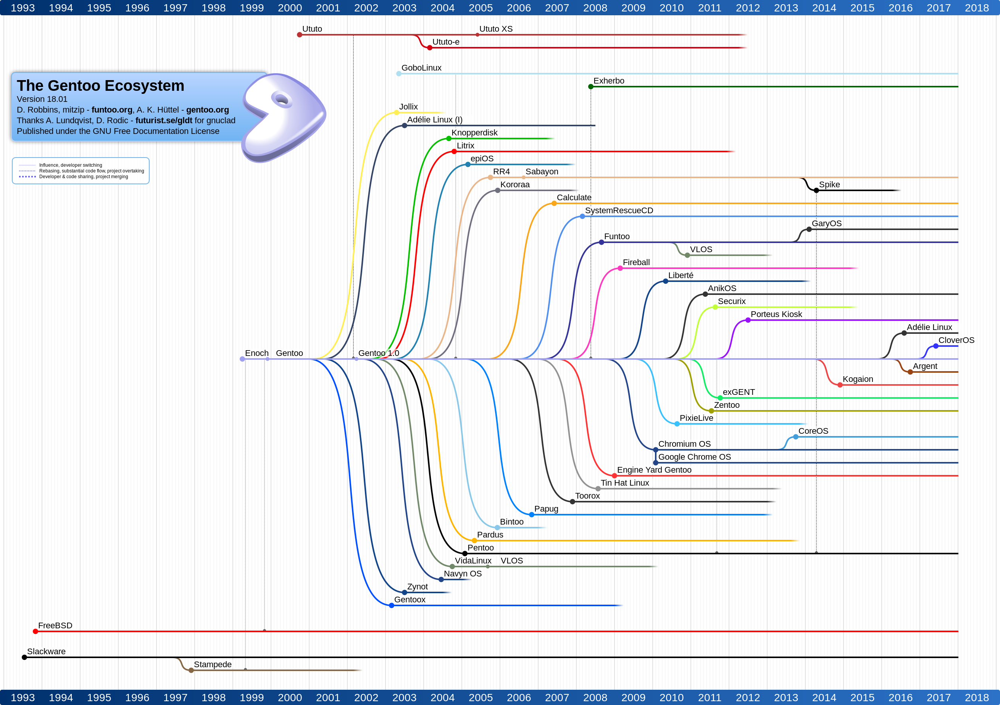

# Welcome to GaryOS (gary-os)

--------------------------------------------------------------------------------


|  | "The one file that does it all."
|:---      |:---
| Latest   | [v3.0 2015-03-16] -- [64-bit] / [32-bit] / [Boot]
| Homepage | <https://github.com/garybgenett/gary-os>
| Download | <https://sourceforge.net/projects/gary-os>

[](https://sourceforge.net/projects/gary-os/files/latest/download)

--------------------------------------------------------------------------------

| [Documentation] | |
|:---        |:---
| [Overview] | [Quick Start] / [Requirements] / [Support]
| [Booting]  | [Linux] / [Windows] / [GRUB] / [EFI] / [PXE] / [Virtual]
| [Running]  | [Networking] / [GUI] / [Update] / [Filesystem]
| [Building] | [Install]

| [Information] | |
|:---        |:---
| [Goals]    | [Advantages] / [Limitations] / [History]
| [Project]  | [References] / [Contributions] / [Contributing] / [Licensing]
| [Details]  | [Versioning] / [Repository] / [Tools] / [Ecosystem]
| [Versions] | [v3.0 2015-03-16] / [v2.0 2014-06-19] / [v1.1 2014-03-13] / [(...)](#v10-2014-02-28)

[Gary B. Genett]: http://www.garybgenett.net
[gary-os@garybgenett.net]: mailto:gary-os@garybgenett.net?subject=GaryOS%20Submission&body=Thank%20you%20for%20sending%20a%20message%21

--------------------------------------------------------------------------------

# Documentation ################################################################
[Documentation]: #documentation

--------------------------------------------------------------------------------

## Overview ####################################################################
[Overview]: #overview

GaryOS is an entire [GNU/Linux] system in a single bootable file.  It is also
a [Builder] system to create and package [Funtoo] installations.

[Builder] creates custom root filesystems that GaryOS can load into memory in
place of its own.  GaryOS can build new or updated versions of itself from
within itself.

Key features:

  * Optimized source-based Funtoo system with [GNU] toolchain
  * Fast in-memory filesystem does not require a physical device
  * Can be booted from anywhere a [Linux Kernel] can
  * Upgrades are as simple as replacing the file

Primary uses:

  * System rescue and recovery
  * Anonymous and secure workstation
  * GNU/Linux learning environment
  * Installation of Funtoo (or [Gentoo])

Unique advantages:

  * Source-based distributions are more flexible and powerful than binary ones
  * A single [Kernel] file is easier to manage and boot than an ISO image
  * GaryOS is stored on media as a resident of it, not the purpose of it

No other GNU/Linux distribution takes the same approach or has the same features
as GaryOS.

<!--  -->
<!--  -->

### Quick Start ################################################################
[Quick Start]: #quick-start

Download the latest [Kernel], and select a boot method:

  1. Use [Virtual] to try it out or test it (quickest and easiest)
  2. Follow the instructions for either [Linux] or [Windows]
  3. Configure an existing [EFI] bootloader
  4. Host on a [PXE] server

Log in as 'root' with password 'gary-os'.  Any boot media can be detached.  Use
the normal 'shutdown now' or simply power off when finished.

### Requirements ###############################################################
[Requirements]: #requirements

A 64-bit x86 CPU is required.  GaryOS is not built for any other platforms.
Intel and AMD x86 processors are by far the most common for desktop and laptop
computers, which is what GaryOS was designed for.

The booted system requires at least 4GB of RAM.  Some of the advanced features
and uses require additional memory, and 8GB is recommended.

The GaryOS kernel is several hundred MB, and 1GB of storage is recommended.  All
efforts have been made to make GaryOS as compact as possible without sacrificing
functionality or pruning the filesystem.

You will also need a keyboard and monitor in order to use GaryOS, although
a serial terminal will work just fine.

### Support ####################################################################
[Support]: #support

[Gary B. Genett] is the sole developer and maintainer of GaryOS.  It is
a personal project with aspirations of recognition as an actual distribution,
however misguided.

All documentation is in this file and the usage output of the [Builder] scripts.
Everything in [Booting], [Running] and [Building] are specifically tested and
supported.  See [Checklist] for details on the final testing done every release.

While there appears to be some adoption of GaryOS, it is not yet enough to
warrant a formal ticket system.  For any issues, or to share the creative ways
you are using GaryOS, please contact the author directly at:
[gary-os@garybgenett.net]

The author will also take you out on the town if you schedule time to geek out
with them in the Seattle area.

--------------------------------------------------------------------------------

## Booting #####################################################################
[Booting]: #booting

GaryOS is a [Linux Kernel] with a large embedded [Linux initramfs] (see
[Design]).  It can be booted in the exact same way as a standard Linux kernel,
and from anywhere that a Linux kernel can.

  |           | |
  |:---       |:---
  | [Linux]   | Starting from any [GNU/Linux] system
  | [Windows] | Starting from a Microsoft Windows system
  | [GRUB]    | USB or hard drives, from either GNU/Linux or Windows
  | [EFI]     | Existing EFI systems, which are an emerging default
  | [PXE]     | Networked environment, or for rapid testing with [QEMU]
  | [Virtual] | Run virtualized on any platform, for [Building] or testing

All standard Linux kernel parameters are valid.  In addition, GaryOS has added
'shmem_size', which specifies the initial amount of memory reserved for the
filesystem if something other than the default is desired at boot time.  Full
details on this parameter are in [Loader].

### Linux ######################################################################
[Linux]: #linux

Starting from [GNU/Linux] is easier than with [Windows], for obvious reasons.
There are two options.

  1. Use an existing booloader configuration
  2. Use the GaryOS [GRUB] tooling

It is recommended to use the first if it is available.  The simplest version
for GRUB is below, with the 'linux' line matching the location of the GaryOS
kernel.

  ```
  menuentry "GaryOS" {
    set debug=linux
    linux (hd0,1)/gary-os/gary-os.kernel
  }
  ```

The 'gary-os.grub.cfg' file in the [Boot] archive is a good example of
a relatively complete GRUB configuration file.

Both of the above will also work for GRUB installations on USB drives.  See
[GRUB] to create or update a bootable USB drive.  For EFI systems, see [EFI].
Any bootloader that can boot Linux will work, but GaryOS is not tested with them
so no instructions or support is provided.

### Windows ####################################################################
[Windows]: #windows

Installation for Windows systems is not complicated, but does involve a few
steps.  Microsoft consistently changes the way their bootloader works, and what
items are supported.  The [v3.0] version of GaryOS was the last one to support
direct modification of the Windows 7/8 bootloader.  In Windows 10, Microsoft
removed support for the application type required to boot the GaryOS GRUB
image.  As such, using a USB drive is the safest and easiest method.  There are
alternatives to the Windows bootloader that can dual-boot Windows and
[GNU/Linux], but they are not tested and no support is provided.

Steps for creating the bootable USB drive are in [GRUB].

### GRUB #######################################################################
[GRUB]: #grub

The GaryOS [Boot] file contains everything needed to create and update GRUB on
both hard drives and USB drives.  The core of the tooling is the
[scripts/grub.sh] script.

Once a drive has been set up, place the GaryOS [Kernel] in the 'gary-os'
directory as 'gary-os.kernel'.  The 'gary-os.grub.cfg' file can also be placed
in that directory and edited as needed.

The drive can be booted using the BIOS or EFI boot menu on any computer that
supports booting from removeable media.  It provides a menu which auto-selects
the most advanced option available.  This menu can be updated at any time using
the [scripts/grub.sh] script within GaryOS, following the directions in
"GNU/Linux" below.

**GNU/Linux**

The [scripts/grub.sh] script can be run directly from the command line.  Running
it without any arguments will display the usage documentation.  The latest
version is always [scripts/grub.sh].  However, the version in the [Boot] file is
going to be better tested and supported.

Be advised that this script creates a brand new partition table on whatever
drive is targeted.  Only use this on a brand new or empty device.  The update
option should only be used on drives that were created by the script or that
have a matching partition table layout.  Only the partition numbers and types
need to match.

  | Partition | Start Sector | End Sector | Size       | Code | Name
  |---:       |---:          |---:        |---:        |---:  |:---
  | 1         |      2363392 |    7275923 |    2.3 GiB | 0700 | Microsoft basic data
  | 3         |       266240 |    2363391 | 1024.0 MiB | EF00 | EFI System
  | 4         |         4096 |     266239 |  128.0 MiB | EF02 | BIOS boot partition

This is the output from 'gdisk -l loopfile.img'.  Using 'fdisk -l' will produce
similar output.

**Windows**

These instructions are tested on Windows 10, but should work just fine on
anything Windows 7 or later.  They use [Rufus] to install the [GRUB] image onto
a USB drive.

  1. Insert a new or empty USB drive at least 4GB in size
  2. Download the [Boot] archive, right click and 'Extract'
  3. Double-click 'rufus*.exe', click allow, and decline updates
     1. Show advanced properties and check 'USB Drives'
     2. For 'Device', select the USB drive
     3. For 'Boot Selection', use the large 'Select' button and 'loopfile.img'
     4. Click 'Start'
     5. Read the warning and click 'OK' when ready
     6. Click 'Close' if it completed successfully
  4. Right-click the Windows 'Start' menu, and select 'Disk Management'
     1. The drive will have both lettered (e.g. D:) and unallocated space
     2. Right-click the lettered drive and select 'Delete Volume'
     3. Read the warning and click 'Yes' when ready
     4. Right-click the expanded unallocated space and select 'Simple Volume'
     5. Follow the prompts, using 'exFAT' as the 'File System'
     6. Click 'Finish' when ready

There will be a new drive letter available in 'My Computer', but it will be
empty.  Create the 'gary-os' directory and add the 'gary-os.kernel' as
described at the at the beginning of [GRUB].  The 'gary-os.grub.cfg'
instructions are also supported.

### EFI ########################################################################
[EFI]: #efi

Both the GaryOS [Kernel] and the GRUB 'x86_64.efi' file in [Boot] (see [GRUB])
are EFI applications, and can be used directly from an EFI menu on an
appropriate partition.

Booting from either of these files with EFI is supported, but the necessary EFI
configuration/steps are not tested or supported.

### PXE ########################################################################
[PXE]: #pxe

In a networked environment GaryOS can boot from a central server.  This is often
used in labs or environments where centralized management of infrastructure is
critical.

Both the GaryOS [Kernel] and the GRUB 'x86_64.efi' file in [Boot] (see [GRUB])
can be loaded directly from PXE.  The GRUB image will automatically select and
load GaryOS from the server, and will also pass any additional boot parameters
to the [Linux Kernel] directly from the PXE server configuration.

DHCPd and TFTPd are included in GaryOS.  An example DHCPd configuration is
below.  GRUB must be used as the 'filename' in order to pass Linux kernel
parameters to GaryOS via 'extensions-path'.  Otherwise, the GaryOS kernel can
be used directly as 'filename' without any other options.

  ```
  next-server             0.0.0.0;
  filename                "/gary-os/gary-os.grub/x86_64.efi";
  option root-path        "/gary-os/gary-os.kernel";
  option extensions-path  "<kernel parameters>";
  ```

Using [Image] to create modified [Filesystem] images could form the basis of
a completely automated and centrally managed lab or server farm.

### Virtual ####################################################################
[Virtual]: #virtual

Using virtualization is is the quickest and easiest way to try out or test
GaryOS.  On a [GNU/Linux] system, [QEMU] is high-performance and
low-complexity, and is what the author uses for all development and testing of
GaryOS (see [Checklist]).  However, it is not well suited for other platforms,
such as Windows, and [VirtualBox] is the best choice there.  VirtualBox also
runs on GNU/Linux, if desired.

On systems with only 4GB of memory virtualization will push system resources to
the limit.  Windows will exhaust them completely.  Using [GRUB] to create a USB
drive is a better idea in that case.

The instructions below use 3072MB for memory, which is the absolute minimum.
Ideally, this should be 4096MB or greater to best emulate an actual system which
meets the [Requirements].

**QEMU**

Use the distribution package manager to install QEMU.  It is available on all
major distributions, including GaryOS.  Once installed, it is simple to get it
running.

  ```
  modprobe kvm_intel
  qemu-system-x86_64 -m 3072 -kernel gary-os.kernel
  ```

The [Boot] file has a pre-made QEMU image inside that is already installed with
[GRUB] and the [Kernel].

  ```
  qemu-system-x86_64 -m 3072 loopfile.qcow2
  ```

See [Checklist] for additional information on how QEMU is used in the
development of GaryOS.

**VirtualBox**

Once [VirtualBox] is installed, create a new virtual machine.

  |                   | |
  |:---               |:---
  | Type              | Linux
  | Version           | Other Linux (64-bit)
  | Memory            | 3072 (or greater)
  | Virtual disk file | loopfile.qcow2 (from [Boot] archive)

This new virtual machine will run GaryOS [GRUB] and boot into the [Kernel].

  [VirtualBox]: https://www.virtualbox.org

--------------------------------------------------------------------------------

## Running #####################################################################
[Running]: #running

There are many things that can be done with GaryOS once it is booted, some of
which are outlined in [Overview].  It is essentially a packaged [Funtoo]
installation.  There are a few common tasks that are documented to make them
easier, and some additional capabilities specific to GaryOS.

  * Set up [Networking]
  * Run the [GUI] graphical interface
  * [Update] or install new packages
  * Loading a different [Filesystem] into memory

By default, GaryOS starts the fewest processes possible and does not mount any
hard drives or partitions.  This is for security, rescue and forensics.

See [Support] if you wish to share any creative uses for GaryOS that you come up
with.

### Networking #################################################################
[Networking]: #networking

For security, no networking configuration or daemons are run by default, but
several networking packages are installed.  Instructions for Ethernet, Wireless
and [OpenSSH] sshd are below.

The [Funtoo Networking] page contains full details on all the configuration
possibilities.  For the purposes of GaryOS, a simple single-interface
configuration is likely all that is needed.

**Ethernet**

The [dhcpcd] utility is the quickest and easiest to use.

  ```
  rc-update add dhcpcd default
  openrc
  ```

This should automatically detect the best interface to use and configure it with
DHCP.  It can also be run explicitly on a specific interface using something
like 'dhcpcd eth0'.

In case this does not work as expected or there is no DHCP available, the 'ip'
command from [iproute2] can be used to configure manually.  Starting with 'ip
address' will show all the available interfaces and their status.  Use 'ip help'
for more information on how to use this command.

**Wireless**

The configuration for wireless is slightly more involved, especially since it is
done on the command line.  The [wpa_supplicant] package is very comprehensive
and accomplishes the goal in the fewest steps.

  ```
  nano /etc/wpa_supplicant/wpa_supplicant.conf
  rc-update add wpa_supplicant default
  rc-update add dhcpcd default
  openrc
  ```

If it is required to manually discover an available network, use the 'wpa_cli'
command.

  ```
  scan
  scan_results
  add_network
  list_networks
  set_network 0 scan_ssid 1
  set_network 0 ssid "<ssid>"
  set_network 0 psk "<password>"
  enable_network 0
  select_network 0
  status
  save_config
  ```

The 'wpa_cli' command supports tab-completion, so it is only necessary to type
the first few letters of each command.

**OpenSSH**

If remote access to GaryOS is needed, OpenSSH sshd is the absolute best option.

  ```
  passwd root
  rc-update add sshd default
  openrc
  ```

It is very important to note that 'root' access is enabled, which is why the
password should be changed before enabling SSH.

  [Funtoo Networking]: https://www.funtoo.org/Networking
  [dhcpcd]: https://roy.marples.name/projects/dhcpcd
  [iproute2]: https://wiki.linuxfoundation.org/networking/iproute2
  [wpa_supplicant]: https://w1.fi/wpa_supplicant

### GUI ########################################################################
[GUI]: #gui

GaryOS boots to the command line by default.  To run the [X.org] graphical
interface, use 'startx'.

  | Utility           | [Kernel]       | [Rootfs]
  |:---               |:---            |:---
  | Window manager    | [dwm]          | Includes [Openbox]
  | Terminal emulator | [rxvt-unicode] | Also the default
  | Web browser       | [Links]        | Includes [surf] and [Firefox]

The dwm title bar has brief reminders for the shortcuts below.  Use
'XSESSION=openbox startx' for Openbox instead of dwm.

  |                    | |
  |:---                |:---
  | GaryOS Readme      | Alt-Left
  | The dwm man page   | Alt-Right
  | Command entry      | Alt-p
  | Terminal emulator  | Alt-Shift-Enter
  | Web browser        | Alt-Ctrl-Enter
  | Web browser (surf) | Alt-Shift-Ctrl-Enter

The surf browser uses the [tabbed] utility for tabbed browsing.  See 'man surf'
and 'man tabbed' for keyboard commands.  Firefox can be ran by using 'Ctrl-p',
typing 'firefox' and hitting 'Enter'.

X.org tries to auto-detect the best resolution for the display.  If it does not,
use the 'xrandr' utility to change it.

  ```
  xrandr --query
  xrandr --output Virtual-0 --mode 1920x1200
  ```

These are not the prettiest or most feature-rich applications.  They were
selected for their lightweight nature and minimal dependencies, along with the
high geek factor (see [Goals]).

  [Openbox]: http://openbox.org
  [surf]: https://surf.suckless.org
  [tabbed]: https://tools.suckless.org/tabbed
  [Firefox]: https://www.mozilla.org/firefox

### Update #####################################################################
[Update]: #update

GaryOS is essentially a packaged [Funtoo] system, and can be updated or modified
just like a normal installation.

  1. Set up [Networking]
  2. Increase the size of the filesystem
  3. Use 'make unpack' to install necessary directories
  4. Do whatever [Portage] 'emerge' or other commands that are desired

It is important to note that 'make unpack' should not be run after making
updates to the system, since it may remove or replace added files.

**Increase Filesystem Size**

The default size of the filesystem includes a minimal amount of additional
space, but not enough to unpack the directories and make other updates.

  ```
  mount -o remount,size=6144m /.overlay
  df -h /.overlay
  ```

Replace '6144' with the amount of MB to allocate.  This may also be specified
as '6g' for GB.  GaryOS is tested with 6GB, to ensure this works with systems
that have 8GB of memory.

**Upack Directories**

GaryOS has a basic, self-documented, packages-like system for fetching and
unpacking additional directories (see [Design]).

  ```
  cd /.gary-os
  nano /.unpack
  make unpack
  ```

Nano is a basic, user-friendly text editor.  The author uses [Vim], so that
option is also available.  The syntax to use is documented in the file.  For
this, just remove the first character from all the 'gcc' and 'emerge' lines
(except for 'meta-repo.git').

**Emerge**

At this point, GaryOS is like any other Funtoo installation.  The 'emerge'
command can be used to install and update packages as usual.

  ```
  emerge app-misc/hello
  ```

Be mindful of how much is being installed compared to available memory.  Each
package will collect source distribution files, require filesystem space for
building, install new files, and generate a binary package file.  It can add up
fast.

If a large number of packages are required, building an [Image] of an updated
[Filesystem] or doing an [Install] are good alternatives.

### Filesystem #################################################################
[Filesystem]: #filesystem

GaryOS uses a three-stage process for unpacking the root filesystem into memory.
This is covered in detail in [Design].  During this process, a filesystem image
is selected, loaded into memory, and booted.  The default is to use the one
packed into the [Kernel].  GaryOS has the capability to load a different
filesystem.

  * Located on a [GRUB] USB drive
  * From a [Linux] or [EFI] configuration (if the EFI partition is large enough)
  * Using [PXE]

Fundamentally, all that is needed is the ability to pass [Linux Kernel]
parameters and host the filesystem image.  GaryOS has a pre-made [Rootfs] that
comes with many additional packages installed.  See [Image] to create new ones.

There are a few kernel parameters specific to GaryOS that are needed to load an
external filesystem.

  |            | |
  |:---        |:---
  | shmem_size | Initial amount of memory reserved for the filesystem
  | groot      | Disk or partition that the [Rootfs] resides on
  | groot_file | Path to the [Rootfs] (default: /gary-os/gary-os.rootfs)
  | groot_hint | Provide a hint from GRUB to [Loader], in case of error

[Loader] goes into each of these in much more detail.  GaryOS provides example
defaults in the [GRUB] configuration files.  Generally, only 'shmem_size' and
'groot' are required to load an external [Rootfs].

The 'shmem_size' value for the pre-made GaryOS [Rootfs] should be at least
'2048m', or '2g' if that format is preferred.  The [Boot] file is already
correctly configured (see [GRUB]).

--------------------------------------------------------------------------------

## Building ####################################################################
[Building]: #building

In addition to being a [GNU/Linux] system, GaryOS is the [Builder] system used
to produce itself.  It has three main purposes.

  * [Compile] and [Manage] [Funtoo] installations
  * Make an [Image] of a root [Filesystem]
  * [Install] GaryOS to disk directly from memory

These sections are in logical order, following the full lifecycle of creating
a build, managing it or creating an image of it, and ultimately installing it.
They are mainly for reference from other sections, and not necessarily
a prescribed list of steps to take.

### Install ####################################################################
[Install]: #install

  * Definition:
    * Install GaryOS to disk as a "stage3" build.
  * Last tested with:
    * GaryOS v3.0

The in-memory environment is a complete Funtoo installation, as shown in the
[Update] section above.  It can be copied directly to a new disk/partition and
booted as a fresh installation.

Instructions for installing to disk:

  1. Mount formatted disk/partition.
     * e.g. `mke2fs -t ext4 -jv /dev/sda2`
     * e.g. `mount /dev/sda2 /mnt`
  2. If you wish for `/boot` to be on a separate partition, mount that
     location in the target.
     * e.g. `mkdir /mnt/boot`
     * e.g. `mount /dev/sda1 /mnt/boot`
  3. Copy in-memory filesystem to installation target.
     * e.g. ...

        ```
        rsync -avv \
            --filter=-_/dev/** \
            --filter=-_/mnt/** \
            --filter=-_/proc/** \
            --filter=-_/run/** \
            --filter=-_/sys/** \
            / /mnt
        ```
  4. Add necessary partition information to `/etc/fstab`, remembering an
     entry for `/boot` if using a separate partition from #2 above.
     * e.g. `vi /mnt/etc/fstab`
  5. Update and install GRUB, to make the new installation bootable.
     * e.g. `for FILE in dev proc sys ; do mount --bind /${FILE} /mnt/${FILE} ; done`
     * e.g. `chroot /mnt grub-install /dev/sda`
     * e.g. `chroot /mnt boot-update`
  6. Reboot into new installation, update `/etc/portage` configuration,
     install "portage" tree and update/install packages as desired.
  7. **Don't forget to change `hostname` and update `root` password!**

--------------------------------------------------------------------------------

# Information ##################################################################
[Information]: #information

--------------------------------------------------------------------------------

## Goals #######################################################################
[Goals]: #goals

Here are the guiding principles that keep GaryOS going in a consistent
direction, with a consistent purpose.

Top requirements:

  * All-purpose, multi-OS rescue environment, based on Funtoo
  * Complete system, with all packages installed as they normally would be
  * As close to default as possible, aside from Portage package build tuning
  * Generic 64-bit build, supporting most modern x86 platforms
  * Bootable from a single kernel file, using initramfs
  * Make Funtoo installation trivial as a live media

Other objectives:

  * Support as many boot methods as possible, such as USB setup and PXE
  * Minimalist, performant Portage configuration, using only what is needed
  * Avoid non-opensource and binary licenses and packages as much as possible
  * Example configuration/scripts for tuning and maintaining a Funtoo system
  * Foster a DIY (Do It Yourself) approach through good documentation
  * Learning environment for those new to GNU/Linux or Funtoo

Explicit non-goals:

  * Growing bigger than a single kernel file
  * Customization or deep branding of overall system
  * Development of a helper scripts/commands library
  * Alteration of boot or "init" infrastructure
  * Becoming a complete desktop environment

### Advantages #################################################################
[Advantages]: #advantages

The number of live systems, for everything from basic rescue to a full
workstation, is quite staggering.  Many of them are extremely useful and very
well-established.  So, why create another one?

The main differentiators of GaryOS:

  1. A single kernel file is easier to manage and boot than an ISO file
  2. It is a source-based Funtoo system, which is much more powerful than
     binary distributions, like those based on Debian (Grml, Ubuntu, etc.)
  3. Installation of Gentoo/Funtoo can be a bit of work, and having
     a ready-made system can make the process much more approachable

ISO files are the standard method of releasing live distributions, and they
work quite well, overall.  There are a few options for using them:

  1. Write directly to CD/DVD or USB media, each install or upgrade
  2. Use a bootloader, like GRUB, which supports booting ISO images
  3. Extract the ISO contents to USB media, and configure everything manually

They do pose some challenges, however:

  1. CDs/DVDs are antiquated, and not as ubiquitous as USB drives
  2. Wiping your USB drive every upgrade makes it more or less single-purpose
  3. Booting directly from an ISO file uses an emulated CD/DVD "loop" drive
     that the OS can use, requiring a small portion of bootloader code to stay
     in memory and for the boot media to stay connected
  4. Extracting everything onto a USB drive preserves other data on the drive
     at the expense of complexity, and upgrades are not trivial

Some distributions, such as Grml, have tools that automate the process of
extracting to USB, which makes the process much simpler.  The drawback is that
these scripts require you to start from a Unix-like system to begin with, and
ultimately they manage rather than remove the complexity.

The GaryOS philosophy is that no complex steps or scripting should be
necessary.  It is a single file, and upgrades are a simple matter of replacing
it.  Once the initial bootloader is configured, it should never need to be
touched again.  GaryOS should be a resident on the media, and not the purpose
of it.  No major live distribution takes this approach or makes these claims.

### Limitations ################################################################
[Limitations]: #limitations

Humans are not perfect, and rarely is anything we create.  While there is great
pride in GaryOS, and the care and attention to detail which goes with it, this
section is to be clear about its shortcomings.  The author wishes to avoid the
appearance of ignorance or negligence by being thoughtfully forthcoming.

General notes:

  * Lack of progress reporting while booting feels very unpolished
  * Portage configuration is tuned more for the author than a general audience

Considerations for the build system:

  * Argument processing is very rudimentary, almost archaic, and non-unique
    environment variables are used heavily for configuration
  * It is essentially just shell scripting, and all that comes with that

General coding style and syntax:

  * The coding style is organic, and not based on any standard guidelines
  * Most of the code is self-explanatory, but there are very few comments
  * Arbitrarily wide number of columns is not POSIX, and requires big monitors
  * Heavy use of tabs, for non-leading space and also mixed with standard
    spaces (a "tab stop" of "8" is required for readability)

Supportability:

  * This is a mostly personal project which the author aspires to update at
    least once a year, but there is not a copious amount of free time with
    which to support and enhance this project
  * The history for the components of this project reside in several different
    personal repositories which are merged together into the public GaryOS Git
    repository (this process is performed by the "[gentoo/_release]" script),
    meaning that even minor disruptions or inclusion of new items will result
    in a public repository that can not use the "fast-forward" feature of Git
    and will require re-cloning

### History ####################################################################
[History]: #history

The origin of the project was experimentation with the Metro, Buildroot and
BusyBox projects, and Metro in particular.  The goal at the time was to use
Metro to build customized "stage3" files.  As development of the concept
continued, the difference between a "stage3" and a system that could be run
live began to disappear.  An inspired moment of "could the custom stage3 be
used as an initramfs?", and GaryOS was born as a relatively unique live OS.

Perusing the history of this repository and the [Downloads] directory will
provide pretty good visibility into those floundering beginnings.

Until [v1.1], it was still mostly a publicly-available experiment and not an
actual project fit for the masses.  That release marked a turning point where
an effort was made towards general usability.  Starting with [v2.0], releases
were made specifically to be utilized by a general audience.  Improvements were
made through [v3.0], but the project remained in an embryonic state.  Both
[v2.0] and [v3.0] were primarily driven by an update in the Portage commit used
to determine the package versions.  In particular, [v3.0] was released mostly
on the self-imposed pressure to put out another release.

In the time from 2015-2019, life took on some big changes for the author, and
GaryOS fell by the wayside.  His own personal system languished until 2017,
when an absolutely necessary update was forced as a matter of being able to
accomplish critical tasks, such as using certain websites.  Another year
whittled by, as infrequent and half-hearted investments where made until
another upgrade in 2018.  Again it took almost a year to perform an upgrade,
and also to complete the efforts towards another actual release of GaryOS.

With the [v4.0] release, a genuine effort was made to upgrade the project to
a production-grade distribution.  Despite over 4 years of release inactivity,
downloads remained consistent, and even experienced a few unexplained spikes.
The build system was switched from Metro to the one being used by the author
for his personal builds, the build system was made much more robust, all the
scripts were cleaned up and documented as much as possible, and a Makefile
was written to make the system more usable.  Tuning of the system was done on
a more granular level, and some non-intrusive branding and polish was added.
Finally, paths to live updating or installation were formalized and wrapped
using the Makefile.  Generally speaking, the final result was designed to be
less "hackish".

At that point in time, upgrades were still taking a year or more to complete.
With the updated build system and release process, work began to decrease the
time between stable builds, and continues today towards [v5.0].

The project was not named GaryOS out of any delusions of grandeur or egomania.
It was coined years before its birth by a pair of good friends who jested at
the amount of time and effort spent tuning and customizing a computing
environment.  The author's workstation was jokingly called "Gary OS".

All the heavily personalized tools, configuration and automation are made
possible by the dedicated efforts of thousands of developers worldwide who
build and maintain a plethora of opensource projects.  Since GaryOS is really
nothing more than a thin layer of wrapping and polish on the more mature work
of these projects, it seemed fitting to name the project as such in
a self-deprecating manner.

That final point is worth re-iterating: GaryOS is 95%+ the work of other
projects.  All that has been done is to tie things together in a way that some
may find novel, appealing and useful.

--------------------------------------------------------------------------------

## Project #####################################################################
[Project]: #project

### References #################################################################
[References]: #references

GaryOS has maintained a [steady stream of overall downloads] since its
inception in 2014.  Activity is concentrated in the U.S. and Europe, but there
is clearly a worldwide audience, with interest coming from [countries all over
the world].  Current [v4.0 downloads] are being tracked since [v4.0] was
released in December 2019.  As of November 2019, GaryOS maintained an average
of 10-15 [v3.0 downloads] a month since the [v3.0] release in March 2015.
There are notable spikes in the overall downloads of ~2K, ~0.6K and ~1.9K in
March 2018, January 2019 and September 2019, respectively, which were most
likely fetches of supporting files.  The SourceForge statistics are not
granular enough to investigate.

Despite the relatively small user base, modest infrastructure, and infrequent
release schedule, GaryOS has managed to receive some official acknowledgment.
Most notably, it has been included in the [Gentoo family tree] and listed on
the [Funtoo ecosystem page].

<!--  -->
<!-- *Source: <https://github.com/gentoo/gentoo-ecosystem/blob/master/gentoo-18.01.svg>* -->

No entries in the [Wikipedia list of Linux distributions] or on [DistroWatch] yet...

There is a [Softpedia review of v3.0] from a few years ago (written the day
after it was released), which is interesting because they took the time to boot
it up and play with it, and make some comments of their own beyond doing
a copy/paste of the README text.

An [Internet search for "GaryOS"] yields a few more random mentions.  It is on
the [Wikipedia list of Gentoo-derived distributions].  By virtue of being based
on Gentoo/Funtoo, it proudly makes the list of [non-systemd distributions].

An extremely random find is a [guide to ntscript tutorial] which uses "GaryOS"
in the examples, based on that author's name.  While entertaining, there are
some very disagreeable comments made in that article.  It is only mentioned
here to make a clear statement on it if anyone else comes across it.

Snapshots of all discovered references to GaryOS are kept in the
"[artifacts/archive]" directory.  Please use [Support] to notify the author of
any other acknowledgements you may find, including you having read this far.

  [steady stream of overall downloads]: https://sourceforge.net/projects/gary-os/files/stats/timeline?dates=2014-02-28+to+2038-01-19
  [countries all over the world]: https://sourceforge.net/projects/gary-os/files/stats/map?dates=2014-02-28+to+2038-01-19
  [v4.0 downloads]: https://sourceforge.net/projects/gary-os/files/gary-os-v4.0-generic_64.kernel/stats/timeline?dates=2014-02-28+to+2038-01-19
  [v3.0 downloads]: https://sourceforge.net/projects/gary-os/files/gary-os-v3.0-generic_64.kernel/stats/timeline?dates=2014-02-28+to+2038-01-19
  [v2.0 downloads]: https://sourceforge.net/projects/gary-os/files/gary-os-v2.0-generic_64.kernel/stats/timeline?dates=2014-02-28+to+2038-01-19
  [v1.1 downloads]: https://sourceforge.net/projects/gary-os/files/gary-os-v1.1-generic_64.kernel/stats/timeline?dates=2014-02-28+to+2038-01-19
  [v1.0 downloads]: https://sourceforge.net/projects/gary-os/files/gary-os-v1.0-generic_64.kernel/stats/timeline?dates=2014-02-28+to+2038-01-19

  [Gentoo family tree]: https://github.com/gentoo/gentoo-ecosystem
  [Funtoo ecosystem page]: https://funtoo.org/Gentoo_Ecosystem
  [Wikipedia list of Linux distributions]: https://en.wikipedia.org/wiki/List_of_Linux_distributions
  [DistroWatch]: https://distrowatch.com/table.php?distribution=funtoo
  [Softpedia review of v3.0]: https://linux.softpedia.com/get/Linux-Distributions/GaryOS-103629.shtml
  [Internet search for "GaryOS"]: https://duckduckgo.com/?q=GaryOS
  [Wikipedia list of Gentoo-derived distributions]: https://en.wikipedia.org/wiki/Gentoo_Linux#Derived_distributions
  [non-systemd distributions]: https://sysdfree.wordpress.com/2019/03/09/135
  [guide to ntscript tutorial]: https://forums.yogstation.net/index.php?threads/garys-guide-to-ntscript.14759

  <!-- http://without-systemd.org/wiki/index.php/Linux_distributions_without_systemd/unlisted -->

### Contributions ##############################################################
[Contributions]: #contributions

As much as possible, and in addition to GaryOS itself, this project tries to
give back to the community in whatever ways it can.  So far, this has
manifested as a few tiny patches to upstream projects.

**Linux Initramfs**

The "shmem" subsystem in the Linux kernel is what manages the "tmpfs"
infrastructure used for in-memory filesystems, including initramfs.  Initial
creation of the shmem filesystem reserves half of the available memory.  On
a 4GB system, this is not enough room for GaryOS to boot.  In the early history
of the "[gentoo/_release]" script, there was a minor hack to the kernel source
to make this work the way that was needed.  For the completion of the [v4.0]
release, this was formalized as a kernel patch which also added a configuration
option and a boot parameter.  This was submitted to the Linux "mm" development
team in the following mailing list threads:

  * [Initial complete patch] -- [shmem-add-shmem_size-option-set-filesystem-size.v5.4-rc2.patch]
  * [Secondary patch, configuration option only] -- [shmem-add-shmem_size-option-for-full-filesystem.v5.4-rc2.patch]
  * [Final patch, default global variable only] -- [shmem-make-shmem-default-size-a-define-value.v5.4-rc2.patch]

All three were ultimately rejected, for good reason.  The
[shmem_size_hack.patch] continues to be used in GaryOS, due to the added
functionality, and is mentioned in the [Structure] and [Update] sections.

**Funtoo Ego**

Ego is the tool used by Funtoo to keep the "meta-repo" Portage tree up to date.
While Portage uses a monolithic directory tree, Ego uses a collection of Git
repositories pulled together using the [Funtoo Kits] infrastructure.  The
[gentoo/_funtoo.kits] script was written to properly "pin" the final tree to
a particular commit, for stability and reproducibility.  Also for the [v4.0]
release, this hack was coded directly into the Ego tool:

  * [add-commit-option-to-ego-sync.2.7.4-r1.patch]

This was submitted upstream, but was not usable in [v4.0] because of
a mis-match in the filesystem and Ego versions.  Thus, the
[ego_commit_hack.patch] is in the GaryOS "[gentoo/overlay]" directory, but is
not yet in production use.  This will hopefully change in [v5.0], with the
updated Portage commit.

**Suckless DWM**

Tangentially related to GaryOS are the [DWM multimon patches] that the author
created to make multiple monitors easier to use in the DWM window manager.  The
[Suckless] team accepts these patches on their website, but due to their
minimalist philosophy contributions of this type are not committed into the
main repository, leaving users to use whatever set of patches suits them.

GaryOS does use DWM as the window manager for [GUI], and a slightly modified
[dwm] configuration file is used for that.  It extends the default DWM color
scheme to the URxvt terminal and Links web browser, and also makes Links the
browser that is launched.  The default configuration is otherwise unmodified,
and no patches are used.

  [Initial complete patch]: https://marc.info/?l=linux-mm&m=157048756423988
  [Secondary patch, configuration option only]: https://marc.info/?l=linux-mm&m=157056583814243
  [Final patch, default global variable only]: https://marc.info/?l=linux-mm&m=157064677005638
  [Funtoo Kits]: https://www.funtoo.org/Funtoo_Kits
  [DWM multimon patches]: http://dwm.suckless.org/patches/historical/multimon

  <!-- https://kernel.org/doc/html/latest/process/submitting-patches.html -->
  <!-- https://kernel.org/doc/html/latest/process/submit-checklist.html -->
  <!-- https://funtoo.org/Development_Guide -->

### Contributing ###############################################################
[Contributing]: #contributing

This is very much a personal project, but any contributions are welcome and
will be publicly acknowledged.  For the time being, the best way is to submit
patches using the information in [Support].  Submissions should include the
commit hash used to create the patch.

For best results, use the `git format-patch` command.  Bonus points for using
the pre-made function in the "[.bashrc]" file in the repository, like so:

  * `[...]/.bashrc git-patch [...]`

The author is passionate about who you are, your ideas and what you manifest in
the world.  All other attributes and circumstances are irrelevant
considerations here.  We are all just human beings.

It seems to be a current trend that opensource projects are adopting equality
and conduct statements.  These are the two best documents the author could
find, the latter of which was suggested by GitHub, which in turn inspired an
Internet search to find the former:

  * [Social Protection & Human Rights Equality and Non-discrimination]
  * [Contributor Covenant Code of Conduct]

  [Social Protection & Human Rights Equality and Non-discrimination]: https://socialprotection-humanrights.org/framework/principles/equality-and-non-discrimination
  [Contributor Covenant Code of Conduct]: https://contributor-covenant.org/version/1/4/code-of-conduct.html

Hopefully that covers all the bases.  Let's all just be kind to one another, so
we don't even need documents like these.

### Licensing ##################################################################
[Licensing]: #licensing

Starting with [v4.0], GaryOS is released under the [GNU GPL v3.0].  It was
originally released under a [BSD-style license].

The author and contributors do not offer any warranty, and you take all
responsibility for your use of this software.

**Licensing**

The author shares the same passion as the GNU project for a completely open
society based on open computing platforms.  The GPL license is a very profound
statement to those ends.

However, there is also the philosophy that BSD-style licenses are yet more
permissive, and support innovation in the for-profit markets of our current
world.  The author's intent was to support this philosophy.

The switch was made for three reasons:

  1. After reviewing and considering closely the implications of each license,
     the decision was made to essentially switch the support in philosphy.  With
     intellectual property protections for source code, instead of copyrights as
     written works, in addition to software patents and the legal enforcement of
     both, the author reverted back to the "free and open society" mindset which
     first inspired his entry into the opensource world and GNU/Linux.
  2. With the [v4.0] release, patches were provided publicly to GPL licensed
     projects (see the [Contributions] section), namely the Linux kernel and
     the Funtoo distribution.  A compatible license was necessary for these
     components, and it was easier to just switch the overall license.
  3. Since the majority of the project is based on interpreted scripting
     languages, which are not compiled source, a BSD license no longer made
     sense.  It is also highly unlikely that any proprietary software will
     incorporate any aspect of this project.

For further details, see the current [License] and/or the licenses for each
release in the [Versions] section.

**Disclaimer**

Please note that both these licenses include disclaimer of warranty and
limitation of liability statements.  The statements in the licenses are the
final word on those subjects, but are summarized here as: use this software at
your own risk, because if it breaks you own all the pieces.  This is unlikely,
but the author and any contributors need to indemnify themselves.

Similar to the [Contributing] section, Hopefully we can dispense with the need
for documents and statements like these someday.

  [GNU GPL v3.0]: https://www.gnu.org/licenses/gpl-3.0.html
  [BSD-style license]: http://opensource.org/licenses/BSD-3-Clause

--------------------------------------------------------------------------------

## Details #####################################################################
[Details]: #details

This section outlines the key pieces which make GaryOS tick.  The work will
still pretty much speak for itself, but some explanation of what all the stuff
in this repository is will likely be beneficial to anyone curious enough to
have read this far.

Most of what is needed to use the contents of this repository is contained in
the [Structure] section.

### Versioning #################################################################
[Versioning]: #versioning

Release version numbers are assigned in the spirit of [Semantic Versioning].
However, GaryOS does not provide any APIs, so the full specification does not
apply.  As such, the model used is to update the major version number whenever
the Portage commit is updated.  Minor version numbers are done for updates to
a particular Portage commit as a new release.

A notable exception was [v1.0].  The reason being that was the first version
released as a single kernel file and meant for general use.  The [v1.1] release
was a continuation of that work.  Starting with [v2.0], GaryOS will adhere to
the major/minor system, where each major is a new Portage tree and each minor
is just an update on that same tree.

Major revisions to the GaryOS build system and supporting scripting and
configuration files will also line up with major version numbers.

  [Semantic Versioning]: https://semver.org

### Repository #################################################################
[Repository]: #repository

Here is an overview of the repository contents, in order of relative importance:

  | Directory / File           | Purpose
  |:---                        |:---
  | [README.md]                | This file.  All the documentation for GaryOS.
  | [LICENSE.md]               | The license GaryOS is distributed under.
  | [Makefile]                 | Primary starting point for using the build system using the `make` command.
  | [_packages]                | Final package list, including sizes and markers for what is installed versus packaged for the build.
  | [_commit]                  | Solely for author tracking.  Records commit IDs for each of the repositories relevant to the building of GaryOS.
  | **Key directories:**       |
  | [linux/]                   | Archive of Linux kernel configuration files.
  | [gentoo/]                  | Entirety of the Funtoo configuration, including the scripts used to build and manage installations.
  | [gentoo/overlay/]          | Funtoo overlay directory.  Used very sparingly, and mostly for fixing broken packages.
  | [scripts/]                 | Ancillary scripts relevant to GaryOS, such as "[scripts/grub.sh]".
  | [artifacts/files/]         | Storage for files used in the initramfs build.
  | [artifacts/patches/]       | Archive of patch files for preparing initramfs images.
  | [artifacts/images/]        | Icons, screenshots and the like.
  | [artifacts/archive/]       | Stash space for files which don't fit elsewhere, including snapshots of [References] items.
  | **Core files:**            |
  | [.bashrc]                  | Custom Bash configuration file.  Included as an essential scripting library.
  | [scripts/grub.sh]          | Generates the [GRUB] archive, which contains BIOS and EFI rescue bootloaders, along with a prepared disk image.
  | [gentoo/_system]           | Heart and soul of the build engine.  Creates new installations, and provides maintenance and inspection tooling.
  | [gentoo/_release]          | Does all the initramfs work, customizing and packaging the root filesystem and building the kernel.  Also performs the entire release and publishing process.
  | [gentoo/_funtoo]           | Contains the commit ID that the Funtoo Portage repository should be "pinned" to.  Ties the Funtoo configuration to a particular version of the Portage tree, which ensures repeatability and stability.
  | [gentoo/_funtoo.kits]      | Hackish wrapper to the `meta-repo` Portage repository, to ensure proper "pinning".  *(The [ego_commit_hack.patch] is a replacement, but currently usused due to a version conflict.  See [Contributions] section.)*
  | [gentoo.config]            | Example script for post-build customization of an initramfs.
  | [gentoo/.emergent]         | Audit script which validates current Funtoo configuration against Portage tools/output.  Also extracts useful information from the `meta-repo` Portage repository.
  | [dwm]                      | Slightly modified DWM configuration file, to make `startx` more usable.
  | [gentoo/sets/gary-os]      | Package list for initramfs build.  Also contains custom keywords for tailoring the build.
  | [gentoo/sets/_gary-os]     | Additional packages list, along with scripting instructions/commands for accomplishing various tasks and testing GaryOS.
  | [shmem_size_hack.patch]    | Kernel code changes to set the initramfs size in memory and add the "shmem_size" parameter.  Both of these changes were understandably rejected by Linux development team, and are therefore custom to GaryOS.  *(See the [Contributions] and [Update] sections for details.)*
  | **Just for fun:**          |
  | [.vimrc]                   | Vim is a pretty critical tool for the author, and this is just to keep a copy of the configuration file handy.  This is also the only place it is published online, and hopefully it is useful to somebody.
  | [xclock_size_hack.patch]   | The author wanted "[gkrellaclock]" to look more like a genuine "xclock", so he did it.  First real experience coding in C.  Created in early 2014 and still in active use.

  [README.md]: https://github.com/garybgenett/gary-os/blob/master/README.md
  [LICENSE.md]: https://github.com/garybgenett/gary-os/blob/master/LICENSE.md
  [Makefile]: https://github.com/garybgenett/gary-os/blob/master/Makefile
  [_packages]: https://github.com/garybgenett/gary-os/blob/master/_packages
  [_commit]: https://github.com/garybgenett/gary-os/blob/master/_commit

  [linux/]: https://github.com/garybgenett/gary-os/blob/master/linux
  [gentoo/]: https://github.com/garybgenett/gary-os/blob/master/gentoo
  [gentoo/overlay/]: https://github.com/garybgenett/gary-os/blob/master/gentoo/overlay
  [scripts/]: https://github.com/garybgenett/gary-os/blob/master/scripts
  [artifacts/files/]: https://github.com/garybgenett/gary-os/blob/master/artifacts/files
  [artifacts/patches/]: https://github.com/garybgenett/gary-os/blob/master/artifacts/patches
  [artifacts/images/]: https://github.com/garybgenett/gary-os/blob/master/artifacts/images
  [artifacts/archive/]: https://github.com/garybgenett/gary-os/blob/master/artifacts/archive

  [.bashrc]: https://github.com/garybgenett/gary-os/blob/master/.bashrc
  [scripts/grub.sh]: https://github.com/garybgenett/gary-os/blob/master/scripts/grub.sh
  [gentoo/_system]: https://github.com/garybgenett/gary-os/blob/master/gentoo/_system
  [gentoo/_release]: https://github.com/garybgenett/gary-os/blob/master/gentoo/_release
  [gentoo/_funtoo]: https://github.com/garybgenett/gary-os/blob/master/gentoo/_funtoo
  [gentoo/_funtoo.kits]: https://github.com/garybgenett/gary-os/blob/master/gentoo/_funtoo.kits
  [gentoo.config]: https://github.com/garybgenett/gary-os/blob/master/gentoo.config
  [gentoo/.emergent]: https://github.com/garybgenett/gary-os/blob/master/gentoo/.emergent
  [dwm]: https://github.com/garybgenett/gary-os/blob/master/gentoo/savedconfig/x11-wm/dwm
  [gentoo/sets/gary-os]: https://github.com/garybgenett/gary-os/blob/master/gentoo/sets/gary-os
  [gentoo/sets/_gary-os]: https://github.com/garybgenett/gary-os/blob/master/gentoo/sets/_gary-os

  [ego_commit_hack.patch]: https://github.com/garybgenett/gary-os/blob/master/gentoo/overlay/app-admin/ego/files/add-commit-option-to-ego-sync.2.7.4-r1.patch
  [Ego "commit" patch]: https://github.com/garybgenett/gary-os/blob/master/artifacts/patches/add-commit-option-to-ego-sync.2.7.4-r1.patch
  [add-commit-option-to-ego-sync.2.7.4-r1.patch]: https://github.com/garybgenett/gary-os/blob/master/artifacts/patches/add-commit-option-to-ego-sync.2.7.4-r1.patch

  [shmem_size_hack.patch]: https://github.com/garybgenett/gary-os/blob/master/artifacts/patches/shmem-add-shmem_size-option-set-filesystem-size.v4.18-rc6.patch
  [shmem-add-shmem_size-option-set-filesystem-size.v4.18-rc6.patch]: https://github.com/garybgenett/gary-os/blob/master/artifacts/patches/shmem-add-shmem_size-option-set-filesystem-size.v4.18-rc6.patch
  [shmem-add-shmem_size-option-set-filesystem-size.v5.4-rc2.patch]: https://github.com/garybgenett/gary-os/blob/master/artifacts/patches/shmem-add-shmem_size-option-set-filesystem-size.v5.4-rc2.patch
  [shmem-add-shmem_size-option-for-full-filesystem.v5.4-rc2.patch]: https://github.com/garybgenett/gary-os/blob/master/artifacts/patches/shmem-add-shmem_size-option-for-full-filesystem.v5.4-rc2.patch
  [shmem-make-shmem-default-size-a-define-value.v5.4-rc2.patch]: https://github.com/garybgenett/gary-os/blob/master/artifacts/patches/shmem-make-shmem-default-size-a-define-value.v5.4-rc2.patch

  [.vimrc]: https://github.com/garybgenett/gary-os/blob/master/.vimrc
  [gkrellaclock]: https://github.com/garybgenett/gary-os/blob/master/gentoo/overlay/x11-plugins/gkrellaclock
  [xclock_size_hack.patch]: https://github.com/garybgenett/gary-os/blob/master/gentoo/overlay/x11-plugins/gkrellaclock/files/xclock_size_hack.patch

### Tools ######################################################################
[Tools]: #tools

This is a list of the primary tools and sites which are used to build and
distribute GaryOS.  Additional honorable mentions are in [Ecosystem].

First and foremost, the projects which brought opensource into the mainstream
need to be recognized:

  * GNU (GNU's Not Unix): <https://gnu.org>
  * GNU/Linux: <https://gnu.org/gnu/linux-and-gnu.html>
  * Linux: <https://linuxfoundation.org> -- <https://kernel.org>

All the real heavy-lifting is accomplished using these tools/projects:

  * Funtoo & Ego: <https://funtoo.org> -- <https://funtoo.org/Package:Ego>
  * Gentoo & Portage: <https://gentoo.org> -- <https://wiki.gentoo.org/wiki/Portage>
  * Linux initramfs: <https://kernel.org/doc/Documentation/filesystems/ramfs-rootfs-initramfs.txt>
  * GNU GRUB: <https://gnu.org/software/grub>

Kernel configuration, package lists and acknowledgments to:

  * Grml: <https://grml.org>
  * SystemRescueCd: <http://www.system-rescue-cd.org>

Special thanks to the sites which made worldwide distribution possible:

  * SourceForge: <https://sourceforge.net>
  * GitHub: <https://github.com>

GitHub was instrumental in inspiring the author to publish this project, but
SourceForge provided the distribution platform which made it possible to reach
an international audience overnight.

### Ecosystem ##################################################################
[Ecosystem]: #ecosystem

Beyond the [Tools] used to create and publish GaryOS, there is a small universe
of projects that either provided inspiration, see some use within GaryOS, or
are related projects that need to be pointed out.

To start, homage must be paid to those who started it all (at least, these are
the ones which the author used most over the years, after discovering tomsrtbt
in 1998):

  * tomsrtbt: <http://www.toms.net/rb>
  * KNOPPIX: <https://knopper.net/knoppix>
  * Debian Live: <https://debian.org/devel/debian-live>

Inspiration was provided by:

  * Metro: <https://funtoo.org/Metro_Quick_Start_Tutorial>
  * Buildroot: <https://buildroot.org>
  * BusyBox: <https://busybox.net>
  * StaticPerl: <http://software.schmorp.de/pkg/App-Staticperl.html>

There are also a few projects which are relied on for critical tasks or highly
visible components, and deserve mention:

  * Vim: <https://www.vim.org>
  * Git: <https://git-scm.com>
  * Qemu: <https://qemu.org>
  * Suckless: <https://suckless.org>
  * Links: <http://links.twibright.com>
  * Rufus: <https://rufus.ie>

  [Vim]: https://www.vim.org
  [Git]: https://git-scm.com
  [Qemu]: https://qemu.org
  [Suckless]: https://suckless.org
  [Links]: http://links.twibright.com
  [Rufus]: https://rufus.ie

It should be noted, with additional emphasis, the critical role tomsrtbt played
in the course of the author's career, and his sustained mentality towards the
malleability of GNU/Linux and its power and flexibility as a "run anywhere,
anyhow" computing environment.

--------------------------------------------------------------------------------

## Versions ####################################################################
[Versions]: #versions

[License]: https://github.com/garybgenett/gary-os/blob/LICENSE.md

[Downloads]: https://sourceforge.net/projects/gary-os/files

[64-bit]: http://sourceforge.net/projects/gary-os/files/gary-os-v3.0-generic_64.kernel
[32-bit]: http://sourceforge.net/projects/gary-os/files/gary-os-v3.0-generic_32.kernel
[Boot]: https://github.com/garybgenett/gary-os/blob/v3.0/scripts/grub.sh

### v3.0 2015-03-16 ############################################################
[v3.0 2015-03-16]: #v30-2015-03-16
[v3.0]: #v30-2015-03-16

  **[Repository](https://github.com/garybgenett/gary-os/tree/v3.0)
  / [Readme](https://github.com/garybgenett/gary-os/blob/v3.0/README.md)
  / [License](https://github.com/garybgenett/gary-os/blob/v3.0/LICENSE.md)
  / [Packages (64-bit)](https://github.com/garybgenett/gary-os/blob/v3.0/_packages.64)
  / [Packages (32-bit)](https://github.com/garybgenett/gary-os/blob/v3.0/_packages.32)**

  |                 | |
  |:---             |:---
  | Kernel          | [gary-os-v3.0-generic_64.kernel](https://sourceforge.net/projects/gary-os/files/gary-os-v3.0-generic_64.kernel)
  | Kernel (32-bit) | [gary-os-v3.0-generic_32.kernel](https://sourceforge.net/projects/gary-os/files/gary-os-v3.0-generic_32.kernel)
  | Boot            | [grub.sh](https://github.com/garybgenett/gary-os/blob/v3.0/scripts/grub.sh)
  | Source Stage3   | [stage3-core2_64-funtoo-stable-2015-01-27.tar.xz](https://sourceforge.net/projects/gary-os/files/v3.0/stage3-core2_64-funtoo-stable-2015-01-27.tar.xz)
  | Source Portage  | [portage-21811b59a8484b2a6b73e0c5277f23c50a0141dc.0.tar.xz](https://sourceforge.net/projects/gary-os/files/v3.0/portage-21811b59a8484b2a6b73e0c5277f23c50a0141dc.0.tar.xz)

  * [Metro]
    * Release checklist in Metro script
    * General updates for upstream Metro changes/enhancements
    * Minor configuration updates for LVM, Postfix and Vim
    * Date variables for Funtoo/Grml upstream files/images
    * Warnings for non-matching upstream files/images
    * Miscellaneous syntax clean-up
  * [Portage]
    * Updated to new Portage commit
    * Minor improvements to audit/review scripting
    * Fixed 'USE' variable, enabling Udev globally
    * Added additional input drivers, for touch devices
    * Added helper packages for networking and basic X.Org GUI scripting
  * [scripts/grub.sh]
    * Additional debugging option in GRUB script
    * Updated list of GRUB rescue modules
    * GRUB rescue options variable

### v2.0 2014-06-19 ############################################################
[v2.0 2014-06-19]: #v20-2014-06-19
[v2.0]: #v20-2014-06-19

  **[Repository](https://github.com/garybgenett/gary-os/tree/v2.0)
  / [Readme](https://github.com/garybgenett/gary-os/blob/v2.0/README.md)
  / [License](https://github.com/garybgenett/gary-os/blob/v2.0/LICENSE.md)
  / [Packages (64-bit)](https://github.com/garybgenett/gary-os/blob/v2.0/_packages.64)
  / [Packages (32-bit)](https://github.com/garybgenett/gary-os/blob/v2.0/_packages.32)**

  |                 | |
  |:---             |:---
  | Kernel          | [gary-os-v2.0-generic_64.kernel](https://sourceforge.net/projects/gary-os/files/gary-os-v2.0-generic_64.kernel)
  | Kernel (32-bit) | [gary-os-v2.0-generic_32.kernel](https://sourceforge.net/projects/gary-os/files/gary-os-v2.0-generic_32.kernel)
  | Boot            | [grub.sh](https://github.com/garybgenett/gary-os/blob/v2.0/scripts/grub.sh)
  | Source Stage3   | [stage3-core2_64-funtoo-stable-2014-01-13.tar.xz](https://sourceforge.net/projects/gary-os/files/v2.0/stage3-core2_64-funtoo-stable-2014-01-13.tar.xz)
  | Source Portage  | [portage-873ca4a3a4e6ff41e510dbcf2e0fe549fb23474d.0.tar.xz](https://sourceforge.net/projects/gary-os/files/v2.0/portage-873ca4a3a4e6ff41e510dbcf2e0fe549fb23474d.0.tar.xz)

  * [Metro]
    * Added creation of package list files
    * Added 'METRO_DEBUG' variable, for testing
    * Improved customization of 'LDFLAGS' and 'USE' variables
    * Better exemption handling for packages which fail to build
    * Fixed initrd build, so that it is more generally useful/applicable
    * Added documentation repository to commit tracking
    * Included Git repository in root filesystem, for reference
    * Moved Git repository handling to dedicated "git-export" function
  * [Portage]
    * Updated to new Portage commit
    * Complete review/revamp of USE flags
    * Added 'LDFLAGS' variable options specific to Metro
    * Cleaned up "_overlay" directory
    * Improvements to audit/review scripting
    * Minor configuration updates/improvements
    * Localized failed package commenting to 32-bit
    * Revised package list, adding CLI (Command-Line Interface) helpers
      and X.Org GUI, while pruning packages that are not as generally
      useful or widely implemented
      * In particular, removed custom Perl modules, Funtoo
        developer/specialized packages, document processing utilities,
        virtualization tools and media software
      * Previously, the X.Org GUI was a specific non-goal of the
        project.  However, certain extremely useful packages (such as
        Wireshark) required it.  The additional screen real-estate is
        also useful for management of multiple terminals and
        web-browsing for solutions to issues.  In order to meet these
        needs, it was decided to incorporate X.Org GUI packages with
        a minimal window manager footprint.
      * CLI interface remains the default (see [GUI] section for information on
        loading up and using the graphical environment).
  * [scripts/grub.sh]
    * Renamed example GRUB disk image to a better extension

### v1.1 2014-03-13 ############################################################
[v1.1 2014-03-13]: #v11-2014-03-13
[v1.1]: #v11-2014-03-13

  **[Repository](https://github.com/garybgenett/gary-os/tree/v1.1)
  / [Readme](https://github.com/garybgenett/gary-os/blob/v1.1/README)
  / [License](https://github.com/garybgenett/gary-os/blob/v1.1/LICENSE)**

  |                 | |
  |:---             |:---
  | Kernel          | [gary-os-v1.1-generic_64.kernel](https://sourceforge.net/projects/gary-os/files/gary-os-v1.1-generic_64.kernel)
  | Kernel (32-bit) | [gary-os-v1.1-generic_32.kernel](https://sourceforge.net/projects/gary-os/files/gary-os-v1.1-generic_32.kernel)
  | Boot            | [grub.sh](https://github.com/garybgenett/gary-os/blob/v1.1/scripts/grub.sh)
  | Source Stage3   | [stage3-core2_64-funtoo-stable-2014-01-13.tar.xz](https://sourceforge.net/projects/gary-os/files/v1.1/stage3-core2_64-funtoo-stable-2014-01-13.tar.xz)
  | Source Portage  | [portage-95ad4fd257697618bae7402d4bc3a27499035d30.4.tar.xz](https://sourceforge.net/projects/gary-os/files/v1.1/portage-95ad4fd257697618bae7402d4bc3a27499035d30.4.tar.xz)

  * [Metro]
    * Added Linux kernel configurations from Grml, to provide more
      comprehensive and flexible hardware/feature support
    * Syntax and formatting clean-up
  * [Portage]
    * Miscellaneous package changes
  * [scripts/grub.sh]
    * Created GRUB script, for rescue and dual-boot

### v1.0 2014-02-28 ############################################################
[v1.0 2014-02-28]: #v10-2014-02-28
[v1.0]: #v10-2014-02-28

  **[Repository](https://github.com/garybgenett/gary-os/tree/v1.0)
  / [Readme](https://github.com/garybgenett/gary-os/blob/v1.0/README)**

  |                 | |
  |:---             |:---
  | Kernel          | [gary-os-v1.0-generic_64.kernel](https://sourceforge.net/projects/gary-os/files/gary-os-v1.0-generic_64.kernel)
  | Kernel (32-bit) | [gary-os-v1.0-generic_32.kernel](https://sourceforge.net/projects/gary-os/files/gary-os-v1.0-generic_32.kernel)
  | Source Stage3   | [stage3-core2_64-funtoo-stable-2014-01-13.tar.xz](https://sourceforge.net/projects/gary-os/files/v1.0/stage3-core2_64-funtoo-stable-2014-01-13.tar.xz)
  | Source Portage  | [portage-95ad4fd257697618bae7402d4bc3a27499035d30.3.tar.xz](https://sourceforge.net/projects/gary-os/files/v1.0/portage-95ad4fd257697618bae7402d4bc3a27499035d30.3.tar.xz)

  * [Metro]
    * Completed support for both 64-bit and 32-bit builds
    * Switched to 'generic' for all builds
    * Removed '-fomit-frame-pointer' GCC flag
    * Removed GRUB customizations
    * Re-added '/boot' and '/var/db/pkg' directories, so the initramfs
      can be used as a "stage3" replacement
    * Added release/distribution processing
  * [Portage]
    * Commented packages that broke during 32-bit build

### v0.3 2014-02-24 ############################################################
[v0.3 2014-02-24]: #v03-2014-02-24
[v0.3]: #v03-2014-02-24

  **[Repository](https://github.com/garybgenett/gary-os/tree/v0.3)**

  |                | |
  |:---            |:---
  | Kernel         | [gary-os-v0.3-core2_64.kernel](https://sourceforge.net/projects/gary-os/files/gary-os-v0.3-core2_64.kernel)
  | Source Stage3  | [stage3-core2_64-funtoo-stable-2014-01-13.tar.xz](https://sourceforge.net/projects/gary-os/files/v0.3/stage3-core2_64-funtoo-stable-2014-01-13.tar.xz)
  | Source Portage | [portage-95ad4fd257697618bae7402d4bc3a27499035d30.2.tar.xz](https://sourceforge.net/projects/gary-os/files/v0.3/portage-95ad4fd257697618bae7402d4bc3a27499035d30.2.tar.xz)

  * [Metro]
    * Consolidated kernel/initrd into single kernel/initramfs file
    * Added initial support for both 64-bit and 32-bit builds
  * [Portage]
    * Updated build/installation script with code to expand Metro
      "stage3" files for testing package builds and fixing breaks
    * Customized package list and USE flags for Metro build, to reduce
      size of installation to below 500MB Linux kernel limit
    * Completely removed X, Java and TeX Live / LaTeX
    * Added sound and miscellaneous media packages

### v0.2 2014-02-13 ############################################################
[v0.2 2014-02-13]: #v02-2014-02-13
[v0.2]: #v02-2014-02-13

  **[Repository](https://github.com/garybgenett/gary-os/tree/v0.2)**

  |                | |
  |:---            |:---
  | Kernel         | [gary-os-v0.2-core2_64.kernel](https://sourceforge.net/projects/gary-os/files/gary-os-v0.2-core2_64.kernel)
  | Initrd         | [gary-os-v0.2-core2_64.initrd](https://sourceforge.net/projects/gary-os/files/gary-os-v0.2-core2_64.initrd)
  | Source Stage3  | [stage3-core2_64-funtoo-stable-2014-01-13.tar.xz](https://sourceforge.net/projects/gary-os/files/v0.2/stage3-core2_64-funtoo-stable-2014-01-13.tar.xz)
  | Source Portage | [portage-95ad4fd257697618bae7402d4bc3a27499035d30.1.tar.xz](https://sourceforge.net/projects/gary-os/files/v0.2/portage-95ad4fd257697618bae7402d4bc3a27499035d30.1.tar.xz)

  * [Metro]
    * Added revision handling
  * [Portage]
    * Added packages from Grml and SystemRescueCD package lists
    * Enabled 'gpm' USE flag

### v0.1 2014-02-09 ############################################################
[v0.1 2014-02-09]: #v01-2014-02-09
[v0.1]: #v01-2014-02-09

  **[Repository](https://github.com/garybgenett/gary-os/tree/v0.1)**

  |                | |
  |:---            |:---
  | Kernel         | [gary-os-v0.1-core2_64.kernel](https://sourceforge.net/projects/gary-os/files/gary-os-v0.1-core2_64.kernel)
  | Initrd         | [gary-os-v0.1-core2_64.initrd](https://sourceforge.net/projects/gary-os/files/gary-os-v0.1-core2_64.initrd)
  | Source Stage3  | [stage3-core2_64-funtoo-stable-2014-01-13.tar.xz](https://sourceforge.net/projects/gary-os/files/v0.1/stage3-core2_64-funtoo-stable-2014-01-13.tar.xz)
  | Source Portage | [portage-95ad4fd257697618bae7402d4bc3a27499035d30.0.tar.xz](https://sourceforge.net/projects/gary-os/files/v0.1/portage-95ad4fd257697618bae7402d4bc3a27499035d30.0.tar.xz)

  * [Metro]
    * Initial proof of concept, with separate kernel/initrd files
  * [Portage]
    * Active personal configuration at time of build
    * Commented packages that broke

--------------------------------------------------------------------------------
*End Of File*
