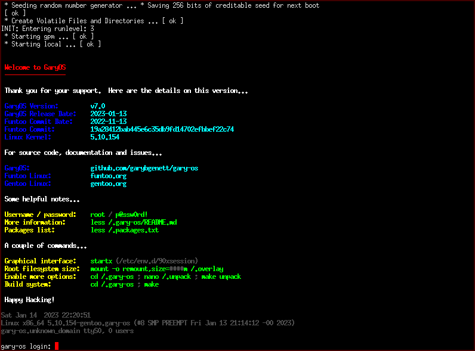
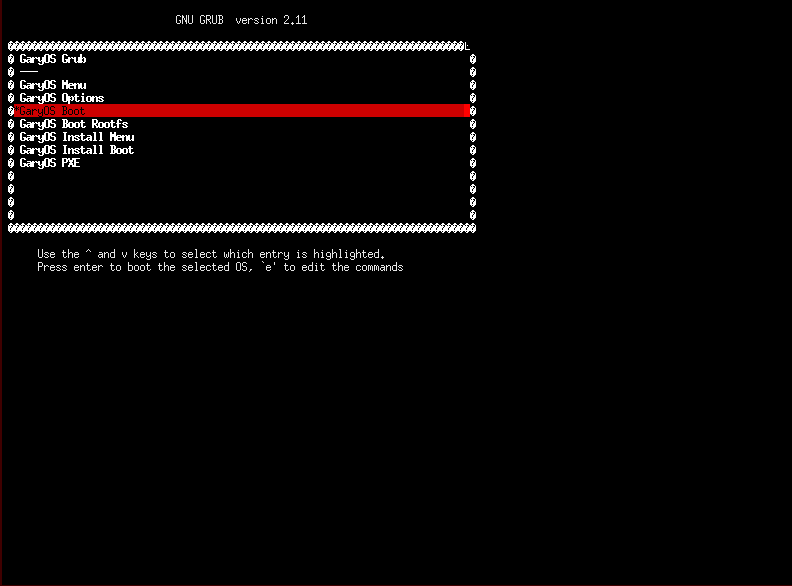
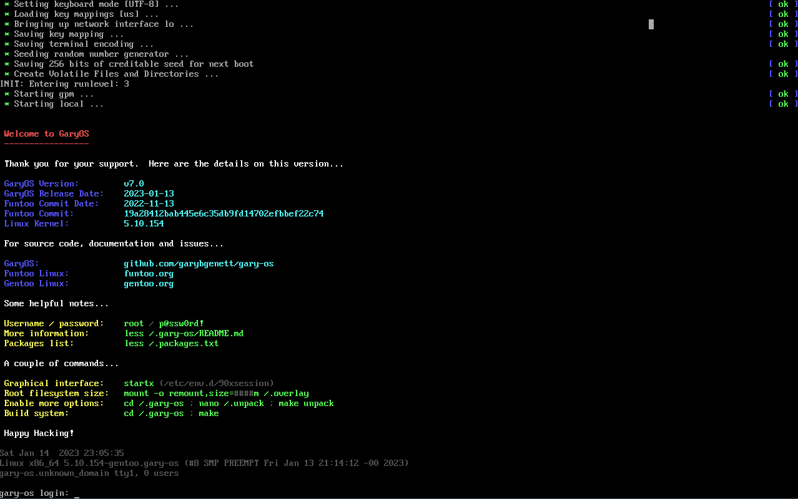

# Welcome to GaryOS

--------------------------------------------------------------------------------

|  | "The one file that does it all."
|:---      |:---
| Latest   | [v9.0 2025-09-08] -- [Kernel], [Rootfs], [Boot], [Disk]
| Homepage | <http://www.garybgenett.net/projects/gary-os>
| Download | <https://sourceforge.net/projects/gary-os>
| Source   | <https://github.com/garybgenett/gary-os>

[](https://sourceforge.net/projects/gary-os/files/latest/download)

| [Documentation] | |
|:---        |:---
| [Overview] | [Quick Start], [Requirements], [Support]
| [Booting]  | [Linux], [Windows], [GRUB], [EFI], [PXE], [Virtual]
| [Running]  | [Networking], [GUI], [Update], [Filesystem]
| [Building] | [Compile], [Manage], [Image], [Install]

| [Information] | |
|:---        |:---
| [Goals]    | [Design], [Builder], [Loader]
| [Project]  | [References], [Contributing], [Licensing]
| [Details]  | [Versioning], [Repository], [Tools], [Ecosystem]
| [Release]  | [Process], [Checklist], [Publish]
| [Versions] | [v9.0 2025-09-08], [v8.0 2024-05-16], [v7.0 2023-01-14], [(...)]

[GaryOS]: http://www.garybgenett.net/projects/gary-os
[Gary B. Genett]: http://www.garybgenett.net
[gary-os@garybgenett.net]: mailto:gary-os@garybgenett.net?subject=GaryOS%20Submission&body=Thank%20you%20for%20sending%20a%20message%21

--------------------------------------------------------------------------------

# Documentation ################################################################
[Documentation]: #documentation

--------------------------------------------------------------------------------

## Overview ####################################################################
[Overview]: #overview

**[GaryOS] is an entire [GNU/Linux] system in a single bootable file.**  It is
also a [Builder] system to create and package [Gentoo] installations.

[Builder] creates custom root filesystems that GaryOS can load into memory in
place of its own.  GaryOS can build new or updated versions of itself from
within itself.

Key features:

  * Optimized source-based Gentoo system with [GNU] toolchain
  * Fast in-memory filesystem does not require a physical device
  * Can be booted from anywhere a [Linux Kernel] can
  * Upgrades are as simple as replacing the file

Primary uses:

  * System rescue and recovery
  * Anonymous and secure workstation
  * GNU/Linux learning environment
  * Installation of Gentoo

Unique advantages:

  * Source-based distributions are more flexible and powerful than binary ones
  * A single [Kernel] file is easier to manage and boot than an ISO image
  * GaryOS is stored on media as a resident of it, not the purpose of it

No other GNU/Linux distribution takes the same approach or has the same features
as GaryOS.

<!--  -->



### Quick Start ################################################################
[Quick Start]: #quick-start

Download the latest [Kernel], and select a boot method:

  1. Use [Virtual] to try it out or test it (quickest and easiest)
  2. Follow the instructions for either [Linux] or [Windows]
  3. Configure an existing [EFI] bootloader
  4. Host on a [PXE] server

Log in as `root` with password `p@ssw0rd!`.  Any boot media can be detached.
Use the normal `shutdown now` or simply power off when finished.

### Requirements ###############################################################
[Requirements]: #requirements

A 64-bit x86 CPU is required.  [GaryOS] is not built for any other platforms.
Intel and AMD x86 processors are by far the most common for desktop and laptop
computers, which is what GaryOS was designed for.

The booted system requires at least 4GB of RAM.  Some of the advanced features
and uses require additional memory, and 8GB is recommended.

The GaryOS [Kernel] is several hundred MB, and 1GB of storage is recommended.
This will be closer to 3GB if the [Rootfs] is also used.  All efforts have been
made to make GaryOS as compact as possible without sacrificing functionality or
pruning the filesystem.

You will also need a keyboard and monitor in order to use GaryOS, although
a serial terminal will work just fine.

### Support ####################################################################
[Support]: #support

[Gary B. Genett] is the sole developer and maintainer of [GaryOS].  It is
a personal project with aspirations of recognition as an actual distribution,
however misguided.

All documentation is in this file and the usage output of the [Builder] scripts.
Everything in [Booting], [Running] and [Building] are specifically tested and
supported.  See [Checklist] for details on the final testing done every release.

While there appears to be some adoption of GaryOS, it is not yet enough to
warrant a formal ticket system.  For any issues, or to share the creative ways
you are using GaryOS, please contact the author directly at
[gary-os@garybgenett.net].

--------------------------------------------------------------------------------

## Booting #####################################################################
[Booting]: #booting

[GaryOS] is a [Linux Kernel] with a large embedded [Linux initramfs] (see
[Design]).  It can be booted in the exact same way as a standard Linux kernel,
and from anywhere that a Linux kernel can.

  |           | |
  |:---       |:---
  | [Linux]   | Starting from any [GNU/Linux] system
  | [Windows] | Starting from a Microsoft Windows system
  | [GRUB]    | USB or hard drives, from either GNU/Linux or Windows
  | [EFI]     | Existing EFI systems, which are the contemporary standard
  | [PXE]     | Networked environment, or for rapid [Rootfs] testing with [QEMU]
  | [Virtual] | Run virtualized on any platform, for [Building] or testing

All standard Linux kernel parameters are valid.  In addition, GaryOS has added
a number of `groot*` options, which specify the initial amount of memory
reserved for the filesystem and other aspects of the boot process.  Full
details on these parameters are in [Filesystem] and [Loader].

### Linux ######################################################################
[Linux]: #linux

Starting from [GNU/Linux] is easier than with [Windows], for obvious reasons.
There are two options.

  1. Use an existing bootloader configuration
  2. Use the [GaryOS] [GRUB] tooling

It is recommended to use the first if it is available.  The simplest version
for GRUB is below, with the `linux` line matching the location of the GaryOS
kernel.

  ```
  menuentry "GaryOS" {
    set debug=linux
    linux (hd0,1)/gary-os/gary-os.kernel
  }
  ```

The `gary-os.grub.cfg` file in the [Boot] archive is a good example of
a complete GRUB configuration file.  It is sourced from
[grub/grub.menu.gary-os.cfg], and provides many additional features and
benefits over the example above.

  ```
  menuentry "GaryOS Menu" {
    configfile (hd0,1)/gary-os/gary-os.grub.cfg
  }
  ```

Both of the these options will also work for GRUB installations on USB drives.
See [GRUB] to create or update a bootable USB drive.  For EFI systems, see
[EFI].  Any bootloader that can boot Linux will work, but GaryOS is not tested
with them, so no instructions or support is provided.

### Windows ####################################################################
[Windows]: #windows

Installation for Windows systems is not complicated, but does involve a few
steps.  Microsoft consistently changes the way their bootloader works, and what
items are supported.  The [v3.0] version of [GaryOS] was the last one to support
direct modification of the Windows 7/8 bootloader.  In Windows 10, Microsoft
removed support for the application type required to boot the GaryOS [GRUB]
image.  As such, using a USB drive is the safest and easiest method.  There are
alternatives to the Windows bootloader that can dual-boot Windows and
[GNU/Linux], but they are not tested and no support is provided.

Steps for creating the bootable USB drive are in [GRUB].

### GRUB #######################################################################
[GRUB]: #grub

The [GaryOS] [Boot] file contains everything needed to create and update [GNU
GRUB] on both hard drives and USB drives.  The core of the tooling is the
[scripts/grub.sh] script.

Once a drive has been set up, place the GaryOS [Kernel] in the `gary-os`
directory as `gary-os.kernel`.  The `gary-os.grub.cfg` file can also be placed
in that directory and edited as needed.

  ```
  /gary-os/gary-os.grub.cfg
  /gary-os/gary-os.kernel
  ```

The drive can be booted using the BIOS or EFI boot menu on any computer that
supports booting from removeable media.  It provides a menu which auto-selects
the most advanced option available.  This menu can be updated at any time using
the [scripts/grub.sh] script within GaryOS, following the directions in
"GNU/Linux" below.  The `gary-os.grub.cfg` file can be updated anytime with the
latest [grub/grub.menu.gary-os.cfg].

**GNU/Linux**

The [scripts/grub.sh] script can be run directly from the command line.  Running
it without any arguments will display the usage documentation.  It expects to be
run from within the GaryOS [Repository], since it requires the menu files in
[grub/].

Be advised that this script creates a brand new partition table on whatever
drive is targeted.  Only use this on a brand new or empty device.  The update
option should only be used on drives that were created by the script or that
have a matching partition table layout.  Only the partition numbers and codes
need to match.

  | Partition | Start Sector | End Sector | Size       | Code | Name
  |---:       |---:          |---:        |---:        |---:  |:---
  | 1         |      2121728 |    7271860 |    2.5 GiB | 0700 | Microsoft basic data
  | 3         |        24576 |    2121727 | 1024.0 MiB | EF00 | EFI System
  | 4         |         4096 |      24575 |   10.0 MiB | EF02 | BIOS boot partition

This is the output from `gdisk -l loopfile.img`.  Using `fdisk -l` will produce
similar output.

**Windows**

These instructions are tested on Windows 10, but should work just fine on
anything Windows 7 or later.  They use [Rufus] to install the [GRUB] image onto
a USB drive.

  1. Insert a new or empty USB drive at least 4GB in size
  2. Download the [Boot] archive, right click and 'Extract'
  3. Double-click `rufus*.exe`, click allow, and decline updates
     2. For 'Device', select the USB drive
     3. For 'Boot Selection', use the large 'Select' button and `loopfile.img`
     4. Click 'Start'
     5. Read the warning and click 'OK' when ready
     6. Click 'Close' if it completed successfully
  4. Right-click the Windows 'Start' menu, and select 'Disk Management'
     1. The drive will have both lettered (e.g. D:) and unallocated space
     2. Right-click the lettered drive and select 'Delete Volume'
     3. Read the warning and click 'Yes' when ready
     4. Right-click the expanded unallocated space and select 'Simple Volume'
     5. Follow the prompts, using 'exFAT' as the 'File System'
     6. Click 'Finish' when ready

There will be a new drive letter available in 'My Computer', but it will be
empty.  Create the `gary-os` directory and add the `gary-os.kernel` as
described at the at the beginning of [GRUB].  The `gary-os.grub.cfg`
instructions are also supported.

### EFI ########################################################################
[EFI]: #efi

Both the [GaryOS] [Kernel] and the GRUB `x86_64.efi` file in [Boot] (see [GRUB])
are EFI applications, and can be used directly from an EFI menu on an
appropriate partition.

Booting from either of these files with EFI is tested and supported, but the
necessary EFI configuration steps are not.

### PXE ########################################################################
[PXE]: #pxe

In a networked environment [GaryOS] can boot from a central server.  This is
often used in labs or environments where centralized management of
infrastructure is critical.

Both the GaryOS [Kernel] and the GRUB `x86_64.efi` file in [Boot] (see [GRUB])
can be loaded directly from PXE.  The [Boot] image will automatically select and
load GaryOS from the server, and will also pass any additional boot parameters
to the [Linux Kernel] directly from the PXE server configuration.

DHCPd and TFTPd are included, so GaryOS can also act as the PXE server.  An
example DHCPd configuration is below.  The `x86_64.efi` image must be used as
the `filename` in order to pass Linux kernel parameters to GaryOS via
`extensions-path`.  Otherwise, the GaryOS kernel can be used directly as
`filename` without any other options.

  ```
  next-server             0.0.0.0;
  filename                "/gary-os/gary-os.grub/x86_64.efi";
  option root-path        "/gary-os/gary-os.kernel";
  option extensions-path  "<kernel parameters>";
  ```

Using [Image] to create modified [Filesystem] images could form the basis of
a completely automated and centrally managed lab or server farm.

### Virtual ####################################################################
[Virtual]: #virtual

Using virtualization is is the quickest and easiest way to try out or test
[GaryOS].  On a [GNU/Linux] system, [QEMU] is high-performance and
low-complexity, and is what the author uses for all development and testing of
GaryOS (see [Checklist]).  However, it is not well suited for other platforms,
such as Windows, and [VirtualBox] is the best choice there.  VirtualBox also
runs on GNU/Linux, if desired, but it is not included in GaryOS.

The instructions below use 4096MB (4GB) for memory, to emulate a minimal system
which meets the [Requirements].  On systems with only 4GB of memory,
virtualization will not work, and using [GRUB] to create a USB drive is the best
path.

**QEMU**

Use the package manager to install QEMU.  It is available on all major
distributions, including GaryOS.  Once installed, it is simple to get it
running.

  ```
  modprobe kvm_intel
  qemu-system-x86_64 -m 4096 -kernel gary-os.kernel
  ```

The [Disk] file is a pre-made QEMU image that is already installed with [GRUB]
and the [Kernel].

  ```
  qemu-system-x86_64 -m 4096 gary-os-*.qcow2
  ```

See [Checklist] for additional information on how QEMU is used in the
development of GaryOS.

**VirtualBox**

Once [VirtualBox] is installed, create a new virtual machine.

  |                   | |
  |:---               |:---
  | Type              | Linux
  | Version           | Other Linux (64-bit)
  | Memory            | 4096 (or greater)
  | Virtual disk file | gary-os-*.qcow2 (the [Disk] file)
  | Enable EFI        | on

This new virtual machine will run GaryOS [GRUB] and boot the [Kernel].

  [VirtualBox]: https://www.virtualbox.org

--------------------------------------------------------------------------------

## Running #####################################################################
[Running]: #running

There are many things that can be done with [GaryOS] once it is booted, some of
which are outlined in [Overview].  It is essentially a packaged [Gentoo]
installation.  There are a few common tasks that are documented to make them
easier, and some additional capabilities specific to GaryOS.

  * Set up [Networking]
  * Run the [GUI] graphical interface
  * [Update] or install new packages
  * Loading a different [Filesystem] into memory

By default, GaryOS starts the fewest processes possible and does not mount any
hard drives or partitions.  This is for security, rescue and forensics.

See [Support] if you wish to share any creative uses for GaryOS that you come up
with.

### Networking #################################################################
[Networking]: #networking

For security, no networking configuration or daemons are run by default, but
several networking packages are installed.  Instructions for Ethernet, Wireless
and [OpenSSH] `sshd` are below.

The [Gentoo Networking] page contains full details on all the configuration
possibilities.  For the purposes of [GaryOS], a simple single-interface
configuration is likely all that is needed.

**Ethernet**

The [dhcpcd] utility is the quickest and easiest to use.

  ```
  rc-update add dhcpcd default
  openrc
  ```

This should automatically detect the best interface to use and configure it with
DHCP.  It can also be run explicitly on a specific interface using something
like `dhcpcd eth0`.

In case this does not work as expected or there is no DHCP available, the `ip`
command from [iproute2] can be used to configure manually.  Starting with `ip
address` will show all the available interfaces and their status.  Use `ip help`
for more information on how to use this command.

**Wireless**

The configuration for wireless is slightly more involved, especially since it is
done on the command line.  The [wpa_supplicant] package is very comprehensive
and accomplishes the goal in the fewest steps.

  ```
  nano /etc/wpa_supplicant/wpa_supplicant.conf
  rc-update add wpa_supplicant default
  rc-update add dhcpcd default
  openrc
  ```

If it is required to manually discover an available network, use the `wpa_cli`
command.  If preferred, the `wpa_gui` graphical utility is available on
[Rootfs].

  ```
  scan
  scan_results
  add_network
  list_networks
  set_network 0 scan_ssid 1
  set_network 0 ssid "<ssid>"
  set_network 0 psk "<password>"
  enable_network 0
  select_network 0
  status
  save_config
  ```

The `wpa_cli` command supports tab-completion, so it is only necessary to type
the first few letters of each command.  Use `iwconfig` to verify success.

  ```
  rc-service wpa_supplicant restart
  ```

In cases where the changes do not immediately take effect, the above will
restart the daemon and reinitialize the interface.

**OpenSSH**

If remote access to GaryOS is needed, OpenSSH `sshd` is the absolute best
option.

  ```
  passwd root
  rc-update add sshd default
  openrc
  ```

It is very important to note that `root` access is enabled, which is why the
password should be changed before enabling SSH.

  [Gentoo Networking]: https://wiki.gentoo.org/wiki/Handbook:AMD64/Installation/Networking
  [dhcpcd]: https://roy.marples.name/projects/dhcpcd
  [iproute2]: https://wiki.linuxfoundation.org/networking/iproute2
  [wpa_supplicant]: https://w1.fi/wpa_supplicant

### GUI ########################################################################
[GUI]: #gui

[GaryOS] boots to the command line by default.  To run the [X.Org] graphical
interface, use `startx`.

  | Utility           | [Kernel]       | [Rootfs]
  |:---               |:---            |:---
  | Window manager    | [dwm]          | Includes [Openbox]
  | Terminal emulator | [rxvt-unicode] | Also the default
  | Web browser       | [Links]        | Includes [Firefox]

The dwm title bar has brief reminders for the shortcuts below.  Use
`XSESSION=openbox startx` for Openbox instead of dwm.  In Links, use the top bar
for the menu and `g` to open the URL bar.

  |                       | |
  |:---                   |:---
  | GaryOS Readme         | Alt-Left
  | The dwm man page      | Alt-Right
  | Command entry         | Alt-p
  | Terminal emulator     | Alt-Shift-Enter
  | Web browser           | Alt-Ctrl-Enter
  | Web browser (Firefox) | Alt-Shift-Ctrl-Enter

X.Org tries to auto-detect the best resolution for the display.  If it does not,
use the `xrandr` utility to change it.  If preferred, the `arandr` graphical
utility is available on [Rootfs].

  ```
  xrandr --query
  xrandr --output Virtual-1 --mode 1920x1200
  ```

These are not the prettiest or most feature-rich applications.  They were
selected for their lightweight nature and minimal dependencies, along with the
high geek factor (see [Goals]).

  [Openbox]: http://openbox.org
  [Firefox]: https://www.mozilla.org/firefox

### Update #####################################################################
[Update]: #update

[GaryOS] is essentially a packaged [Gentoo] system, and can be updated or
modified just like a normal installation.

  1. Set up [Networking]
  2. Increase the size of the filesystem
  3. Use `make unpack` to install necessary directories
  4. Run whatever [Portage] `emerge` or other commands that are desired

It is important that `make unpack` is run before making updates to the system,
since it may remove or replace added files if done afterward.

**Increase Filesystem Size**

The default size of the filesystem includes a minimal amount of additional
space, but not enough to unpack the directories and make other updates.

  ```
  mount -o remount,size=6144m /.overlay
  df -h /.overlay
  ```

Replace `6144` with the amount of MB to allocate.  This may also be specified
as `6g` for GB.  GaryOS is tested with 6GB, to ensure this works with systems
that have 8GB of memory.

**Unpack Directories**

GaryOS has a basic, self-documented, packages-like system for fetching and
unpacking additional directories (see [Design]).

  ```
  cd /.gary-os
  nano /.unpack
  make unpack
  ```

Nano is a basic, user-friendly text editor.  The author uses [Vim], so that
option is also available.  The syntax to use is documented in the file.  For
this, just remove the first character from all the `gcc` and `emerge` lines
(except for `gentoo-repo.git`).

**Emerge**

At this point, GaryOS is like any other Gentoo installation.  The `emerge`
command can be used to install and update packages as usual.

  ```
  emerge app-misc/hello
  ```

Be mindful of how much is being installed compared to available memory.  Each
package will collect source distribution files, require filesystem space for
building, install new files, and generate a binary package file.  It can add up
fast.

GaryOS maintains a packages repository on [SourceForge] for the latest version.
All packages in [gentoo/sets/packages] are included, and match the settings in
[Rootfs] ([Kernel] may need to re-compile some of them).  Installing these
packages should be quick and inexpensive.

If a large number of non-GaryOS packages are required, building an [Image] of an
updated [Filesystem] or doing an [Install] are good alternatives.

### Filesystem #################################################################
[Filesystem]: #filesystem

[GaryOS] uses a three-stage process for unpacking the root filesystem into
memory.  This is covered in detail in [Design].  During this process,
a filesystem image is selected, loaded into memory, and booted.  The default is
to use the one packed into the [Kernel].  GaryOS has the capability to load
a different filesystem.

  * Located on a [GRUB] USB drive or other storage
  * From a [Linux] or [EFI] configuration (if the EFI partition is large enough)
  * Using [PXE]

Fundamentally, all that is needed is the ability to pass [Linux Kernel]
parameters and host the filesystem image.  GaryOS has a pre-made [Rootfs] that
comes with many additional packages installed.  See [Image] to create new ones.

There are a few kernel parameters specific to GaryOS that are needed to load an
external filesystem.

  |            | |
  |:---        |:---
  | groot      | Disk or partition that the [Rootfs] resides on
  | groot_size | Initial amount of memory reserved for the filesystem
  | groot_file | Path to the [Rootfs] (default: /gary-os/gary-os.rootfs)
  | groot_hint | Provide a hint to [Loader] (used by [Boot]), in case of error

[Loader] goes into each of these in much more detail.  GaryOS provides example
defaults in the [Boot] configuration file, sourced from
[grub/grub.menu.gary-os.cfg].  Generally, only `groot` and `groot_size` are
required to load an external [Image].

The `groot_size` value for the pre-made GaryOS [Rootfs] should be at least
`4096m`, or `4g` if that format is preferred.  The [Boot] file is already
correctly configured (see [GRUB]).

--------------------------------------------------------------------------------

## Building ####################################################################
[Building]: #building

In addition to being a [GNU/Linux] system, [GaryOS] is the [Builder] system used
to produce itself.  It has three main purposes.

  * [Compile] and [Manage] [Gentoo] installations
  * Make an [Image] of a root [Filesystem]
  * [Install] GaryOS to disk directly from memory

These sections are in logical order, following the full lifecycle of creating
a build, managing it or creating an image of it, and ultimately installing it.
They are mainly for reference from other sections, and not necessarily
a prescribed list of steps to take.

### Compile ####################################################################
[Compile]: #compile

The process to build and install a source-based distribution like [Gentoo] from
scratch is long and complex.  The [GaryOS] [Builder] is designed to condense it
into a small number of atomic steps using [GNU Make].

  | Target  | Action
  |:---     |:---
  | init    | Initial build from a [stage3] tarball
  | doit    | Update a build with any package or configuration changes
  | krnl    | Recompile [Linux Kernel] list, and 'doit' once complete
  | redo    | Complete start-to-finish rebuild of entire system
  | edit    | Wrapper around [gentoo.config] customization script

To prepare for a build, create a `sources` directory in the repository and
download a `stage3` tarball into it.  Each version of GaryOS has a link in
[Versions] to the `stage3` it was built with.  The default GaryOS settings in
[gentoo/make.conf] call for a `generic_64` tarball.

The `build` directory will be created and used as a 'chroot'.  If this will be
a direct installation to disk, create the `build` directory manually and mount
the target partition on it.  Do not mount any subdirectories until after the
'init' phase.  Upon completion of the build, the [GRUB Quick Start] is all that
is needed to make it ready to boot into.

None of the steps in this process are specific to GaryOS, other than the
starting [Portage] configuration and the selected list of packages.  This
process is generally applicable to all Gentoo systems.

**Init**

The target directory `build` will be created.  It will grow to many tens of GB,
so having 100GB available is recommended.

For the best performance, change the `MAKEOPTS -j` variable in
[gentoo/make.conf] to the number of CPU threads your system has.

  ```
  grep "^processor" /proc/cpuinfo | wc -l
  ```

The last line in [gentoo/_funtoo] must be the release version and commit hash
in [Portage] that it is desired to use for the packages repository.

Make any desired Portage package selection and configuration changes, and then
start the build with `make init`.  By default, the base GaryOS [Kernel] package
list and configuration is used.  The full [Rootfs] build can be done with `make
P=_gary-os init`.  If so, be sure to add `P=_gary-os` in all the rest of the
steps as well.

The initial build is where errors are most likely to occur.

  * Dependency conflicts
  * Conflicting `$USE` variable values
  * Package incompatibilities causing build breaks
  * Broken or out of date packages

These are all beyond the control of GaryOS.  See [Builder] and [Process] for
strategies to deal with these quickly and continue building.

This phase must at least reach the stage where it is building the selected
package list after updating the base system (the `@system` set) and downloading
all the source files.  The 'doit' target can be used after that to resume.  In
that case, the 'redo' phase must definitely be performed, to make sure the
skipped 'init' steps are run.

**Doit**

The main purpose of this target is to do a system update after any package or
configuration changes.  It also handles a number of backend items key to
keeping things clean and orderly.

Once the 'init' phase reaches the point of building the package list, this phase
can be used to resume after failed builds.  It can be handy to do `make
DOFAST=true doit` to skip some of the ancillary time-consuming steps until
a successful build is achieved, and then do a final `make doit` to ensure they
are run.  This is a real time saver.

The `DOREDO=true` variable is also available, and forces an update and
re-archive of the Portage tree.

Successful completion of this phase is the #1 measure of a healthy build.  It
can't be run too often.

**Krnl**

Somewhere between a 'doit' and a 'redo', this rebuilds the [Linux Kernel] list
and completes the 'doit' process, without performing a full system rebuild as is
done with 'init' or 'redo'.  Primarily used during development to build and test
new kernels and configurations.

The `DOREDO=true` variable is also available, and removes all previous kernels,
along with their modules and configurations.

**Redo**

This is almost identical to 'init'.  Once the build successfully completes
'doit', it is good practice to recompile everything from start to finish.  This
resolves any mutual dependencies, filters out binary bootstrap packages, and
guarantees that the entire system can build flawlessly with the current package
list and configuration.

Ultimately, this is maybe not a necessary step under normal circumstances.
However, when performing a new build there are usually multiple passes with
'init' and 'doit', with lots of changes to the configuration and additions to
[gentoo/overlay/].  The final rebuild pass is to catch any bugs with the build
that might have slipped in.

**Edit**

This target is only required if the [gentoo.config] script has been modified
(see [Builder]).  It performs any automated customization steps that are
desired.

  [stage3]: https://wiki.gentoo.org/wiki/Stage_tarball
  [GRUB Quick Start]: https://wiki.gentoo.org/wiki/GRUB2_Quick_Start

### Manage #####################################################################
[Manage]: #manage

The [GaryOS] [Builder] is designed to support the "rolling release" model of
source-based distributions, where the system is more or less constantly being
updated and built.  Its original and ongoing purpose is to do exactly that.  It
supports all [Gentoo] systems, regardless of how they were installed.

  * [Install] from GaryOS
  * Direct [Compile] into a partition
  * Using the [Gentoo Installation Guide]

There are a lot of steps and miscellaneous tasks that are best practice to keep
a Gentoo system in good working order.  Over time, it is also inevitable that
the [Portage] configuration will acquire cruft or not be using new options that
are available.  GaryOS [Builder] condenses all this into a simple two-step
process.

  | Target  | Action
  |:---     |:---
  | update  | Update the [Portage] packages repository and `emerge` databases
  | upgrade | Upgrade the system to the current packages and configuration

The `update` target is completely automated, but `upgrade` requires interaction
at various steps to accept updates or confirm configuration file changes.

At the end of `upgrade`, the `/_gentoo` directory is updated with information
to aid in the maintenance of a healthy system.  See [Builder] for details.

### Image ######################################################################
[Image]: #image

This is the process of creating new [Filesystem] images.  It requires
a directory installed with [GaryOS] (or [Gentoo]).  There are multiple sources
where this can come from.

  * Within GaryOS itself ([Update])
  * GaryOS [Install]
  * [Compile] directory
  * Gentoo system built with the [Gentoo Installation Guide]

There are two key requirements of the final image for it to work correctly.

  1. That `/init` is an executable location for the startup process
  2. Has the same [Linux Kernel] version (the `/usr/lib/modules` directory)

[Image] tries to handle the first automatically.  Verify this, and be mindful of
the second if the source directory is updated (such as [Update] or [Compile]).
If needed, there is a `packdir` archive of the `/usr/lib/modules` directory in
[Downloads].

It may be important to review the package file that will be used.  There are
GaryOS variables in them which control portions of this process, such as which
directories to package, archive or exclude and what `rc-update` or other
commands should be run to tailor the image filesystem (see [Loader]).  The
defaults in [gentoo/sets/gary-os] should be reasonable.  A more complete
configuration is in [gentoo/sets/_gary-os].

  ```
  make rootfs
  make P=_gary-os rootfs
  ls -adl build/.gary-os-*/*.rootfs*
  ```

It is also possible to directly build a customized [Kernel], so that the
two-stage [Filesystem] process is not needed.

  ```
  make release
  ls -adl build/.gary-os-*/*.kernel*
  ```

This method is a little more involved, since it creates an image and then
compiles it into the Linux kernel.  There may also be unexpected issues when
trying to boot a kernel with a very large [Linux initramfs] (anything bigger
than the GaryOS [Kernel] is untested).

Both will skip portions of the build if there are already output files present,
including the final image or kernel.  This is sometimes desired when iterating,
to avoid doing the same time-consuming steps repeatedly.  However, it can be
problematic when the intention is to implement changes.

  ```
  make clean
  make DOREDO=true rootfs
  make DOREDO=true release
  ```

The `clean` target will completely remove all [Builder] output files, restoring
the `build` directory to its original state.  This includes all images and
kernels, along will all their supporting files.  The `DOREDO` variable is
specific to each target, and only rebuilds the relevant files.

### Install ####################################################################
[Install]: #install

One of the [Goals] of [GaryOS] is to simplify the process of installing
[Gentoo].  This can be done using [Compile] or from directly within GaryOS.

  | Image    | Packages              | Configuration
  |:---      |:---                   |:---
  | [Kernel] | [packages.txt]        | Optimized for size and fewer dependencies
  | [Rootfs] | [packages.rootfs.txt] | Complete configuration and package list

The final result will be identical to a [Compile] for both images.  There are
only a few steps to doing the install.

  1. Unpack all the [Loader] directories
  2. Reset all configuration files to default *(optional)*
  3. [Update] packages and configurations *(optional)*
  4. Run the install

All of this except the [Update] will be done by [Builder].

At least 8GB of memory will be required, due to the size of the fully unpacked
filesystem.  The base size of the in-memory filesystem will need to be at least
6G, which can be set with `groot_size=6144m` before booting (see [Filesystem])
or `mount -o remount,size=6144m /.overlay` after booting (see [Update]).

  ```
  mount -o remount,size=6144m /.overlay
  ```

It is strongly advised to at least skim through the [Gentoo Installation Guide]
or the [Gentoo Installation Guide].  GaryOS aims to simplify the process, and is
not meant to supplant all understanding of it.

**Unpack**

This ensures all directories are uncompressed onto the filesystem.  Without it,
the install will be incomplete.

  ```
  cd /.gary-os
  make DOREDO=true unpack
  ```

Both [Kernel] and [Rootfs] require [Networking] for this, although [Rootfs]
already has all of the absolutely necessary directories locally.  For
a network-less install, use [Rootfs] and follow the unpacking instructions in
[Update].  Namely, edit the `/.unpack` file to skip the external
`gentoo-repo.git` directory.

**Configuration Files** *(Optional)*

By default, the small amount of branding and configuration that GaryOS does will
be copied over to the installation.

  ```
  cd /.gary-os
  make DOREDO=true install
  ```

The above will reset the running GaryOS to a completely default system.  The
full list of modified files is in "Modifications" below.

  ```
  cd /.gary-os
  make reset
  ```

Somewhat similar to the above, a `reset` will "upgrade" the Portage
configuration to [gentoo/sets/packages].

**Update** *(Optional)*

Perform any [Update] steps that are desired to have in the final install.  If
there are a large number of changes, it is best to wait and perform them on the
final system after it is installed.

Any changes to package configuration files can also be done at this stage.  They
should be done on the live [Filesystem] and not the [Repository].

**Install**

The system is ready for install.  All that is needed is to mount the target
partition (replace `/dev/sda1` with the desired location).  This partition must
be empty.  Anything on it will be erased.

  ```
  mkdir /.install
  mount /dev/sda1 /.install
  make install
  ```

Once complete, the final step is to install the GRUB bootloader.  Some helpful
pointers are provided at the end of the `install` process.  This is a simple
step, but has a few important considerations, so it is not automated.  The [GRUB
Quick Start] can also be a helpful starting point.

The `install` target can be run any number of times without issue.  Make sure to
install GRUB as the absolute last step.

All that is left are a few key items to make the system ready for use.

  * Update `/etc/fstab` with location of the root filesystem
  * Set hostname in `/etc/conf.d/hostname`
  * Change the password: `passwd root`

Enjoy your new system!

**Modifications**

As part of the [Image] process, several files are added, modified, or replaced
to ensure a good experience, fix issues, and generally create a particular look
and feel for GaryOS.

  | File                      | Change   | Purpose
  |:---                       |:---      |:---
  | /etc/issue                | Replaced | [_artifacts/files/issue]
  | /etc/motd                 | Added    | [_artifacts/files/issue]
  | /init                     | Added    | Symbolic link to `/usr/bin/init`
  | /etc/inittab              | Modified | Added serial console
  | /etc/fstab                | Modified | Commented all lines
  | /etc/locale.gen           | Replaced | [_artifacts/files/locale.gen]
  | /etc/conf.d/hostname      | Modified | Set to `gary-os`
  | /etc/profile.d/setterm.sh | Added    | Disabled terminal bell
  | /etc/wpa_supplicant/wpa_supplicant.conf | Replaced | [_artifacts/files/wpa_supplicant.conf]
  | /etc/ssh/sshd_config      | Modified | Enabled `root` login
  | /etc/env.d/90xsession     | Added    | Set default window manager
  | /etc/X11/Sessions/dwm     | Modified | Tune [dwm] running environment

In cases where the files are modified or replaced, the original is kept as
a `*.gary-os` file.

In addition to the above, the [OpenRC] configuration is modified (see
[Loader]).  This is primarily to disable all network daemons.  The [gpm] daemon
is enabled for mouse support on the console.

As for the overall system, all configuration files for the [Linux Kernel] and
[Portage] are in the repository.

  |                    | |
  |:---                |:---
  | [Linux Kernel]     | [linux/]
  | [Portage]          | [gentoo/]
  | [Portage Overlays] | [gentoo/overlay/]

Finally, the `root` password is set to `p@ssw0rd!`.

  [Gentoo Installation Guide]: https://wiki.gentoo.org/wiki/Handbook:AMD64/Full/Installation
  [OpenRC]: https://wiki.gentoo.org/wiki/OpenRC
  [gpm]: https://www.nico.schottelius.org/software/gpm

--------------------------------------------------------------------------------

# Information ##################################################################
[Information]: #information

--------------------------------------------------------------------------------

## Goals #######################################################################
[Goals]: #goals

Here are the guiding principles that keep [GaryOS] going in a consistent
direction with a consistent purpose.

Top requirements:

  * Source-based, all-purpose, multi-OS rescue environment ([Gentoo])
  * Complete system, installing packages normally with no filesystem pruning
  * Stay as default as possible, aside from [Portage] tuning of package builds
  * Generic 64-bit build, supporting all modern x86 platforms
  * Bootable from a single kernel file, using [Linux initramfs]
  * Simplify the process of installing Gentoo
  * Proudly demonstrate and evangelize old-school hacker geekiness

Other objectives:

  * Support as many boot methods as possible (see [Booting])
  * Minimalist, performant Portage configuration, using only what is needed
  * Avoid closed source licenses and binary packages as much as possible
  * Example configuration and scripts for tuning and maintaining a Gentoo system
  * Foster a DIY (Do It Yourself) approach through good documentation
  * Learning environment for those new to [GNU/Linux] or Gentoo

Explicit non-goals:

  * Growing bigger than a single kernel file ([Rootfs] [Filesystem] aside)
  * Development of a helper scripts or commands library for non-GaryOS tasks
  * Customization or deep branding of overall system
  * Alteration of boot or 'init' infrastructure
  * Becoming a complete desktop environment

GaryOS will continue to be a [Builder] and [Kernel] above all else.

### Design #####################################################################
[Design]: #design

[GaryOS] uses [Linux initramfs] as a root filesystem, which was only designed
for minimal environments to load kernel modules, do hardware detection, and
perform other tasks before mounting an actual root filesystem.  This approach
presented a few challenges in the early versions of GaryOS.

  * The GaryOS filesystem is a few GB, which was large and slow to boot
  * [GNU/Linux] packages continue to grow in size and number of dependencies
  * Repeatedly installing the same packages for a full workstation was tedious
  * Many sizeable directories were only needed occasionally or not at all
  * The [Linux Kernel] compression was minimal, with only minor speed gain

The solutions for each of these are somewhat mutually exclusive.

  * [Squashfs] is a compressed filesystem designed for live GNU/Linux systems
  * [Busybox] and [Coreutils] are enough to find and mount a filesystem image
  * [XZ compression] of directories, and unpacking at boot or on demand

In GaryOS [v4.0], a comprehensive three-stage [Loader] infrastructure was
developed, along with a robust, generally usable [Builder] system.

  1. Linux kernel loads and uncompresses the base initramfs into memory
  2. A minimal environment locates, mounts and boots a [Rootfs]
  3. XZ compressed directories are unpacked or left archived

This approach provides a number of advantages:

  * Sizeable pre-built root filesystems can be created and used on demand
  * Large directories are maximally compressed, and can be hosted externally
  * Basic package management for selectively used directories
  * Boot time is minimized, with better progress output

In the default [Kernel], this all happens seamlessly.  When loading
a [Filesystem], additional kernel parameters are required (see [Loader]).

  [XZ compression]: https://tukaani.org/xz

### Builder ####################################################################
[Builder]: #builder

Installing source-based [GNU/Linux] systems like [Gentoo] involves a large
number of steps and is very error-prone.  Keeping them up to date can be equally
complex.  [GaryOS] addresses this by applying a monolithic release model.  The
[Builder] system was developed over many years to accomplish the goal of
a reliable process that produces repeatable builds.

[Builder] is more of an abstract concept than it is an actual thing, but it is
most helpful to think of it this way.  [Builder] is the very core of GaryOS.

Type `make usage` (basic) or `make help` (advanced) to get started.

**Responsibilities**

  * User interface for the build system
    * [GNU Make] (usage | help)
    * [gentoo/_system] -v
  * [Building]
    * [Compile]
    * [Manage]
    * [Install]

  | Component          | Purpose
  |:---                |:---
  | [Makefile]         | Wrapper around the other components
  | [gentoo/_system]   | Worker for all of [Building] (core of [Builder])
  | [gentoo/_funtoo]   | [Gentoo] [Portage] commit tracking
  | [gentoo/.emergent] | Audit script which creates `/_gentoo` directory
  | [gentoo.config]    | Optional customization for 'edit' in [Compile]

**Build Tuning**

The `SELECT` variable defined in the package set file determines which `eselect`
values are configured during the build.  There are other variables which do
similar tuning, and are self-explanatory.  The full list is at the top of
[gentoo/sets/gary-os].

**Build Output**

The `/_build` directory is created by [Compile], which archives the [Linux
Kernel] and [Portage] configurations, along with the [stage3] tarball and
[Portage] tree used.  The purpose of this directory is to centralize everything
needed to reproduce the build.

After [Compile] or [Manage], the `/_gentoo` directory will be created by
[gentoo/.emergent].  It performs a number of checks of the Portage configuration
and the installed system.  The results are in the `/_gentoo/+checks` text file.
This file is very helpful in keeping a Portage configuration in line with
upstream, particularly the addition or removal of `$USE` flags.

The `/_gentoo.log` file is created every [Compile].  It contains the complete
output of the build, for troubleshooting.  Please include this file when
reporting any issues (see [Support]).

**Tooling**

Another primary function of [Makefile] and [gentoo/_system] is to provide
helpful tooling for the sometimes arduous process of bringing [Compile] 'init'
or 'redo' through to a successful build.  [Process] walks through the author's
workflow, and has examples of these helpers.

Use [gentoo.config] to automate any final build steps with [Compile] 'edit'.  By
default, it is run inside the 'chroot', so all paths should start from `/`.
Examples are creating users or making initial configuration changes.  The author
uses a custom version to make sure important personal steps are not forgotten.

**Colorization**

One final feature of [Builder] is that [Compile] is wrapped with a "colorizer"
(based on [GoboLinux]), which makes all the output very pretty.

The entire process of compiling a new system is quite a beautiful thing to
admire.  Sit and watch it sometime, and contemplate how many human hands and
minds are at work in front of your very eyes.

**References**

References to this section:

  * [Compile]
    * Init -- Strategies for build breaks
    * Edit -- [gentoo.config]
  * [Manage]
    * Upgrade -- `/_gentoo`
  * [Repository]
    * Heart and soul -- [gentoo/_system]
    * Audit script and information -- [gentoo/.emergent]

These are to make sure everything is cross-linked, and that this section is
complete.

### Loader #####################################################################
[Loader]: #loader

The sole purpose of [Loader] is to create and load a [Filesystem] into memory
when [Booting].  This process and the rationale behind it are detailed in
[Design].  [Loader] also creates [Kernel] and [Rootfs] for distribution using
[Image].

[Loader] is more of an abstract concept than it is an actual thing, but it is
most helpful to think of it this way.

**Responsibilities**

  * [Running]
    * [Filesystem]
  * [Building]
    * [Image]

  | Component           | Purpose
  |:---                 |:---
  | [Makefile]          | Wrapper around the other components
  | [gentoo/_system]    | All environment and variable initialization
  | [gentoo/_release]   | Worker for [Filesystem] [Image] (core of [Loader])
  | [_artifacts/files/] | [Filesystem] [Image] scripts and configuration

**Package Directories**

During [Image] creation (also [Kernel] and [Rootfs]), large directories are
packaged with [XZ Compression] to maximize space savings (see [Design]).
Commands such as `rc-update` are run during [Image] creation or at boot time
after directories are unpacked.  There are variables sourced from the package
set file which define these.

  |        | |
  |:---    |:---
  | RCUPDT | Commands such as `rc-update` to be run before [Image] creation
  | FSUPDT | Identical to `RCUPDT`, but are run after directories are unpacked
  | FSPACK | Included in [Image], and unpacked during boot
  | FSKEEP | Included in [Image], but are left packed
  | FSARCH | Excluded from [Image], but are packed for later use
  | FSEXCL | Excluded from [Image], and are not packed at all

Note that these can be nested one level deep.  Meaning, a directory can be
`FSARCH` from a `FSPACK` or `FSEXCL` from a `FSKEEP` and so on.  Anything nested
deeper will produce undefined results.  They are evaluated in reverse order, so
lower on the list will take precedence.  For example, if the same directory is
set in `FSEXCL` and `FSPACK`, the directory will be `FSEXCL`.  Take this into
consideration when nesting, since doing things like `FSPACK` on a `FSKEEP`
subdirectory will also produce undefined results.

Complete examples of usage are in [gentoo/sets/gary-os] and
[gentoo/sets/_gary-os].

**Overlay Environment**

The [Booting] process goes through three stages (see [Design]).  In the first,
[Kernel] loads into memory along with a [Linux initramfs].  This is a minimal
environment designed to locate, mount and boot a [Filesystem] such as [Rootfs].
There are [Linux Kernel] parameters which inform this environment.

First, `groot_size` specifies how much memory to reserve for the filesystem.
This must be large enough to contain both [Kernel] and [Filesystem], plus
a little extra for space needed after booting.  Then, the `groot` partition is
mounted and `groot_file` is loaded into memory.  Optionally, `groot_hint` can be
used to provide helpful information in case loading the [Filesystem] fails.

During this stage, Linux kernel modules are loaded from the [Kernel] internal
[Filesystem] if they are needed.

In case of failure, a minimal shell environment will be loaded.  It is
menu-driven and self-documented.  Its purpose is to facilitate real-time user
selection of a [Filesystem] to load.

Once a [Filesystem] is loaded, directories are unpacked as specified in 'Package
Directories' above, and `/init` on the target filesystem is booted.  The
majority of Linux kernel modules will be loaded after this point, so it is
important that the [Filesystem] has a `/usr/lib/modules` directory which matches
the [GaryOS] [Kernel] version.  There is a `packdir` archive of this directory
in [Downloads].

The final in-memory filesystem is mounted on the backend at `/.overlay`, so it
can be resized after boot using something like `mount -o remount,size=6144m
/.overlay` (see [Update]).

If desired, the intermediary environment used to locate and boot the
[Filesystem] can intentionally be loaded by using `groot=null`.  This process is
a great learning experience for anyone interested in the [GNU/Linux] boot
process or how live systems work.  In particular, there is a reference
implementation of a completely in-memory [Squashfs] [Overlay] in
[_artifacts/files/initrc].

**References**

References to this section:

  * [Booting]
    * Parameter -- `groot_size`
  * [Filesystem]
    * Parameters -- `groot_size`, `groot`, `groot_file` and `groot_hint`
  * [Image]
    * Symbolic link -- `/init`
    * [Loader] directories and `rc-update`
  * [Design]
    * [Linux Kernel] parameters
  * [Repository]
    * Heart and soul -- [gentoo/_release]

These are to make sure everything is cross-linked, and that this section is
complete.

--------------------------------------------------------------------------------

## Project #####################################################################
[Project]: #project

The project is not named [GaryOS] out of any delusions of grandeur or egomania.
It was coined years before its public birth by a pair of good friends who jested
at the amount of time and effort spent tuning and customizing a computing
environment.  The author's workstation was jokingly called "Gary OS".

GaryOS as it is today is the organic evolution of that long-ago workstation into
the public project it has become.  It is produced directly from the same build
the author uses on their personal system.  In all ways, it **IS** Gary's OS.

That said, the name is meant to be humorously, ironically self-deprecating.
GaryOS would not be possible if not for the incalculable, invaluable
contributions of countless developers and enthusiasts worldwide over the course
of many decades (as far back as the 1970s).  It is the author's hope that this
small contribution to the universe of open source software is valuable to
someone other than themself.

### References #################################################################
[References]: #references

[GaryOS] has maintained a [steady stream of downloads] since its debut in
February 2014.  It has also shown up in some notable places.

  * [Gentoo ecosystem] ([2018-08](https://github.com/garybgenett/gary-os/raw/master/_artifacts/archive/gentoo-20.08.pdf))
  * [List of non-systemd distributions] (proudly)
  * [Softpedia review of v3.0] (not just a paste of the [README.md] text)

Hopefully, it will someday make these lists as well.

  * [Wikipedia Gentoo derived distributions] (it was, before the page re-write)
  * [DistroWatch]

Snapshots of all discovered references to GaryOS are kept in
[_artifacts/archive/].  Please contact the author at [gary-os@garybgenett.net]
with any other acknowledgments you find.  The fact that you are reading this
counts.

  [steady stream of downloads]: https://sourceforge.net/projects/gary-os/files/stats/timeline?dates=2014-02-28+to+2038-01-19
  [Gentoo ecosystem]: https://github.com/gentoo/gentoo-ecosystem
  [List of non-systemd distributions]: https://sysdfree.wordpress.com/2019/03/09/135
  [Softpedia review of v3.0]: https://linux.softpedia.com/get/Linux-Distributions/GaryOS-103629.shtml

  [Wikipedia Gentoo derived distributions]: https://en.wikipedia.org/wiki/Gentoo_Linux#Derived_distributions
  [DistroWatch]: https://distrowatch.com/table.php?distribution=funtoo

  <!-- Unused, Tracking Only -->

  [Gentoo pamphlet]: https://download.sumptuouscapital.com/gentoo/fosdem2018/gentoo-fosdem2018-flyer.pdf
  [Random blog mention]: https://josesfreelinux.blogspot.com/2015/03

### Contributing ###############################################################
[Contributing]: #contributing

Contributions are welcome and will be publicly acknowledged.

**Patches**

To create patches there is a function in [.bashrc].  Submit patches to
[gary-os@garybgenett.net].

  ```
  ./.bashrc git-patch <parent commit>
  ```

The parent commit should be the last commit hash before your changes.  This will
create `####-*` patch files for each commit since the parent.  Email them as
attachments.  [GitHub] pull requests or links to commits in a forked repository
also work.

**Inclusivity**

The author is passionate about who you are, your ideas, what you manifest, and
how you carry yourself in the world.  Come as you are.  We are all just human
beings.

  * [Social Protection & Human Rights Equality and Non-discrimination]
  * [Contributor Covenant Code of Conduct]

Let's all just be kind to one another, so we someday won't even need documents
like these.

  [Social Protection & Human Rights Equality and Non-discrimination]: https://socialprotection-humanrights.org/framework/principles/equality-and-non-discrimination
  [Contributor Covenant Code of Conduct]: https://contributor-covenant.org/version/1/4/code-of-conduct.html

### Licensing ##################################################################
[Licensing]: #licensing

Starting with [v4.0], [GaryOS] is released under the [GNU GPL v3.0].  It was
originally released under a [BSD-style license].

The [FSF] and [GNU] projects are dedicated to a completely open society based
on open source computing.  The GPL is a manifesto as much as it is a license.

The [BSD] philosophy is that BSD-style licenses are yet more permissive and
foster the innovation of new technologies by allowing them to be driven by
profit.

The original intent was to support the BSD philosophy.  Switching to the GPL was
predicated by a few factors.

  * The perspective that code is a written work of art and not a product
  * Proliferation of software patents and intellectual property enforcement
  * GaryOS is written entirely in interpreted and not compiled languages
  * It is unlikely that any proprietary software will be based on GaryOS
  * Patches are sometimes submitted to GPL projects

For further details, see the current [License] or the licenses for the
individual [Versions].

The author and contributors do not offer any warranty.  You take all
responsibility for your use of this software.  If it breaks, you own all the
pieces.

  [GNU GPL v3.0]: https://www.gnu.org/licenses/gpl-3.0.html
  [BSD-style license]: http://opensource.org/licenses/BSD-3-Clause
  [BSD]: https://en.wikipedia.org/wiki/Berkeley_Software_Distribution

--------------------------------------------------------------------------------

## Details #####################################################################
[Details]: #details

This is additional information mostly pertaining to how the [GaryOS] project is
managed.  It is not necessary reading in order to use any aspect of GaryOS, and
is only for the curious.

  * [Versioning] scheme
  * [Repository] overview
  * Primary [Tools] used
  * The overall [Ecosystem] GaryOS lives in

If you read this section, the author would appreciate a note at
[gary-os@garybgenett.net].

### Versioning #################################################################
[Versioning]: #versioning

Version numbers follow [Semantic Versioning].  The major version number
increments whenever the [Portage] tree commit is updated.  Minor version numbers
increment for release updates that are on the same Portage tree.

Revisions to the [GaryOS] [Builder], [Loader] and Portage configuration will
also line up with the Portage tree, since they can only be validated by doing
a full build or a build update.

  [Semantic Versioning]: https://semver.org

### Repository #################################################################
[Repository]: #repository

Here is an overview of the repository contents, in order of relative importance:

  | Project Files            | Purpose
  |:---                      |:---
  | [README.md]              | All documentation
  | [LICENSE.md]             | License for project and all patches
  | [Makefile]               | Primary interface to [Builder] and [Loader]
  | [packages.txt]           | [Kernel] packages, sizes and install information
  | [packages.rootfs.txt]    | [Rootfs] packages, sizes and install information
  | [_commit]                | Solely for author tracking of source repositories

  | Key Directories          | Purpose
  |:---                      |:---
  | [grub/]                  | [GNU GRUB] menu files (for [Boot], see [GRUB])
  | [linux/]                 | [Linux Kernel] configuration files
  | [gentoo/]                | [Portage] configuration, [Builder] and [Loader]
  | [gentoo/overlay/]        | Version management and fixing broken packages
  | [scripts/]               | [GRUB] and [QEMU]
  | [_artifacts/files/]      | [Loader] scripts and [Image] configuration files
  | [_artifacts/patches/]    | [GaryOS] features and improvements
  | [_artifacts/archive/]    | Miscellaneous stash space, including [References]
  | [_artifacts/images/]     | Icons and screenshots

  | Core Files               | Purpose
  |:---                      |:---
  | [.bashrc]                | Scripting library (author's [Bash] configuration)
  | [scripts/grub.sh]        | [GRUB] backed worker script
  | [linux/_config]          | Simplifies [Linux Kernel] configuration updates
  | [gentoo/_system]         | Heart and soul of [Builder], and GaryOS itself
  | [gentoo/_release]        | Heart and soul of [Loader] (and publish process)
  | [gentoo/_funtoo]         | [Gentoo] [Portage] commit tracking
  | [gentoo.config]          | Example for "Edit" stage in [Compile]
  | [gentoo/.emergent]       | Audit script and information (see [Builder])
  | [gentoo/savedconfig/x11-wm/dwm] | Slightly modified [dwm] configuration
  | [gentoo/sets/gary-os]    | [Kernel] packages, [Loader] and [Image]
  | [gentoo/sets/_gary-os]   | [Rootfs] packages, [Loader] and [Image]

  | Other                    | Purpose
  |:---                      |:---
  | [.vimrc]                 | Keeps this handy and also published online
  | [xclock_size_hack.patch] | Make [gkrellaclock] look like `xclock`

The commit history for all these components reside in more than one personal
repository.  They are merged together into the public GaryOS [Git] repository by
[gentoo/_release].  This means that even minor merging issues or the inclusion
of new files will result in a public repository that can not 'fast-forward' and
will require re-cloning.

  [README.md]: https://github.com/garybgenett/gary-os/blob/master/README.md
  [LICENSE.md]: https://github.com/garybgenett/gary-os/blob/master/LICENSE.md
  [Makefile]: https://github.com/garybgenett/gary-os/blob/master/Makefile
  [packages.txt]: https://github.com/garybgenett/gary-os/blob/master/packages.txt
  [packages.rootfs.txt]: https://github.com/garybgenett/gary-os/blob/master/packages.rootfs.txt
  [_commit]: https://github.com/garybgenett/gary-os/blob/master/_commit

  [grub/]: https://github.com/garybgenett/gary-os/blob/master/grub
  [grub/grub.menu.gary-os.cfg]: https://github.com/garybgenett/gary-os/blob/master/grub/grub.menu.gary-os.cfg
  [linux/]: https://github.com/garybgenett/gary-os/blob/master/linux
  [gentoo/]: https://github.com/garybgenett/gary-os/blob/master/gentoo
  [gentoo/overlay/]: https://github.com/garybgenett/gary-os/blob/master/gentoo/overlay
  [scripts/]: https://github.com/garybgenett/gary-os/blob/master/scripts
  [_artifacts/files/]: https://github.com/garybgenett/gary-os/blob/master/_artifacts/files
  [_artifacts/patches/]: https://github.com/garybgenett/gary-os/blob/master/_artifacts/patches
  [_artifacts/images/]: https://github.com/garybgenett/gary-os/blob/master/_artifacts/images
  [_artifacts/archive/]: https://github.com/garybgenett/gary-os/blob/master/_artifacts/archive

  [.bashrc]: https://github.com/garybgenett/gary-os/blob/master/.bashrc
  [scripts/grub.sh]: https://github.com/garybgenett/gary-os/blob/master/scripts/grub.sh
  [linux/_config]: https://github.com/garybgenett/gary-os/blob/master/linux/_config
  [gentoo/_system]: https://github.com/garybgenett/gary-os/blob/master/gentoo/_system
  [gentoo/_release]: https://github.com/garybgenett/gary-os/blob/master/gentoo/_release
  [gentoo/_funtoo]: https://github.com/garybgenett/gary-os/blob/master/gentoo/_funtoo
  [gentoo.config]: https://github.com/garybgenett/gary-os/blob/master/gentoo.config
  [gentoo/.emergent]: https://github.com/garybgenett/gary-os/blob/master/gentoo/.emergent
  [gentoo/savedconfig/x11-wm/dwm]: https://github.com/garybgenett/gary-os/blob/master/gentoo/savedconfig/x11-wm
  [gentoo/sets/gary-os]: https://github.com/garybgenett/gary-os/blob/master/gentoo/sets/gary-os
  [gentoo/sets/_gary-os]: https://github.com/garybgenett/gary-os/blob/master/gentoo/sets/_gary-os
  [gentoo/sets/packages]: https://github.com/garybgenett/gary-os/blob/master/gentoo/sets/packages

  [.vimrc]: https://github.com/garybgenett/gary-os/blob/master/.vimrc
  [gkrellaclock]: http://gkrellm.srcbox.net
  [xclock_size_hack.patch]: https://github.com/garybgenett/gary-os/blob/master/gentoo/overlay/x11-plugins/gkrellaclock/files-patches/xclock_size_hack.patch

  <!-- Global Links -->

  [gentoo/make.conf]: https://github.com/garybgenett/gary-os/blob/master/gentoo/make.conf
  [gentoo/package.use]: https://github.com/garybgenett/gary-os/blob/master/gentoo/package.use
  [gentoo/sets/]: https://github.com/garybgenett/gary-os/blob/master/gentoo/sets
  [_artifacts/files/initrc]: https://github.com/garybgenett/gary-os/blob/master/_artifacts/files/initrc
  [_artifacts/files/issue]: https://github.com/garybgenett/gary-os/blob/master/_artifacts/files/issue
  [_artifacts/files/locale.gen]: https://github.com/garybgenett/gary-os/blob/master/_artifacts/files/locale.gen
  [_artifacts/files/wpa_supplicant.conf]: https://github.com/garybgenett/gary-os/blob/master/_artifacts/files/wpa_supplicant.conf
  [ego_commit_hack.patch]: https://github.com/garybgenett/gary-os/blob/master/gentoo/overlay/app-admin/ego/files-patches/add-commit-option-to-ego-sync.2.7.4-r1.patch

### Tools ######################################################################
[Tools]: #tools

[GaryOS] relies on too many open source projects to count (see [Project]).
However, there are a few primary tools and sites which are used to build and
distribute GaryOS.  An additional list of secondary items is in [Ecosystem].

First and foremost, the projects which brought open source into the mainstream:

  * [FSF] & [GNU] (GNU's Not Unix)
  * [Linux Foundation] & [Linux Kernel]
  * [GNU/Linux]

  [FSF]: https://www.fsf.org
  [GNU]: https://www.gnu.org
  [Linux Foundation]: https://linuxfoundation.org
  [Linux Kernel]: https://kernel.org
  [GNU/Linux]: https://gnu.org/gnu/linux-and-gnu.html

The backbones which do the real heavy lifting in GaryOS:

  * [Gentoo], [Portage] & [Portage Overlays]
  * [Linux initramfs]
    * [Squashfs]
    * [Overlay]
    * [Busybox]
    * [Coreutils]
  * [GNU GRUB]
  * [GNU Make]
  * [QEMU]

  [Gentoo]: https://www.gentoo.org
  [Portage]: https://wiki.gentoo.org/wiki/Portage
  [Portage Overlays]: https://wiki.gentoo.org/wiki/Project:Overlays
  [Linux initramfs]: https://kernel.org/doc/Documentation/filesystems/ramfs-rootfs-initramfs.txt
  [Squashfs]: https://www.kernel.org/doc/html/latest/filesystems/squashfs.html
  [Overlay]: https://www.kernel.org/doc/html/latest/filesystems/overlayfs.html
  [Busybox]: https://busybox.net
  [Coreutils]: https://www.gnu.org/software/coreutils/coreutils.html
  [GNU GRUB]: https://gnu.org/software/grub
  [GNU Make]: https://www.gnu.org/software/make
  [QEMU]: https://www.qemu.org

Kernel configuration, package lists and acknowledgments:

  * [Gentoo Kernel]
  * [Grml]
  * [SystemRescue]

  [Gentoo Kernel]: https://wiki.gentoo.org/wiki/Kernel
  [Grml]: https://grml.org
  [SystemRescue]: http://www.system-rescue.org

Special thanks to the sites which made worldwide distribution possible:

  * [SourceForge]
  * [GitHub] & [Git]

  [SourceForge]: https://sourceforge.net
  [GitHub]: https://github.com
  [Git]: https://git-scm.com

GitHub inspired the initial publication of this project, and SourceForge
provided the distribution platform that made it possible to instantly reach an
international audience.

### Ecosystem ##################################################################
[Ecosystem]: #ecosystem

Beyond the [Tools] used to create and publish [GaryOS], there is a small
universe of projects that either provided inspiration or are used for GaryOS.

To start, homage to those who started it all:

  * [tomsrtbt] (floppy disk!)
  * [KNOPPIX]
  * [Debian Live]

Tomsrtbt was especially influential.  GaryOS is modeled very much after Tom's
project.  Some familiar quotes straight from the [tomsrtbt FAQ]:

  ```
  1) tomsrtbt is
     "The most GNU/Linux on one floppy disk"
     Tomsrtbt stands for:
       "Tom's floppy which has a root filesystem and is also bootable."

  2) Design goals
     as much stuff as possible on 1 floppy disk
     keep it self contained, build under itself
     try to make it behave like a normal system
     rescue and recovery functions get priority
  ```

Thank you so much, Tom.

  [tomsrtbt]: http://www.toms.net/rb
  [tomsrtbt FAQ]: http://www.toms.net/rb/tomsrtbt.FAQ
  [KNOPPIX]: https://knopper.net/knoppix
  [Debian Live]: https://debian.org/devel/debian-live

Inspiration and core concepts were also provided by:

  * [Metro]
  * [Buildroot] & [BusyBox]
  * [GoboLinux]

  [Metro]: https://funtoo.org/Metro_Quick_Start_Tutorial
  [Buildroot]: https://buildroot.org
  [BusyBox]: https://busybox.net
  [StaticPerl]: http://software.schmorp.de/pkg/App-Staticperl.html
  [GoboLinux]: https://gobolinux.org

Projects which are relied on daily for critical tasks or highly visible
components, and deserve mention:

  * [Bash]
    * [Vim]
    * [Rsync]
    * [OpenSSH]
  * [X.Org]
    * [Suckless] [dwm]
    * [rxvt-unicode]
    * [Links]
  * [Rufus]
  * [Grip]

  [Bash]: https://www.gnu.org/software/bash
  [Vim]: https://www.vim.org
  [Rsync]: https://rsync.samba.org
  [OpenSSH]: https://www.openssh.com
  [X.Org]: https://x.org
  [Suckless]: https://suckless.org
  [dwm]: https://dwm.suckless.org
  [rxvt-unicode]: http://software.schmorp.de/pkg/rxvt-unicode.html
  [Links]: http://links.twibright.com
  [Rufus]: https://rufus.ie
  [Grip]: https://github.com/joeyespo/grip

Gratitude to all those who have contributed to making [GNU/Linux] the most
powerful and flexible operating system on the planet, and a true "run
anywhere, anyhow" computing environment.

--------------------------------------------------------------------------------

## Release #####################################################################
[Release]: #release

This is additional information pertaining exclusively to how [GaryOS] is
developed, tested and released.  As the author evolved an ever more formal and
repeatable process, it made sense to make this part of the public documentation.

Everything needed to perform these steps is in the [Repository] or the
[Downloads] folder.

### Process ####################################################################
[Process]: #process

**Personal Build**

*`Iterate {`*

  * `make DOFAST=true doit`
    * [x] *Errors()*
  * `make gendir`
    * `vi ./build/_gentoo/+checks`

*`}`*

*`Errors {`*

   * `make <package atom>`
     * [ ] Copy "gentoo browse" link to browser
     * [ ] Copy "gitweb" link to browser
   * `make overlay-<package atom|/|%>^<ebuild>^<commit>`
     * `mkdir ./gentoo/overlay/<package atom>`
     * `(cd _build/gentoo/gentoo; git-list -20 -l -- <package atom>)`
     * `(cd _build/gentoo/gentoo; git-list -2 -- <package atom>/<ebuild>)`
     * `(cd _build/gentoo/gentoo; vdiff -l -20 -- <package atom>)`
   * `make emerge-<package atom|/|%>`

*`}`*

  * `cd .setup/gentoo.make`
    * `(cd _builds; rm ./_gentoo.working; ln _gentoo ./_gentoo.working)`
        * `(cd _builds/_gentoo; rm-all; ll)`
        * `(cd _target/iso; vi ./.urls; ./.urls -f)`
        * `(cd _build/gentoo/gentoo; git pull; GIT_PAGER= git-list -n1)`
        * `(cd _build/gentoo/gentoo; ll ./sys-kernel/gentoo-sources)`
        * `(cd _build/gentoo/gentoo; ll ./sys-kernel/gentoo-kernel)`
    * `vi ./gentoo/_release`
        * [ ] Update `${_VERSN}` number
        * `vi ./gentoo/_funtoo`
            * [ ] Update [Gentoo] commit
        * `vi ./gentoo/sets/*`
            * [ ] [Linux Kernel] versions
            * [ ] Review
        * `vi ./gentoo/package.* ./gentoo/sets/*`
            * [ ] Command comments at top of [gentoo/package.use]
        * `(cd ./gentoo/overlay; ./.review -a)`
            * [ ] Review `.keep` packages
        * [ ] Update `${RUFUS_VER}` number
    * `cd .setup/linux`
        * `(cd _build/gentoo/gentoo; grep -A10 SRC_URI ./sys-kernel/gentoo-kernel/gentoo-kernel-*.ebuild)`
            * `wget [...]`
        * `mv ./kernel-x86_64-fedora.config ./default-gentoo64.config-[...]`
            * `rm ./.default; ln default-gentoo64-[...] ./.default`
            * `rsync -L ./.default ./config-gentoo64-[...]`
        * `rsync -L ./.options ./config-gentoo64-[...]-options`
            * `rm ./.config; ln config-gentoo64-[...] ./.config`
            * `rm ./.options; ln config-gentoo64-[...]-options ./.options`
        * `vi ./.options`
            * [ ] Update source kernel version
            * [ ] Review
  * `make DOMODS=false init`
    * [ ] Until `@world`, at least
        * `while :; do make DOMODS=false DOFAST=true init; inotifywait --event modify gentoo/make.* gentoo/package.* gentoo/sets/*; done`
        * `(cd .setup; vi gentoo/make.* gentoo/package.* gentoo/sets/*; vdiff -g gentoo/make.* gentoo/package.* gentoo/sets/*)`
    * [x] *Iterate()*
  * `./linux/_config ./build/usr/src/linux`
        * `rsync $(realpath ./linux/.default) ./build/usr/src/linux/.config`
        * `chroot ./build bash -c "(cd /usr/src/linux && make olddefconfig)"`
        * `rsync ./build/usr/src/linux/.config $(realpath ./linux/.default)`
    * [ ] Review final version
        * `vdiff $(realpath ./linux/.default) $(realpath ./linux/.config).*.DONE`
        * `rsync $(realpath ./linux/.config).*.DONE $(realpath ./linux/.config)`
        * `rm $(realpath ./linux/.config).*`
  * `make DOMODS=false doit`
    * [ ] Update `savedconfig` directory
    * [x] *Iterate()*
  * `cd .setup/gentoo.make`
    * `(cd .setup; git-commit ./linux ./gentoo)`
  * `make DOMODS=false redo`
    * [x] *Iterate()*
    * `make DOMODS=false doit`
    * `(cd _builds; rsync ./_gentoo/ ./_gary-os.working)`
  * `make DOMODS=true edit`
    * `(cd _builds; rm ./_gentoo.boot; ln _gentoo ./_gentoo.boot)`
    * `(cd _builds; rsync ./_gentoo/ ../../_toor)`
    * [ ] Boot to "gary-os"
        * `rsync [...]/_root/{.runit,.setup} [...]/_toor/`
    * [ ] Boot to "\_toor"
        * [ ] Smoke test for 2-3 weeks
        * [x] *Iterate()*
        * `_sync _sys _clone _full _setup`
    * [ ] Boot to "gary-os"
        * `_sync _sys _chroot [...]`
        * `rsync [...]/_toor/{.runit,.setup} [...]/_root/`
    * [ ] Boot to "\_root"
  * `make DOMODS=true doit`
    * `ll ./build/ ./build/_build`
    * `(cd .setup; git-commit ./gentoo)`
    * `(cd _builds; rsync ./_gentoo/ ../../_toor)`
    * `_sync _sys _clone _full _setup`

**GaryOS Build**

*`Validate { <kernel> <check> <option> <target>`*

  * `make` *`${3}`* `doit && make` *`${3}`* `DOREDO=true` *`${4}`*
    * [x] *Iterate()*
  * [ ] Target size of *`${1}`* or less (`make check` = Total disk usage: *`${2}`*)
    * [ ] Command comments at bottom of [gentoo/package.use]
        * `make` *`${3}`* `depends-<package atom|/|%>`
        * `make` *`${3}`* `depgraph-<package atom|/|%>`
        * `make` *`${3}`* `belongs-<file path|/|%>`
    * `make` *`${3}`* `DOFAST=true doit && make` *`${3}`* `DOFAST=true` *`${4}`*
        * `make` *`${3}`* `check`
        * `mkdir ./mnt; mount -o loop ./build/.gary-os-*/gary-os-*.cpio.rootfs ./mnt; ncdu ./mnt; umount ./mnt; rm ./mnt`
    * `ll ./build/.gary-os-*`
  * `make` *`${3}`* `gendir`
    * [ ] Command comments at bottom of [gentoo/make.conf]
    * `vi ./build/_gentoo/+checks`

*`}`*

  * `cd .setup/gentoo.gary-os`
    * `make DOFAST=true init`
    * `make DOREDO=true krnl`
  * [x] *Validate( 850MB 1.4GiB '' devel )*
    * [ ] Verify `#{rootfs}` markers
  * `make ROOTFS=false devel`
    * `./scripts/qemu-minion.bsh ./build/.gary-os-*/gary-os-*.kernel 1 -m 8192`
    * [ ] Test kernel size and root filesystem resize
  * [x] *Validate( 1.8GB 3.4GiB P=\_gary-os rootfs )*
  * `(cd .setup; git-commit ./gentoo)`
  * `make doit && make DOREDO=true devel`

**Test & Publish**

  * `cd .setup/gentoo.gary-os`
    * `(cd _builds/.gary-os.release; rm ./v#.#; ln ../_gary-os.working/.gary-os-* ./v#.#)`
        * `vi ./gentoo/_release`
            * [ ] Add `${RELEASE[*]}` number, with empty `${CMTHASH[*]}`
        * `make DOREDO=true _release_grub`
        * `make _publish_release`
    * `(cd _builds; rm ./_gary-os.boot; ln _gary-os.working ./_gary-os.boot)`
        * `_sync boot`
    * `make DOREDO=true DOTEST=true _release_grub`
  * [x] [Checklist]
  * [x] [Publish]

**Rolling Builds**

*`Retry {`*

   * `make DOMODS=true DOFAST=true init`
   * `make DOMODS=true DOFAST=true doit`

*`}`*

  * `cd .setup/gentoo.make`
    * `(cd _builds; rm ./_gentoo.boot; ln ../../_toor ./_gentoo.boot)`
    * `(cd _builds; rm ./_gentoo.working; ln ../../_toor ./_gentoo.working)`
    * `chmod -vR 755 ./gentoo/`
    * `vi ./gentoo/_funtoo`
        * `(cd _build/gentoo/gentoo; git pull; GIT_PAGER= git-list -n1)`
        * [ ] Update [Gentoo] commit
    * `make DOMODS=true DOREDO=true doit`
        * [x] *Retry()*
    * `make DOMODS=true edit`

### Checklist ##################################################################
[Checklist]: #checklist

Everything in [Booting], [Running] and [Building] should be validated below.

**[Compile]**

  * (Completed in [Process])

**[Linux] / [Virtual]**

  * `./scripts/qemu-minion.bsh ./build/.gary-os-*/gary-os-*.kernel 1`
    * [ ] Boot time
    * `rc-status`
        * `htop`
        * `free; df -h; ls -la / /.overlay /.overlay/*`
    * `mount -o remount,size=3072m /; df -h`
        * `mount -o remount,size=3072m /.overlay; df -h`

**[GRUB] / [Filesystem]**

  * `./scripts/qemu-minion.bsh ./build/.gary-os-*/gary-os-*.qcow2 1 MBR`
    * [x] Menu
        * [x] Options
            * [ ] Verify "gopts=true"
            * [ ] Test each entry
        * [x] Menu -> Options
            * [ ] Verify values
        * [x] Options -> `reset`
            * [ ] Verify values
        * `reboot`
    * [x] Boot
        * [ ] Verify normal console
        * `cat /proc/cmdline`
            * [ ] Verify "gopts=true"
        * `reboot`
    * [x] Boot Rootfs
        * [x] Options -> `groot=null`
        * [ ] Verify `rootfs` menu is readable
        * `cat /proc/cmdline`
        * `reboot`
    * [x] Boot Rootfs
        * [x] Serial console on `---` entry
        * [x] Options -> `groot=null`
        * `vi /.profile /initrc`
            * `if true; then`
        * `rootfs -`
            * `g`
            * `mount; ls -la /.overlay /.overlay/.overlay; unrootfs; mount`
        * `rootfs = /dev/null /.gary-os; exit 0`
            * `<enter>`
            * `c; exit 0`
            * `l`
            * `<enter>`
            * `q`
        * `rootfs =; mount /dev/sda1 /.groot; exit 1`
            * `mount; ls -la /.groot /.groot/.groot /.groot/.overlay; unrootfs; mount`
            * `rm /usr/bin/mount.*; rootfs /dev/sda1`
            * [ ] Verify `rsync` phase (may exhaust memory)
            * [ ] If it crashes, reset and restart from here
            * `mount; ls -la /.overlay/.overlay; unrootfs; mount`
        * `dotty; exit 0`
            * `dottys`
            * `rootfs =`
            * `modprobe e1000; dhcpcd eth0`
            * `ssh -vv root@10.0.0.254`
            * `exit 1`
            * `unrootfs; mount`
        * `rootfs /dev/sda1`
            * `boot`
    * `rc-status`
        * `htop`
        * `free; df -h; ls -la / /.overlay /.overlay/*`

**[EFI]**

  * `./scripts/qemu-minion.bsh ./build/.gary-os-*/gary-os-*.qcow2 1`
    * [ ] EFI menu (using `\<escape\>`)
        * [x] Boot Maintenance Manager
        * [x] Boot From File
        * [ ] [Boot]
        * `reboot`
    * [ ] Repeat with [Kernel]

**[PXE]**

  * `./scripts/qemu-minion.bsh /dev/null 1`
    * `(cd .store; rsync -L ./gary-os/gary-os.kernel ./_rescue)`
        * [ ] Verify direct boot
    * `(cd .store; rsync -L ./gary-os/gary-os.grub/x86_64.efi ./_rescue)`
    * `vi [...]/dhcpd.conf; sv restart dhcpd tftpd`
        * [ ] Uncomment `root-path`
        * [x] PXE
        * `ls -la /.overlay`
  * `./scripts/qemu-minion.bsh /dev/null 1 -m 8192`
    * `vi [...]/dhcpd.conf; sv restart dhcpd tftpd`
        * [ ] Change `root-path` location
        * [ ] Uncomment `extensions-path`
        * [x] PXE
        * `ls -la /.overlay`
  * `./scripts/qemu-minion.bsh ./build/.gary-os-*/gary-os-*.qcow2 1 -m 8192`
    * [x] Options
        * [x] `dhcp`
        * [x] `pxe: groot`
    * [x] PXE
  * `/.setup/.setconf; sv restart dhcpd tftpd`

**[Windows] / [GRUB] / [Virtual]**

  * `sv stop qemu.windows`
    * `rm /tmp/qemu.windows.img.*`
    * `(cd _systems/qemu; rm windows.img)`
    * `(cd _systems/qemu; qemu-img create -f qcow2 -F qcow2 -o compat=1.1,backing_file=$(ls -L windows-10.*.qcow2 | tail -n1) windows.img)`
  * `./scripts/qemu-windows.bsh / ALT -m 8192`
    * [ ] Download [Boot] and [Kernel] to the desktop
    * [ ] Download and install [VirtualBox]
        * [ ] Use `Desktop` for new [Virtual]
        * [x] Task Manager, Performance
        * [ ] Verify boot
    * [ ] Install [GRUB]
  * `./scripts/qemu-windows.bsh / ALT BOOT -m 8192`
    * [ ] Verify both "Windows" entries
        * `change cdrom0 [...]/en_windows_10_*.iso`
    * [x] Boot
        * `reboot`
    * [x] Windows
        * [ ] Run `bcdedit.bat` as 'Administrator'
  * `./scripts/qemu-windows.bsh / ALT -m 8192`
    * [x] Windows
        * [x] GaryOS Grub (produces EFI error screen)
        * `<escape>`
    * [x] Boot Manager
        * [x] GaryOS Grub
        * [x] Windows
  * `./scripts/qemu-minion.bsh /dev/null 1`
    * [x] Boot
  * `(cd _systems/qemu; rm windows.img)`
    * `(cd _systems/qemu; ln windows-10.qcow2 windows.img)`
    * `rm /tmp/qemu.windows.img.*`
    * `sv restart qemu.windows`

**[Networking] / [GUI]**

  * `./scripts/qemu-minion.bsh ./build/.gary-os-*/gary-os-*.qcow2 1`
    * [ ] Ethernet [Networking]
    * [ ] [GUI]
  * [ ] Boot to "gary-os"
    * [ ] Wireless [Networking]
    * [ ] [GUI]

**[Update] / [Manage] / [Image] / [Install]**

  * `rm /tmp/qemu.gary-os-* /tmp/qemu.null.*`
  * `./scripts/qemu-minion.bsh ./build/.gary-os-*/gary-os-*.qcow2 1 -m 8192`
    * `cd /.gary-os`
        * `rc-update add dhcpcd default; openrc`
            * `mount -o remount,size=6144m /.overlay`
        * `source ./.bashrc`
            * `shell -i`
            * `rsync -L --filter=-_/gentoo.git --filter=-_/sources --filter=-_/build --filter=-_/gary-os root@10.0.0.254:[...]/.setup/gentoo.gary-os/ /.gary-os`
        * `exit 0`
    * `cd /.gary-os`
        * `touch ./overlay`
            * *note: should not be necessary, but resolves: `grub-bios-setup: error: failed to get canonical path of 'overlay'.`*
            * https://unix.stackexchange.com/a/429434
        * `mkdir /tmp/grub; HOME=/.gary-os GRUB_DIR=/.gary-os/grub ./scripts/grub.sh /tmp/grub -fx -k/dev/sda1 /dev/sdb1`
            * `umount /dev/sdb*`
            * `gdisk /dev/sdb`
                * [ ] Expand partition size
            * `./.bashrc format /dev/sdb1`
        * `make unpack`
            * `mount /dev/sdb1 /.install`
            * `mkdir /.install/gary-os`
    * `ls -la ./gary-os/`
        * `rm ./gary-os/gary-os-*.fetch`
        * `make fetch`
            * `sed -i "s|^[#]||g" ./gary-os/gary-os-*.fetch`
            * `for FILE in $(cat ./gary-os/gary-os-*.fetch); do rsync -L --progress root@10.0.0.254:[...]/_builds/_gary-os.working/.gary-os-*/${FILE} /.install/gary-os/; done`
            * `make DOTEST=true fetch`
    * `ls -la /.gary-os-*/`
        * `make DOREDO=true unpack`
            * `sed -i "s|^[+]|*|g" /.unpack`
            * `make unpack`
        * `emerge app-misc/hello`
            * `hello`
        * `emerge app-text/aspell`
            * [ ] Verify from [SourceForge] package
    * `ls -la /.gary-os-*/`
        * `rm /.gary-os-*/gary-os-*.rootfs*`
            * `make rootfs`
            * `mount -o loop /.gary-os-*/gary-os-*.rootfs /mnt; ls -la /mnt; umount /mnt`
    * `ls -la ./sources/; ls -la ./build.install/`
        * `rm ./build; ln -fsv /.install ./build`
        * `mv ./gary-os/gary-os-*.stage3.tar.xz ./gary-os/stage3-generic_64.tar.xz`
        * `make init`
            * [ ] Exit with \<ctrl-c\> once unpacking the `stage3`
        * `ls -la ./build/ ./build/_build`
    * `ls -la /.install/`
        * `rm ./build; ln -fsv / ./build`
        * `make install`
            * [ ] Copy and paste GRUB instructions
            * `cat /.install/etc/issue`
            * `ls -la /.install`
            * `df -h`
        * `make DOREDO=true install`
            * `cat /etc/issue`
    * `vi /.install/etc/inittab`
        * [ ] Uncomment serial console
  * `./scripts/qemu-minion.bsh /dev/null 1`
    * [ ] Verify default boot
        * `hello`
        * `reboot`
    * [x] Boot (manually from GRUB command line)
        * `cd /.gary-os`
        * `touch ./overlay`
        * `mount -o remount,size=3072m /.overlay`
        * `mkdir /tmp/grub; HOME=/.gary-os GRUB_DIR=/.gary-os/grub ./scripts/grub.sh /tmp/grub /dev/sda1`
        * `reboot`
    * [x] Install Menu
        * `<escape>`
    * [x] Install Boot
        * `cd /.gary-os`
        * `make reset`
        * `vi +/#{GFG} /etc/portage/{make.conf,package.use}`
        * `rm /var/db/repos/gentoo`
        * `make update`
        * `make upgrade`
  * `rm /tmp/qemu.gary-os-* /tmp/qemu.null.*`
  * `./scripts/qemu-minion.bsh ./build/.gary-os-*/gary-os-*.qcow2 1 -m 8192`
    * [x] Boot Rootfs
        * [ ] Command comments in [gentoo/sets/_gary-os]
  * `rm /tmp/qemu.gary-os-* /tmp/qemu.null.*`

### Publish ####################################################################
[Publish]: #publish

**Review**

  * `cd coding/gary-os`
  * `vi ./README.md`
    * [ ] [Kernel], [Rootfs] and [Boot] links
    * [ ] [Versions] list in [Header](#welcome-to-garyos)
    * [ ] [Versions] section and release notes
        * `for FILE in coding/gary-os .setup .static; do [...]`
        * `if [ ${FILE} == coding/gary-os ]; then LIST=""; fi`
        * `if [ ${FILE} == .setup ]; then LIST="grub linux gentoo"; fi`
        * `if [ ${FILE} == .static ]; then LIST=".bashrc .vimrc scripts/grub.sh scripts/qemu*"; fi`
        * `(cd ${FILE}; vdiff -g $(sed -n "s|^$(basename ${FILE}): ||gp" [...]/_builds/_gary-os/_commit) ${LIST})`
    * [ ] Screenshots
        * `(cd .setup/gentoo.gary-os; ./scripts/qemu-minion.bsh ./build/.gary-os-*/gary-os-*.qcow2 1)`
            * [x] Peek
        * `wmctrl -i -r 0x00000000 -e 0,0,0,800,600`
            * `vi ~/.Xresources` -> `URxvt.background: rgb:00/00/00`
            * `ctrl-a s, crtl-a F`
            * [x] Gimp -> File -> Create -> Screenshot
        * `remote-viewer`
            * `startx`
            * `xrandr -s 1024x768`
            * [x] Links -> <http://10.0.0.254:6419/#welcome-to-gary-os>
            * [x] File -> Screenshot
        * `(file *; exiv2 *; identify -verbose *) | less`
  * `make TOKN=[...] readme-github`
    * `make DOTEST=true readme`
    * `make readme-all`
        * `pages ./GaryOS-Readme.html`
    * `aspell -c ./README.md`
        * `rm ./README.md.bak`
  * `make readme-clean`

**Commit**

**`Verify {`**

  * `cat ./build/etc/issue ./build/etc/motd ./build/_commit`
  * `for FILE in coding/gary-os .setup .static; do (cd ${FILE}; GIT_PAGER= git-list -n1 2>/dev/null); done`
    * `(cd ./build/.gary-os; GIT_PAGER= git-list -n1)`
  * `./scripts/qemu-minion.bsh [...]`
    * `cd /.gary-os; GIT_PAGER= git log -n1; git status`
    * `GIT_PAGER= git diff`
    * `startx`

**`}`**

  * `cd .setup/gentoo.gary-os`
    * `(cd _builds/.gary-os.release; rm ./v#.#)`
    * `make clean`
    * `ll ./build/ ./build/_build`
  * `(cd .setup; vi gentoo/_release; git-commit -m "Incremented version number." gentoo/_release)`
    * [ ] Commit `${_VERSN}` number
  * `(cd coding/gary-os; git-commit -m "Stamped v#.# release." ./README.md)`
    * `make _publish_gitdir`
    * `(cd _builds/.gary-os/.gary-os; GIT_PAGER= git-list -n1)`
  * `make doit && make DOREDO=true release _prepare_packdirs`
    * `(cd _builds; rsync ./_gentoo/var/cache/{distfiles,binpkgs} ./_gary-os.working/var/cache/)`
    * `./scripts/qemu-minion.bsh ./build/.gary-os-*/gary-os-*.kernel 1`
    * [x] **Verify()**
  * `make P=_gary-os doit && make P=_gary-os DOREDO=true rootfs`
    * `_sync boot`
    * `./scripts/qemu-minion.bsh ./build/.gary-os-*/gary-os-*.kernel 1 "groot=10.0.0.254 groot_size=6144m" -m 8192`
    * [x] **Verify()**
  * `make _publish_prep`
    * `ll ./build/ ./build/_build ./build/.gary-os-*`
  * `(cd _builds; rsync -L ./_gary-os.working/.gary-os-*/ ./_gary-os)`
    * `(cd _builds/_gary-os; git-backup <gentoo commit>.#; GIT_PAGER= git-list -n1)`
  * `(cd .setup; vi gentoo/_release; git-commit -m "Published v#.# release." gentoo/_release)`
    * [ ] Commit `${RELEASE[*]}` number
  * `make _publish_gitdir`
    * `(cd _builds/.gary-os/.gary-os; GIT_PAGER= git-list -n3)`
    * `(cd _builds/.gary-os/.gary-os; GIT_PAGER= git tag -l)`
    * `./.validate`

**Upload**

  * `make _publish_export`
    * `(cd _builds/.gary-os.release; ll ./ ./v#.#)`
  * `make _publish_release`
  * <https://sourceforge.net/projects/gary-os>
    * [ ] Verify page information
    * [ ] Verify directory contents
    * [ ] Update download button
  * <https://github.com/garybgenett/gary-os>
    * [ ] Test v#.# links
  * `cd writing/garybgenett`
    * `make -C projects && make site-force && make export-all`
    * `git-save`

**Personal**

  * `(cd _builds; rm ./_gary-os.boot; ln _gary-os ./_gary-os.boot)`
    * `_sync boot`
  * `cd .setup/gentoo.make`
    * `make DOMODS=true doit`
    * `make DOMODS=true edit`
    * `make _publish_prep`
    * `(cd _builds/_gentoo; git-backup "gary-os v#.#"; GIT_PAGER= git-list -n1)`
    * `(cd _builds; rsync ./_gentoo/ ../../_toor)`
  * `cd coding/gary-os-history`
    * `ln ../gary-os.git ./.git`
    * `GIT_PAGER= git-list -n1`
    * `git checkout README.md`
    * `rm ./.git`

**Celebrate**

  * `cd coding/gary-os`
    * `make TOKN=[...] DOMODS=true DOREDO=true readme-github`
    * `make TOKN=[...] DOMODS=true readme-github`
  * <https://github.com/garybgenett/gary-os/graphs/traffic>
    * [x] [steady stream of downloads]
    * [ ] Downloads_2014-02_to_XXXX-XX.csv

--------------------------------------------------------------------------------

## Versions ####################################################################
[Versions]: #versions

[License]: https://github.com/garybgenett/gary-os/blob/master/LICENSE.md
[Downloads]: https://sourceforge.net/projects/gary-os/files

[Kernel]: https://sourceforge.net/projects/gary-os/files/gary-os-v9.0-generic_64.kernel
[Rootfs]: https://sourceforge.net/projects/gary-os/files/gary-os-v9.0-generic_64.rootfs
[Boot]: https://sourceforge.net/projects/gary-os/files/gary-os-v9.0-generic_64.grub.zip
[Disk]: https://sourceforge.net/projects/gary-os/files/gary-os-v9.0-generic_64.qcow2

[(...)]: #v60-2021-09-12

### v9.0 2025-09-08 ############################################################
[v9.0 2025-09-08]: #v90-2025-09-08
[v9.0]: #v90-2025-09-08

  **[Repository](https://github.com/garybgenett/gary-os/tree/v9.0)
  / [Readme](https://github.com/garybgenett/gary-os/blob/v9.0/README.md)
  / [License](https://github.com/garybgenett/gary-os/blob/v9.0/LICENSE.md)
  / [Packages (Kernel)](https://github.com/garybgenett/gary-os/blob/v9.0/packages.txt)
  / [Packages (Rootfs)](https://github.com/garybgenett/gary-os/blob/v9.0/packages.rootfs.txt)**

  |                | |
  |:---            |:---
  | Kernel         | [gary-os-v9.0-generic_64.kernel](https://sourceforge.net/projects/gary-os/files/gary-os-v9.0-generic_64.kernel)
  | Rootfs         | [gary-os-v9.0-generic_64.rootfs](https://sourceforge.net/projects/gary-os/files/gary-os-v9.0-generic_64.rootfs)
  | Boot           | [gary-os-v9.0-generic_64.grub.zip](https://sourceforge.net/projects/gary-os/files/gary-os-v9.0-generic_64.grub.zip)
  | Disk           | [gary-os-v9.0-generic_64.qcow2](https://sourceforge.net/projects/gary-os/files/gary-os-v9.0-generic_64.qcow2)
  | Source Stage3  | [gary-os-v9.0-generic_64.stage3.tar.xz](https://sourceforge.net/projects/gary-os/files/v9.0/gary-os-v9.0-generic_64.stage3.tar.xz)
  | Source Portage | [gary-os-v9.0-generic_64.gentoo-repo.tar.xz](https://sourceforge.net/projects/gary-os/files/v9.0/gary-os-v9.0-generic_64.gentoo-repo.tar.xz)

  * Overall
      * Increased default initramfs size to `3072m` for [Kernel] packages growth
      * Integrated `tmpfs` into build process, to optimize speed and disk usage
      * General improvements to build/update process
      * Renamed "artifacts" directory
  * [Portage]
      * Improved support for post-installation rolling builds/updates
      * Added an option for additional package overlays
  * [GRUB]
      * Increased [Boot] `groot_size` to `4096m` for [Rootfs] packages growth

### v8.0 2024-05-16 ############################################################
[v8.0 2024-05-16]: #v80-2024-05-16
[v8.0]: #v80-2024-05-16

  **[Repository](https://github.com/garybgenett/gary-os/tree/v8.0)
  / [Readme](https://github.com/garybgenett/gary-os/blob/v8.0/README.md)
  / [License](https://github.com/garybgenett/gary-os/blob/v8.0/LICENSE.md)
  / [Packages (Kernel)](https://github.com/garybgenett/gary-os/blob/v8.0/packages.txt)
  / [Packages (Rootfs)](https://github.com/garybgenett/gary-os/blob/v8.0/packages.rootfs.txt)**

  |                | |
  |:---            |:---
  | Kernel         | [gary-os-v8.0-generic_64.kernel](https://sourceforge.net/projects/gary-os/files/gary-os-v8.0-generic_64.kernel)
  | Rootfs         | [gary-os-v8.0-generic_64.rootfs](https://sourceforge.net/projects/gary-os/files/gary-os-v8.0-generic_64.rootfs)
  | Boot           | [gary-os-v8.0-generic_64.grub.zip](https://sourceforge.net/projects/gary-os/files/gary-os-v8.0-generic_64.grub.zip)
  | Disk           | [gary-os-v8.0-generic_64.qcow2](https://sourceforge.net/projects/gary-os/files/gary-os-v8.0-generic_64.qcow2)
  | Source Stage3  | [gary-os-v8.0-generic_64.stage3.tar.xz](https://sourceforge.net/projects/gary-os/files/v8.0/gary-os-v8.0-generic_64.stage3.tar.xz)
  | Source Portage | [gary-os-v8.0-generic_64.gentoo-repo.tar.xz](https://sourceforge.net/projects/gary-os/files/v8.0/gary-os-v8.0-generic_64.gentoo-repo.tar.xz)

  * Overall
    * Upstream filesystem consolidation into `/usr` directory
    * Improvements to [Loader], and better compression of package directories
    * Improvements to [Builder], [Rootfs], and release processes
    * Removed build dependency packages from [Kernel], for size
    * Formally incorporated rolling build updates
    * Separated [Disk] file from [Boot] archive
    * Retired [Tiny] kernel!
  * [Portage]
    * Updated and centralized `emerge` command-line options
    * Ongoing refinements of `$USE` variables for [Kernel] build
    * Upgraded [Linux Kernel] to 6.x version
    * Customized [Busybox] configuration
  * [GRUB]
    * Fixes for upstream changes

  [Tiny]: https://sourceforge.net/projects/gary-os/files/v7.0/gary-os-v7.0-generic_64.tiny.kernel

### v7.0 2023-01-14 ############################################################
[v7.0 2023-01-14]: #v70-2023-01-14
[v7.0]: #v70-2023-01-14

  **[Repository](https://github.com/garybgenett/gary-os/tree/v7.0)
  / [Readme](https://github.com/garybgenett/gary-os/blob/v7.0/README.md)
  / [License](https://github.com/garybgenett/gary-os/blob/v7.0/LICENSE.md)
  / [Packages (Kernel)](https://github.com/garybgenett/gary-os/blob/v7.0/packages.txt)
  / [Packages (Tiny)](https://github.com/garybgenett/gary-os/blob/v7.0/packages.tiny.txt)
  / [Packages (Rootfs)](https://github.com/garybgenett/gary-os/blob/v7.0/packages.rootfs.txt)**

  |                | |
  |:---            |:---
  | Kernel         | [gary-os-v7.0-generic_64.kernel](https://sourceforge.net/projects/gary-os/files/gary-os-v7.0-generic_64.kernel)
  | Kernel (Tiny)  | [gary-os-v7.0-generic_64.tiny.kernel](https://sourceforge.net/projects/gary-os/files/v7.0/gary-os-v7.0-generic_64.tiny.kernel)
  | Rootfs         | [gary-os-v7.0-generic_64.rootfs](https://sourceforge.net/projects/gary-os/files/gary-os-v7.0-generic_64.rootfs)
  | Boot           | [gary-os-v7.0-generic_64.grub.zip](https://sourceforge.net/projects/gary-os/files/gary-os-v7.0-generic_64.grub.zip)
  | Source Stage3  | [gary-os-v7.0-generic_64.stage3.tar.xz](https://sourceforge.net/projects/gary-os/files/v7.0/gary-os-v7.0-generic_64.stage3.tar.xz)
  | Source Portage | [gary-os-v7.0-generic_64.gentoo-repo.tar.xz](https://sourceforge.net/projects/gary-os/files/v7.0/gary-os-v7.0-generic_64.gentoo-repo.tar.xz)

  * Overall
    * Switched to [Gentoo] proper, for better stability and support
    * [Linux Kernel] configuration now from [Gentoo Kernel]
    * Enhancements and optimizations to [Builder] and the [Compile] process
    * Replaced `shmem_size` with `groot_size` for [Rootfs] [Overlay] process
    * Minimized [Loader] packages list
  * [Portage]
    * Upgraded to new [GPKG binary package] format
    * Finally consolidated to single version of Python, and eliminated Ruby
    * Created closer tracking of `$USE` variables for [Kernel] build
    * Minimized proprietary firmware and binary packages
    * Minor changes to package lists
  * [GRUB]
    * Latest development version of [GNU GRUB] (see [grub rationale file])
    * At last, fixed the need for [Tiny] with upstream patch!
    * Switched to `sfdisk` for partitioning
    * Upgraded to new version of [Rufus]

  [GPKG binary package]: https://wiki.gentoo.org/wiki/Binary_package_guide
  [grub rationale file]: https://github.com/garybgenett/gary-os/blob/master/gentoo/overlay/sys-boot/grub/.rationale

### v6.0 2021-09-12 ############################################################
[v6.0 2021-09-12]: #v60-2021-09-12
[v6.0]: #v60-2021-09-12

  **[Repository](https://github.com/garybgenett/gary-os/tree/v6.0)
  / [Readme](https://github.com/garybgenett/gary-os/blob/v6.0/README.md)
  / [License](https://github.com/garybgenett/gary-os/blob/v6.0/LICENSE.md)
  / [Packages (Kernel)](https://github.com/garybgenett/gary-os/blob/v6.0/packages.txt)
  / [Packages (Tiny)](https://github.com/garybgenett/gary-os/blob/v6.0/packages.tiny.txt)
  / [Packages (Rootfs)](https://github.com/garybgenett/gary-os/blob/v6.0/packages.rootfs.txt)**

  |                | |
  |:---            |:---
  | Kernel         | [gary-os-v6.0-generic_64.kernel](https://sourceforge.net/projects/gary-os/files/gary-os-v6.0-generic_64.kernel)
  | Kernel (Tiny)  | [gary-os-v6.0-generic_64.tiny.kernel](https://sourceforge.net/projects/gary-os/files/v6.0/gary-os-v6.0-generic_64.tiny.kernel)
  | Rootfs         | [gary-os-v6.0-generic_64.rootfs](https://sourceforge.net/projects/gary-os/files/gary-os-v6.0-generic_64.rootfs)
  | Boot           | [gary-os-v6.0-generic_64.grub.zip](https://sourceforge.net/projects/gary-os/files/gary-os-v6.0-generic_64.grub.zip)
  | Source Stage3  | [gary-os-v6.0-generic_64.stage3.tar.xz](https://sourceforge.net/projects/gary-os/files/v6.0/gary-os-v6.0-generic_64.stage3.tar.xz)
  | Source Portage | [gary-os-v6.0-generic_64.meta-repo.tar.xz](https://sourceforge.net/projects/gary-os/files/v6.0/gary-os-v6.0-generic_64.meta-repo.tar.xz)

  * Overall
    * Completely up-to-date [Funtoo] [meta-repo] commit!
    * [Linux Kernel] configuration now from [Debian Kernel]
    * Streamlined [Builder] [Compile] process
    * More comprehensive `FS*` variable defaults
    * Improved "rootfs" overlay process and menu system in [Kernel]
    * Added [Tiny] kernel build
    * Color-branded [dwm]
  * [Portage]
    * Promoted "FUNTOO" variable
    * Tightened up [gentoo/sets/] package lists
    * Consolidated and condensed Python versions
    * Eliminated Systemd, Surf, WebKit, SpiderMonkey, Ruby and CUPS
    * Quieter, prettier and easier to read [gentoo/_system] output
    * Improved [gentoo/overlay/] management
    * Enhanced [gentoo/.emergent] output
  * [GRUB]
    * Extracted menus from script to [grub/] directory
    * Added options menu
    * Enhanced Windows support, including USB install partitions
    * Enabled block devices for `mount` options
    * Updated MBR modules list
    * Improved debugging, including custom tracing output
    * Better usage and error output
    * Cleaned up [Boot] archive

  [Funtoo]: https://www.funtoo.org
  [meta-repo]: https://github.com/funtoo/meta-repo
  [Debian Kernel]: https://www.debian.org/doc/manuals/debian-handbook/sect.kernel-compilation.pl.html

### v5.0 2021-08-04 ############################################################
[v5.0 2021-08-04]: #v50-2021-08-04
[v5.0]: #v50-2021-08-04

  **[Repository](https://github.com/garybgenett/gary-os/tree/v5.0)
  / [Readme](https://github.com/garybgenett/gary-os/blob/v5.0/README.md)
  / [License](https://github.com/garybgenett/gary-os/blob/v5.0/LICENSE.md)
  / [Packages (Kernel)](https://github.com/garybgenett/gary-os/blob/v5.0/packages.txt)
  / [Packages (Rootfs)](https://github.com/garybgenett/gary-os/blob/v5.0/packages.rootfs.txt)**

  |                | |
  |:---            |:---
  | Kernel         | [gary-os-v5.0-generic_64.kernel](https://sourceforge.net/projects/gary-os/files/gary-os-v5.0-generic_64.kernel)
  | Rootfs         | [gary-os-v5.0-generic_64.rootfs](https://sourceforge.net/projects/gary-os/files/gary-os-v5.0-generic_64.rootfs)
  | Boot           | [gary-os-v5.0-generic_64.grub.zip](https://sourceforge.net/projects/gary-os/files/gary-os-v5.0-generic_64.grub.zip)
  | Source Stage3  | [stage3-generic_64-1.4-release-std-2019-10-28.tar.xz](https://sourceforge.net/projects/gary-os/files/v5.0/stage3-generic_64-1.4-release-std-2019-10-28.tar.xz)
  | Source Portage | [gary-os-v5.0-generic_64.meta-repo.tar.xz](https://sourceforge.net/projects/gary-os/files/v5.0/gary-os-v5.0-generic_64.meta-repo.tar.xz)

  * Overall
    * Unification of personal and public builds!
    * Formalized development process and release checklist
    * Improved [Linux initramfs] overlay in [Kernel]
    * Included [Ego] configuration into [gentoo/sets/]
    * Additional development helpers in [Makefile]
    * Achieved pure 64-bit
  * [Portage]
    * Improved [meta-repo] tool in [gentoo/_funtoo.kits]
    * Overhauled [gentoo/sets/] and [gentoo/overlay/]
    * Streamlined [gentoo/overlay/] management
    * Complete debug stripping of packages
    * Tightened up [gentoo/sets/] lists
    * Ongoing Python management
    * Added ZFS support
  * [GRUB]
    * Minor improvements and fixes

  [Ego]: https://funtoo.org/Package:Ego
  [gentoo/_funtoo.kits]: https://github.com/garybgenett/gary-os/blob/master/gentoo/_funtoo.kits

### v4.0 2021-07-26 ############################################################
[v4.0 2021-07-26]: #v40-2021-07-26
[v4.0]: #v40-2021-07-26

  **[Repository](https://github.com/garybgenett/gary-os/tree/v4.0)
  / [Readme](https://github.com/garybgenett/gary-os/blob/v4.0/README.md)
  / [License](https://github.com/garybgenett/gary-os/blob/v4.0/LICENSE.md)
  / [Packages (Kernel)](https://github.com/garybgenett/gary-os/blob/v4.0/packages.txt)
  / [Packages (Rootfs)](https://github.com/garybgenett/gary-os/blob/v4.0/packages.rootfs.txt)**

  |                | |
  |:---            |:---
  | Kernel         | [gary-os-v4.0-generic_64.kernel](https://sourceforge.net/projects/gary-os/files/gary-os-v4.0-generic_64.kernel)
  | Rootfs         | [gary-os-v4.0-generic_64.rootfs](https://sourceforge.net/projects/gary-os/files/gary-os-v4.0-generic_64.rootfs)
  | Boot           | [gary-os-v4.0-generic_64.grub.zip](https://sourceforge.net/projects/gary-os/files/gary-os-v4.0-generic_64.grub.zip)
  | Source Stage3  | [stage3-generic_64-funtoo-current-2018-09-30.tar.xz](https://sourceforge.net/projects/gary-os/files/v4.0/stage3-generic_64-funtoo-current-2018-09-30.tar.xz)
  | Source Portage | [gary-os-v4.0-generic_64.meta-repo.tar.xz](https://sourceforge.net/projects/gary-os/files/v4.0/gary-os-v4.0-generic_64.meta-repo.tar.xz)

  * Put out a new release!
  * Complete overhaul of entire system
    * Removed 32-bit support
    * [Portage] and [Linux Kernel] configurations
    * Package lists and [gentoo/overlay/]
  * Replaced [Metro] with [Builder]
  * Created [Loader] for external [Filesystem] support
  * Feature-rich [GNU GRUB] package in [Boot] file
  * Rewrote [README.md] and switched [LICENSE.md] to [GNU GPL v3.0]

### v3.0 2015-03-16 ############################################################
[v3.0 2015-03-16]: #v30-2015-03-16
[v3.0]: #v30-2015-03-16

  **[Repository](https://github.com/garybgenett/gary-os/tree/v3.0)
  / [Readme](https://github.com/garybgenett/gary-os/blob/v3.0/README.md)
  / [License](https://github.com/garybgenett/gary-os/blob/v3.0/LICENSE.md)
  / [Packages (64-bit)](https://github.com/garybgenett/gary-os/blob/v3.0/_packages.64)
  / [Packages (32-bit)](https://github.com/garybgenett/gary-os/blob/v3.0/_packages.32)**

  |                 | |
  |:---             |:---
  | Kernel          | [gary-os-v3.0-generic_64.kernel](https://sourceforge.net/projects/gary-os/files/gary-os-v3.0-generic_64.kernel)
  | Kernel (32-bit) | [gary-os-v3.0-generic_32.kernel](https://sourceforge.net/projects/gary-os/files/gary-os-v3.0-generic_32.kernel)
  | Boot            | [grub.sh](https://github.com/garybgenett/gary-os/blob/v3.0/scripts/grub.sh)
  | Source Stage3   | [stage3-core2_64-funtoo-stable-2015-01-27.tar.xz](https://sourceforge.net/projects/gary-os/files/v3.0/stage3-core2_64-funtoo-stable-2015-01-27.tar.xz)
  | Source Portage  | [portage-21811b59a8484b2a6b73e0c5277f23c50a0141dc.0.tar.xz](https://sourceforge.net/projects/gary-os/files/v3.0/portage-21811b59a8484b2a6b73e0c5277f23c50a0141dc.0.tar.xz)

  * [Metro]
    * Integration of upstream Metro changes
  * [Portage]
    * Improvements to audit and review scripting
    * Helper packages for [Networking] and basic [X.Org] [GUI] scripting
    * Additional input drivers
  * [scripts/grub.sh]
    * Updated [GNU GRUB] modules and script options
  * Release checklist

### v2.0 2014-06-19 ############################################################
[v2.0 2014-06-19]: #v20-2014-06-19
[v2.0]: #v20-2014-06-19

  **[Repository](https://github.com/garybgenett/gary-os/tree/v2.0)
  / [Readme](https://github.com/garybgenett/gary-os/blob/v2.0/README.md)
  / [License](https://github.com/garybgenett/gary-os/blob/v2.0/LICENSE.md)
  / [Packages (64-bit)](https://github.com/garybgenett/gary-os/blob/v2.0/_packages.64)
  / [Packages (32-bit)](https://github.com/garybgenett/gary-os/blob/v2.0/_packages.32)**

  |                 | |
  |:---             |:---
  | Kernel          | [gary-os-v2.0-generic_64.kernel](https://sourceforge.net/projects/gary-os/files/gary-os-v2.0-generic_64.kernel)
  | Kernel (32-bit) | [gary-os-v2.0-generic_32.kernel](https://sourceforge.net/projects/gary-os/files/gary-os-v2.0-generic_32.kernel)
  | Boot            | [grub.sh](https://github.com/garybgenett/gary-os/blob/v2.0/scripts/grub.sh)
  | Source Stage3   | [stage3-core2_64-funtoo-stable-2014-01-13.tar.xz](https://sourceforge.net/projects/gary-os/files/v2.0/stage3-core2_64-funtoo-stable-2014-01-13.tar.xz)
  | Source Portage  | [portage-873ca4a3a4e6ff41e510dbcf2e0fe549fb23474d.0.tar.xz](https://sourceforge.net/projects/gary-os/files/v2.0/portage-873ca4a3a4e6ff41e510dbcf2e0fe549fb23474d.0.tar.xz)

  * [Metro]
    * Added package lists
    * Customization of `LDFLAGS` and `$USE` variables
    * Debug option and better error handling
  * [Portage]
    * Complete review and rewrite of `$USE` flags
    * Cleaned up [gentoo/overlay/] directory
    * Improvements to audit and review scripting
    * Revised package list
  * [scripts/grub.sh]
    * Improved naming of output files
  * Git repository in root filesystem

### v1.1 2014-03-13 ############################################################
[v1.1 2014-03-13]: #v11-2014-03-13
[v1.1]: #v11-2014-03-13

  **[Repository](https://github.com/garybgenett/gary-os/tree/v1.1)
  / [Readme](https://github.com/garybgenett/gary-os/blob/v1.1/README)
  / [License](https://github.com/garybgenett/gary-os/blob/v1.1/LICENSE)**

  |                 | |
  |:---             |:---
  | Kernel          | [gary-os-v1.1-generic_64.kernel](https://sourceforge.net/projects/gary-os/files/gary-os-v1.1-generic_64.kernel)
  | Kernel (32-bit) | [gary-os-v1.1-generic_32.kernel](https://sourceforge.net/projects/gary-os/files/gary-os-v1.1-generic_32.kernel)
  | Boot            | [grub.sh](https://github.com/garybgenett/gary-os/blob/v1.1/scripts/grub.sh)
  | Source Stage3   | [stage3-core2_64-funtoo-stable-2014-01-13.tar.xz](https://sourceforge.net/projects/gary-os/files/v1.1/stage3-core2_64-funtoo-stable-2014-01-13.tar.xz)
  | Source Portage  | [portage-95ad4fd257697618bae7402d4bc3a27499035d30.4.tar.xz](https://sourceforge.net/projects/gary-os/files/v1.1/portage-95ad4fd257697618bae7402d4bc3a27499035d30.4.tar.xz)

  * [Metro]
    * Added [Linux Kernel] configuration from [Grml]
    * Formatting and Syntax
  * [Portage]
    * Minor package changes
  * [scripts/grub.sh]
    * Created [GNU GRUB] script

### v1.0 2014-02-28 ############################################################
[v1.0 2014-02-28]: #v10-2014-02-28
[v1.0]: #v10-2014-02-28

  **[Repository](https://github.com/garybgenett/gary-os/tree/v1.0)
  / [Readme](https://github.com/garybgenett/gary-os/blob/v1.0/README)**

  |                 | |
  |:---             |:---
  | Kernel          | [gary-os-v1.0-generic_64.kernel](https://sourceforge.net/projects/gary-os/files/gary-os-v1.0-generic_64.kernel)
  | Kernel (32-bit) | [gary-os-v1.0-generic_32.kernel](https://sourceforge.net/projects/gary-os/files/gary-os-v1.0-generic_32.kernel)
  | Source Stage3   | [stage3-core2_64-funtoo-stable-2014-01-13.tar.xz](https://sourceforge.net/projects/gary-os/files/v1.0/stage3-core2_64-funtoo-stable-2014-01-13.tar.xz)
  | Source Portage  | [portage-95ad4fd257697618bae7402d4bc3a27499035d30.3.tar.xz](https://sourceforge.net/projects/gary-os/files/v1.0/portage-95ad4fd257697618bae7402d4bc3a27499035d30.3.tar.xz)

  * [Metro]
    * Full support for both 64-bit and 32-bit builds
    * Switched to `generic` for all builds
    * GCC flag tuning
  * [Portage]
    * Minor package list comments
  * Made changes for [Linux initramfs] to be a viable [stage3]
  * Added release process

### v0.3 2014-02-24 ############################################################
[v0.3 2014-02-24]: #v03-2014-02-24
[v0.3]: #v03-2014-02-24

  **[Repository](https://github.com/garybgenett/gary-os/tree/v0.3)**

  |                | |
  |:---            |:---
  | Kernel         | [gary-os-v0.3-core2_64.kernel](https://sourceforge.net/projects/gary-os/files/gary-os-v0.3-core2_64.kernel)
  | Source Stage3  | [stage3-core2_64-funtoo-stable-2014-01-13.tar.xz](https://sourceforge.net/projects/gary-os/files/v0.3/stage3-core2_64-funtoo-stable-2014-01-13.tar.xz)
  | Source Portage | [portage-95ad4fd257697618bae7402d4bc3a27499035d30.2.tar.xz](https://sourceforge.net/projects/gary-os/files/v0.3/portage-95ad4fd257697618bae7402d4bc3a27499035d30.2.tar.xz)

  * [Metro]
    * Consolidated [Linux Kernel] and `initrd` into a single [Linux initramfs]
    * Reduced initramfs size to below 500MB Linux kernel limit
    * Updated [stage3] with support for testing builds and fixing breaks
  * [Portage]
    * Initial support for both 64-bit and 32-bit builds
    * Tuned package list and `$USE` flags for size

### v0.2 2014-02-13 ############################################################
[v0.2 2014-02-13]: #v02-2014-02-13
[v0.2]: #v02-2014-02-13

  **[Repository](https://github.com/garybgenett/gary-os/tree/v0.2)**

  |                | |
  |:---            |:---
  | Kernel         | [gary-os-v0.2-core2_64.kernel](https://sourceforge.net/projects/gary-os/files/gary-os-v0.2-core2_64.kernel)
  | Initrd         | [gary-os-v0.2-core2_64.initrd](https://sourceforge.net/projects/gary-os/files/gary-os-v0.2-core2_64.initrd)
  | Source Stage3  | [stage3-core2_64-funtoo-stable-2014-01-13.tar.xz](https://sourceforge.net/projects/gary-os/files/v0.2/stage3-core2_64-funtoo-stable-2014-01-13.tar.xz)
  | Source Portage | [portage-95ad4fd257697618bae7402d4bc3a27499035d30.1.tar.xz](https://sourceforge.net/projects/gary-os/files/v0.2/portage-95ad4fd257697618bae7402d4bc3a27499035d30.1.tar.xz)

  * [Metro]
    * Added revision handling
  * [Portage]
    * Added packages from [Grml] and [SystemRescue] lists
    * Enabled [gpm]

### v0.1 2014-02-09 ############################################################
[v0.1 2014-02-09]: #v01-2014-02-09
[v0.1]: #v01-2014-02-09

  **[Repository](https://github.com/garybgenett/gary-os/tree/v0.1)**

  |                | |
  |:---            |:---
  | Kernel         | [gary-os-v0.1-core2_64.kernel](https://sourceforge.net/projects/gary-os/files/gary-os-v0.1-core2_64.kernel)
  | Initrd         | [gary-os-v0.1-core2_64.initrd](https://sourceforge.net/projects/gary-os/files/gary-os-v0.1-core2_64.initrd)
  | Source Stage3  | [stage3-core2_64-funtoo-stable-2014-01-13.tar.xz](https://sourceforge.net/projects/gary-os/files/v0.1/stage3-core2_64-funtoo-stable-2014-01-13.tar.xz)
  | Source Portage | [portage-95ad4fd257697618bae7402d4bc3a27499035d30.0.tar.xz](https://sourceforge.net/projects/gary-os/files/v0.1/portage-95ad4fd257697618bae7402d4bc3a27499035d30.0.tar.xz)

  * [Metro]
    * Initial proof of concept, with separate [Linux Kernel] and `initrd` files
  * [Portage]
    * Active personal configuration at time of build

--------------------------------------------------------------------------------

*End Of File*
